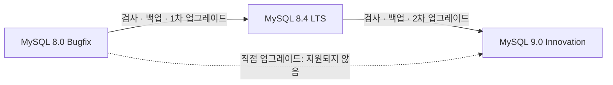

# 02-2.3 MySQL 서버 업그레이드

## 읽은 위치

- 책: [[Real MySQL 8.0 1]]
- 범위: 02 설치와 설정 · 2.3 MySQL 서버 업그레이드

## 내 메모 원문

> 02 > 2.3 MySQL 서버 업그레이드 인플레이스 업그레이드와 논리적 업그레이드에 대해
>
> 인플레이스 업그레이드 시 메이저 버전은 두 단계 건너뛴 업그레이드가 불가능, GA 버전이 아닌 경우 예를 들어 5.7.8에서 8.0으로 바로 업그레이드 불가능
>
> 8.0에서 9.0으로 업그레이드하는법 찾아서 정리해줘.
>
> 그리고 이거 origin에 올리자 이제

## 먼저 바로잡을 표현

“메이저 버전을 두 단계 건너뛸 수 없다”보다 **중간 Bugfix/LTS 계열을 건너뛰는 지원되지 않은 경로는 사용할 수 없다**고 이해하는 편이 현재 MySQL 릴리스 모델에 정확하다.

- 과거 규칙: 5.6에서 8.0으로 바로 가지 않고 5.7을 거친다.
- 현재 규칙: 8.0에서 9.x로 바로 가지 않고 8.4 LTS를 거친다.
- GA 원칙: 5.7에서 8.0으로 업그레이드하려면 최초 GA인 5.7.9 이상이어야 한다. 따라서 개발 릴리스인 5.7.8은 출발점으로 지원되지 않는다.

이 경로 제한은 인플레이스에만 국한된 암기 규칙이 아니다. 공식 Upgrade Paths 표는 인플레이스, 논리적 dump/load, replication 각각에 지원 가능한 출발·도착 계열을 제시한다.

## 인플레이스와 논리적 업그레이드

| 구분 | 인플레이스 업그레이드 | 논리적 업그레이드 |
|---|---|---|
| 핵심 | 기존 데이터 디렉터리를 유지하고 서버 바이너리·패키지를 교체 | 구버전에서 SQL을 내보내고 새 서버·새 데이터 디렉터리에 적재 |
| 데이터 변환 | 새 `mysqld`가 시작되며 data dictionary와 system schema 등을 업그레이드 | 새 서버가 dump의 DDL·DML을 다시 실행하며 객체와 데이터를 재생성 |
| 장점 | 대용량 데이터를 전부 export/import하지 않아 보통 빠르고 추가 저장 공간이 적음 | 구·신 서버를 병렬로 두기 쉽고 새 환경 검증과 전환·복귀 경계가 명확함 |
| 위험 | 기존 데이터 디렉터리가 바뀌므로 실패·롤백의 영향 반경이 큼 | dump/load 시간, 추가 저장 공간, 긴 전환 시간 또는 변경분 동기화 전략이 필요 |
| 호환성 | data dictionary, 설정, 제거된 기능, 파일 형식의 영향을 직접 받음 | 새 버전에서 제거·변경된 SQL, 인증, system table, GTID 등의 호환 문제를 수정해야 할 수 있음 |
| 적합한 경우 | 지원 경로가 명확하고 다운타임·저장 공간을 줄여야 할 때 | 환경·OS까지 교체하거나 병렬 검증과 복귀 가능성을 더 중시할 때 |

## MySQL 8.0에서 9.0으로 가는 지원 경로

직접 `8.0 → 9.0`은 지원 경로가 아니다. 두 단계로 진행한다.



8.4는 8.0 다음의 LTS 경계다. 8.4에서 9.0은 LTS에서 그 다음 Innovation 계열로 가는 지원 경로다. 각 화살표마다 독립적인 업그레이드로 취급하여 호환성 검사, 백업, 테스트, 실행, 사후 검증을 반복한다.

### 0. 목표 버전부터 다시 확인

MySQL 9.0은 2024년의 Innovation 릴리스다. Innovation 릴리스는 다음 Innovation 릴리스가 나오기 전까지만 지원된다. 따라서 9.0 절차는 버전 경로를 이해하는 예시로는 유효하지만, 2026년 신규 운영 목표라면 장기 안정성을 위한 최신 8.4 LTS 또는 현재 지원되는 최신 9.x를 별도로 검토한다.

### 1. 8.0을 최신 8.0 GA 패치로 정리

다음 계열로 넘어가기 전 현재 계열의 최신 릴리스로 올리는 것이 권장된다. 현재 버전, 설정, plugin, 문자 집합, 인증 방식, replication/GTID 사용 여부를 목록화한다.

```sql
SELECT VERSION();
SHOW VARIABLES WHERE Variable_name IN
  ('datadir', 'innodb_fast_shutdown', 'gtid_mode', 'lower_case_table_names');
```

### 2. `8.0 → 8.4` 사전 검사

목표 버전을 명시해 MySQL Shell Upgrade Checker를 실행하고 오류를 먼저 없앤다. 사용하는 MySQL Shell 버전은 목표 서버 버전 이상을 검사할 수 있어야 한다.

```bash
mysqlsh -- util check-for-server-upgrade \
  root@127.0.0.1:3306 \
  --target-version=8.4.0 \
  --output-format=JSON
```

Upgrade Checker가 모든 운영 조건을 대신하지는 않는다. 8.4에서 제거된 옵션·기능, 예약어, 인증 plugin, application driver 호환성, 실행 계획과 성능 회귀도 별도로 확인한다.

### 3. 복구 가능한 백업과 리허설

- 데이터뿐 아니라 `mysql` system database를 포함해 백업한다.
- 백업 파일의 존재가 아니라 별도 환경에서 실제 복원되는지 확인한다.
- 운영과 같은 데이터·설정·application workload로 8.4 리허설을 한다.
- 전환 중 쓰기를 멈추는 시점과 허용 downtime을 정한다.

인플레이스 업그레이드 뒤 단순히 이전 바이너리로 되돌리는 것을 롤백으로 생각하면 안 된다. 새 서버가 기존 데이터 디렉터리와 data dictionary를 변경할 수 있으므로, 복귀는 보통 업그레이드 전 백업·snapshot을 복원하거나 구버전 서버를 별도로 유지하는 방식으로 설계한다.

### 4. `8.0 → 8.4` 실행과 검증

인플레이스라면 다음 흐름이다.

1. 미완료 XA transaction을 확인하고 정리한다.
2. `innodb_fast_shutdown=2`를 사용했다면 `0` 또는 `1`로 바꾼 뒤 정상 종료한다.
3. 8.4 바이너리·패키지 또는 container image로 교체한다.
4. **기존 데이터 디렉터리**로 8.4를 시작한다.
5. 서버가 data dictionary, `mysql`, Performance Schema, `INFORMATION_SCHEMA`, `sys`와 user schema의 호환성을 처리·검사하도록 기다린다.
6. error log, 버전, schema, row count, 핵심 query, application test, 성능 지표를 확인한다.

논리적 방식이라면 8.0에서 dump를 만들고, 별도의 8.4 서버와 새 데이터 디렉터리를 초기화한 뒤 dump를 적재하고 같은 검증을 수행한다. `mysqldump`를 쓸 때 routine과 event가 누락되지 않도록 옵션을 확인하며, GTID가 켜진 환경에서 system table을 포함한 dump를 그대로 적재하는 문제도 검토한다.

### 5. `8.4 → 9.0`을 같은 절차로 반복

8.4가 정상 동작한다는 증거를 확보한 뒤, 목표를 9.0으로 바꿔 Upgrade Checker·변경점 검토·백업·리허설을 다시 수행한다. 8.4에서 9.0은 별도의 major/Innovation 경계이므로 첫 단계의 검사 결과를 재사용해 생략하지 않는다.

```bash
mysqlsh -- util check-for-server-upgrade \
  root@127.0.0.1:3306 \
  --target-version=9.0.0 \
  --output-format=JSON
```

그 다음 인플레이스라면 9.0 바이너리로 기존 8.4 데이터 디렉터리를 열고, 논리적 방식이라면 새 9.0 서버에 8.4 dump를 적재한다. 마지막으로 application driver, 인증, SQL, 실행 계획, 성능과 error log까지 확인하고 트래픽을 전환한다.

## 현재 Docker 실습에 적용할 때

현재 `realmysql`은 `mysql:8.0` container로 만들었지만 실행 명령에 named volume 또는 bind mount가 명시되어 있지 않다. 업그레이드 실습 전에 `docker inspect realmysql`로 `/var/lib/mysql`의 실제 mount를 확인하고, 검증 가능한 dump와 별도의 volume 복사본을 만든다.

Docker 인플레이스 업그레이드의 본질도 같다.

`8.0 container 정상 종료 → 같은 영속 data volume을 8.4 image에 연결 → 검증 → 정상 종료 → 같은 volume을 9.0 image에 연결`

단, 현재 학습 DB를 실제로 9.0까지 올리기 전에 8.0 원본 volume은 보존한다. image tag만 바꾸는 것이 아니라 **새 `mysqld`가 같은 데이터 디렉터리를 업그레이드하는 작업**이다.

## 핵심 판단 기준

- 버전 번호만 보지 말고 Bugfix/LTS/Innovation 경계와 공식 지원 경로를 본다.
- “업그레이드 성공”은 서버가 켜진 것이 아니라 application 정합성·성능·운영 지표까지 검증된 상태다.
- 인플레이스는 데이터 이동 비용을 줄이고, 논리적 방식은 구·신 환경의 분리와 전환 통제력을 얻는다.
- 업그레이드 방법보다 먼저 복구 방법과 허용 downtime을 결정한다.

## 지식 지도 연결

`릴리스 모델 → 지원 경로 → 호환성 검사 → 백업·복구 → data dictionary 변환 또는 dump/load → application·성능 검증 → 트래픽 전환`

- [[MySQL 인플레이스 업그레이드와 논리적 업그레이드]]
- [[DB 서버와 애플리케이션 서버]]
- [[장애 복구]]
- [[관측 가능성]]
- [[컨테이너와 이미지]]

## 공식 확인 자료

- MySQL 8.4 Upgrade Paths: https://dev.mysql.com/doc/refman/8.4/en/upgrade-paths.html
- MySQL Releases: Innovation and LTS: https://dev.mysql.com/doc/refman/8.4/en/mysql-releases.html
- Before You Begin: https://dev.mysql.com/doc/refman/8.4/en/upgrade-before-you-begin.html
- Preparing Your Installation for Upgrade: https://dev.mysql.com/doc/refman/8.4/en/upgrade-prerequisites.html
- In-Place and Logical Upgrade: https://dev.mysql.com/doc/refman/8.4/en/upgrade-binary-package.html
- Upgrade Checker Utility: https://dev.mysql.com/doc/mysql-shell/9.7/en/mysql-shell-utilities-upgrade.html
- MySQL 8.0 Upgrade Paths와 GA 조건: https://dev.mysql.com/doc/mysql-installation-excerpt/8.0/en/upgrade-paths.html

## 현재 진단

- 맞는 연결: 중간 release series를 건너뛰는 업그레이드와 non-GA 출발점은 지원되지 않는다는 핵심 제약을 포착했다.
- 보완한 연결: 8.0과 9.0 사이의 8.4 LTS 경계, 두 방식의 데이터 처리 차이, 검사·백업·롤백·Docker 적용을 연결했다.
- level: 0 유지 — 제약을 포착했지만 두 방식과 단계별 복구 전략을 아직 자신의 말로 설명한 기록은 없다.

## 다음 확인 질문

[[MySQL 8.0에서 9.0으로 어떻게 업그레이드하는가]]
