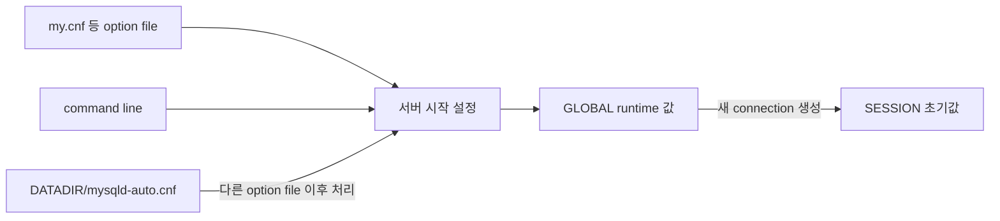

# 02-2.4 SET과 영속 시스템 변수

## 읽은 위치

- 책: [[Real MySQL 8.0 1]]
- 범위: 02 설치와 설정 · 2.4 서버 설정의 `SET`, `GLOBAL`, persisted system variable

## 내 메모 원문

> SET 명령으로 시스템 변수를 바꾸는건 my.cnf 등의 파일에 바로 적용되는게 아님. 기동 중인 MySQL 인스턴스에서만 유효함
> SET PERSIST로 하면 가능 -> mysqld-auto.cnf 파일에 기록해서 MySQL이 다시 시작할 때 적용됨
> GLOBAL 키워드도 존재함
>
> my.cnf에 있는 모든 변수 정리해둘것

## 먼저 한 문장으로

`SET` 계열은 **어느 scope의 runtime 값을 바꿀지**와 **재시작 후에도 남길지**를 선택하며, `SET PERSIST`도 `my.cnf`를 수정하지 않고 data directory의 `mysqld-auto.cnf`를 MySQL 서버가 관리하게 한다.

## 명령별 차이

| 명령 | 현재 SESSION | 현재 GLOBAL | `mysqld-auto.cnf` | 재시작 후 |
|---|---:|---:|---:|---|
| `SET SESSION var = value` | 변경 | 유지 | 기록 안 함 | 사라짐 |
| `SET var = value` | SESSION 값이 있으면 변경 | 유지 | 기록 안 함 | 사라짐 |
| `SET GLOBAL var = value` | 기존 session은 유지 | 변경 | 기록 안 함 | 사라짐 |
| `SET PERSIST var = value` | 기존 session은 유지 | 변경 | 기록 | 다시 적용 |
| `SET PERSIST_ONLY var = value` | 유지 | 유지 | 기록 | 다음 시작 때 적용 |
| `RESET PERSIST var` | 유지 | 유지 | 해당 항목 제거 | 다음 시작부터 persisted 값 제거 |

`SET PERSIST`는 “재시작 때만 적용”되는 것이 아니라 **현재 GLOBAL runtime 값도 즉시 변경하면서** persisted setting도 기록한다. 현재 값을 건드리지 않고 다음 시작에만 반영하려면 `SET PERSIST_ONLY`를 사용한다. 이는 runtime 변경이 불가능한 read-only 변수의 다음 시작값을 저장할 때 특히 유용하다.

## `GLOBAL` 키워드의 역할

```sql
SET SESSION autocommit = OFF;
SET GLOBAL max_connections = 300;
SET PERSIST max_connections = 300;
SET PERSIST_ONLY back_log = 200;
```

- `SESSION`: 현재 connection의 값
- `GLOBAL`: 현재 server instance의 global 값과 미래 connection의 기본값
- `PERSIST`: GLOBAL runtime 값 + 재시작용 persisted 값
- `PERSIST_ONLY`: 재시작용 persisted 값만

`GLOBAL`, `PERSIST`, `PERSIST_ONLY`를 session-only 변수에 사용하면 오류가 발생하고, `SESSION`을 global-only 변수에 사용해도 오류가 발생한다. 변수의 `Var Scope`와 `Dynamic` 속성을 먼저 확인한다.

## 설정 파일 관계와 우선순위



`mysqld-auto.cnf`는 다른 option file을 읽은 뒤 처리되므로 같은 dynamic system variable이 `my.cnf`와 양쪽에 있으면 persisted 값이 최종 runtime 값을 덮을 수 있다. 그래서 `my.cnf`만 보고 현재 설정을 판단하면 안 된다.

- `persisted_globals_load=OFF`로 시작하면 `mysqld-auto.cnf`를 무시한다.
- 일부 startup 초기 단계에 필요한 변수는 persisted 적용 시점이 늦을 수 있어 `my.cnf`가 더 적절하다.
- `mysqld-auto.cnf`는 JSON 파일이지만 직접 편집하지 않고 `SET PERSIST`와 `RESET PERSIST`로 관리한다.
- 잘못 수동 편집하면 parse error로 서버 시작이 실패할 수 있다.

## 조회 방법

```sql
-- 현재 GLOBAL·SESSION 값
SELECT @@GLOBAL.autocommit, @@SESSION.autocommit;

-- mysqld-auto.cnf에 저장된 항목
SELECT *
FROM performance_schema.persisted_variables
ORDER BY VARIABLE_NAME;

-- 현재 값이 어디에서 설정됐는지
SELECT VARIABLE_NAME, VARIABLE_SOURCE, VARIABLE_PATH
FROM performance_schema.variables_info
WHERE VARIABLE_SOURCE <> 'COMPILED'
ORDER BY VARIABLE_SOURCE, VARIABLE_NAME;
```

`variables_info`의 `VARIABLE_SOURCE`를 보면 compiled default, option file, command line, persisted setting, runtime 변경 등을 구분할 수 있다.

## 삭제와 원복의 차이

`RESET PERSIST max_connections`는 `mysqld-auto.cnf`의 항목만 없앤다. 현재 GLOBAL 값을 즉시 과거 값으로 되돌리지 않는다. 즉 다음 두 작업은 별개다.

1. persisted override 제거
2. 현재 runtime 값을 원하는 값으로 다시 설정

전체 persisted 항목을 제거하는 `RESET PERSIST`는 영향 범위가 크므로 목록을 먼저 확인한다.

## 현재 실습 환경 연결

[[realmysql my.cnf 설정 인벤토리]]에서 Docker `realmysql`의 실제 설정을 확인했다.

- MySQL: 8.0.44
- 기본 option file: `/etc/my.cnf`
- `/etc/mysql/conf.d/`: 추가 `.cnf` 없음
- `mysqld-auto.cnf`: 아직 없음
- `performance_schema.persisted_variables`: 0건

즉 현재는 `SET PERSIST`로 저장된 override가 없다. 실제 `/etc/my.cnf`의 모든 활성·주석 예제 option은 별도 인벤토리에 기록했다.

## 지식 지도 연결

`option file·command line → startup GLOBAL → runtime SET → mysqld-auto.cnf persistence → restart → 새 SESSION 초기화 → JDBC pool 적용 시점`

- [[MySQL SET PERSIST와 설정 우선순위]]
- [[SET PERSIST는 my.cnf를 수정하는가]]
- [[MySQL 시스템 변수의 scope와 생명주기]]
- [[MySQL GLOBAL 변수 변경은 기존 세션에 적용되는가]]
- [[장애 복구]]

## 공식 확인 자료

- Persisted System Variables: https://dev.mysql.com/doc/refman/8.0/en/persisted-system-variables.html
- SET Syntax: https://dev.mysql.com/doc/refman/8.0/en/set-variable.html
- Option Files: https://dev.mysql.com/doc/refman/8.0/en/option-files.html
- `persisted_variables`: https://dev.mysql.com/doc/refman/8.0/en/performance-schema-persisted-variables-table.html
- `variables_info`: https://dev.mysql.com/doc/refman/8.0/en/performance-schema-variables-info-table.html

## 현재 진단

- 맞는 연결: 일반 `SET`은 현재 instance에만 유효하고 `SET PERSIST`는 별도 파일에 기록돼 재시작 뒤에도 적용된다는 흐름을 설명했다.
- 보완한 연결: `SET PERSIST`는 현재 GLOBAL 값도 즉시 바꾸며, 다음 시작만 바꾸려면 `PERSIST_ONLY`를 사용한다.
- level: 1 → 2 — runtime 변경과 persisted configuration의 상태 전이를 자신의 말로 연결했다. 충돌 시 우선순위와 제거 절차는 아직 설명하지 않았다.

## 다음 확인 질문

[[SET PERSIST는 my.cnf를 수정하는가]]
