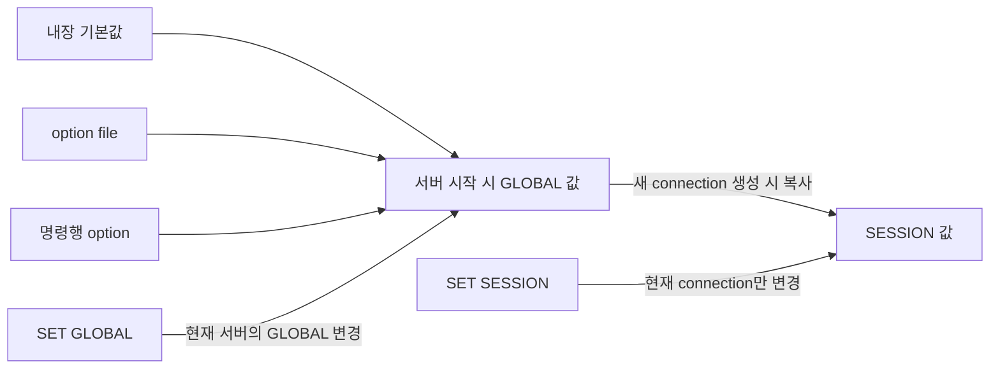

# 02-2.4.2 MySQL 시스템 변수의 특징

## 읽은 위치

- 책: [[Real MySQL 8.0 1]]
- 범위: 02 설치와 설정 · 2.4.2 MySQL 시스템 변수의 특징

## 내 메모 원문

> MySQL서버는 기동하면서 설정 파일을 읽어 메모리나 작동 방식을 초기화하고, 접속된 사용자를 제어하기 위한 값을 별도로 저장함. MySQL 서버에 저장된 이런 값들은 시스템 변수라고하고, SHOW VARIABLES, SHOW GLOBAL VALIABLES로 알 수 있음
>
> 각 변수가 글로별 변수인지, 세션 변수인지 알아야함.
>
> 시스템 변수가 가지는 5가지 속성이 있음
>
> Cmd-Line: MySQL서버의 명령행 인자로 설정될 수 있는지 여부
>
> Option file: MySQL 설정파일(my.cnf(리눅스)/my.ini(윈도우)) 로 제어할 수 있는지 여부 (옵션, 설정, 컨피규레이션 파일 모두 같은말)
>
> System Var: 시스템 변수인지 여부, MySQL 서버의 설정 파일을 작성할 때 각 변수명에 사용된 -(하이픈)이나 언더스코어(_)의 구분에 주의. MySQL 8.0에서는 _를 구분자로 사용함. 명령행 옵션으로 만 사용가능한 설정은 - 구분자로 사용
>
> Var Scope: 시스템 변수의 적용 범위를 나타낸다. 글로벌 / 커넥션(Session) 또는 둘다
>
> Dynamic: 시스템 변수가 동적인지 정적인지 구분.

## 핵심 정의

시스템 변수는 MySQL 서버와 각 connection의 작동 방식을 구성하는 현재 설정값이다. 서버 시작 시 기본값·option file·명령행 인자 등으로 초기화되고, dynamic 변수는 실행 중에도 바꿀 수 있다.

“접속된 사용자를 제어하기 위한 값”보다는 **connection마다 적용되는 동작 설정도 별도로 가진다**고 표현하는 편이 정확하다. SESSION 변수는 사용자 계정에 영구 저장되는 값이 아니라 해당 connection에 속하는 값이다.

## 다섯 가지 속성

| 속성 | 확인하려는 질문 | 의미 |
|---|---|---|
| `Cmd-Line` | 서버 시작 명령에 넣을 수 있는가? | `mysqld --옵션=값` 형태로 지정 가능한지 |
| `Option file` | 설정 파일에 넣을 수 있는가? | `my.cnf`, `my.ini`의 `[mysqld]` 같은 option group에서 지정 가능한지 |
| `System Var` | 실행 중 조회할 시스템 변수인가? | 대응하는 system variable 이름이 있는지. 모든 startup option이 system variable인 것은 아님 |
| `Var Scope` | 누구에게 적용되는가? | `Global`, `Session`, 또는 `Global, Session` |
| `Dynamic` | 재시작 없이 바꿀 수 있는가? | `Yes`면 실행 중 `SET` 가능, `No`면 현재 실행 중인 값은 바꿀 수 없는 정적·read-only 변수 |

이 속성들은 서로 다른 축이다. 예를 들어 option file에 쓸 수 있다고 해서 반드시 dynamic인 것은 아니며, system variable이라고 해서 반드시 SESSION 값을 가지는 것도 아니다.

## 값의 생명주기



대부분의 `Global, Session` 변수는 connection이 만들어질 때 현재 GLOBAL 값으로 SESSION 값을 초기화한다. 이후 둘은 별도의 값이다.

- `SET GLOBAL`은 GLOBAL 값과 **앞으로 생성될 session의 초기값**을 바꾼다.
- 이미 연결된 session의 값은 자동으로 바뀌지 않는다.
- `SET SESSION`은 현재 connection에만 적용된다.
- 단, 일부 변수는 SESSION 초기화 규칙이 다르므로 개별 변수 설명을 확인한다.

## 조회할 때 범위를 명시한다

```sql
-- 기본값은 SESSION
SHOW VARIABLES LIKE 'autocommit';
SHOW SESSION VARIABLES LIKE 'autocommit';

-- 서버의 GLOBAL 값
SHOW GLOBAL VARIABLES LIKE 'autocommit';

-- 두 값을 한 번에 비교
SELECT @@GLOBAL.autocommit, @@SESSION.autocommit;
```

`SHOW VARIABLES`는 modifier를 생략하면 `SESSION`이다. SESSION 값을 갖지 않는 global-only 변수는 이 결과에서도 GLOBAL 값이 표시될 수 있으므로, 운영 점검에서는 `GLOBAL`과 `SESSION`을 명시하는 편이 안전하다.

원문의 `SHOW GLOBAL VALIABLES`는 `SHOW GLOBAL VARIABLES`가 올바른 철자다.

## GLOBAL과 SESSION을 구분해야 하는 이유

운영자가 `SET GLOBAL`을 성공적으로 실행하고도 기존 application connection에서는 값이 그대로인 상황이 생긴다. connection pool은 connection을 오래 재사용하므로, 새 GLOBAL 값이 실제 요청에 적용되는 시점은 pool이 새 connection을 만드는 시점과 연결될 수 있다.

```text
SET GLOBAL
  → 서버 GLOBAL 값 변경
  → 기존 JDBC connection은 기존 SESSION 값 유지
  → connection 종료·재생성
  → 새 SESSION이 변경된 GLOBAL 값으로 초기화
```

따라서 `SHOW GLOBAL VARIABLES`만 보고 application 요청에도 적용됐다고 판단하면 안 된다. application이 실제 사용하는 connection에서 `@@SESSION.변수명`을 확인해야 한다.

## Dynamic과 재시작·영속성은 다른 질문이다

- `Dynamic: Yes`: 현재 실행 중인 서버에서 `SET GLOBAL` 또는 `SET SESSION`으로 변경할 수 있다.
- `Dynamic: No`: 실행 중인 현재 값은 변경할 수 없으므로 보통 startup 설정과 재시작이 필요하다.
- `SET GLOBAL`만 사용한 변경은 기본적으로 서버 재시작 후 사라진다.
- MySQL 8.0의 `SET PERSIST`는 GLOBAL runtime 값 변경과 `mysqld-auto.cnf` 영속화를 함께 수행한다.
- `SET PERSIST_ONLY`는 현재 runtime 값은 바꾸지 않고 다음 시작에 사용할 값을 저장하며, read-only 변수에도 활용할 수 있다.

즉 `Dynamic`은 **지금 바꿀 수 있는가**, persistence는 **재시작 뒤에도 남는가**를 묻는다.

## 하이픈과 언더스코어 규칙 교정

다음처럼 구분한다.

| 위치 | 예 | 규칙 |
|---|---|---|
| runtime SQL | `SET GLOBAL max_connections = 300;` | system variable 이름은 `_`만 사용 |
| command line | `mysqld --max-connections=300` | startup option은 선행 `--`가 필요하고, 이름 안의 `-`와 `_`는 대부분 호환 |
| option file | `max_connections=300` | 선행 `--`를 빼며, `-`와 `_`는 대부분 호환 |

따라서 “명령행에서만 가능한 설정은 하이픈을 쓴다”는 규칙은 정확하지 않다. command option인지 system variable인지는 표의 `System Var` 속성으로 구분하고, 표기법은 해당 option의 공식 이름을 확인한다.

공식 문서는 option 이름에 주로 하이픈을 권장하지만 예외도 있다. 예를 들어 `--log-bin`과 `--log_bin`처럼 의미가 다른 option도 있으므로 무조건 치환하지 않는다.

## 설정이 들어오는 경로와 우선순위

MySQL은 내장 기본값 위에 여러 설정 입력을 적용한다. 일반적으로 명령행 option은 option file과 환경 변수보다 우선하며, option file은 환경 변수보다 우선한다. 실행 후 `SET`이나 persisted variable까지 포함하면 “파일에 적힌 값”과 “현재 메모리 값”이 다를 수 있다.

운영에서 원인을 찾을 때는 다음을 따로 확인한다.

1. 시작할 때 어떤 파일과 option을 읽었는가?
2. 현재 GLOBAL 값은 무엇인가?
3. 문제의 connection에서 SESSION 값은 무엇인가?
4. runtime 변경이 재시작 뒤에도 남도록 persist됐는가?

## 지식 지도 연결

`설정 입력 → 서버 시작 시 GLOBAL 초기화 → connection 생성 시 SESSION 초기화 → JDBC pool이 session 재사용 → 동적 변경 → 재시작과 persistence`

- [[MySQL 시스템 변수의 scope와 생명주기]]
- [[JDBC 커넥션 풀]]
- [[DB 서버와 애플리케이션 서버]]
- [[관측 가능성]]
- [[MySQL 인플레이스 업그레이드와 논리적 업그레이드]]

## 공식 확인 자료

- Using System Variables: https://dev.mysql.com/doc/refman/8.0/en/using-system-variables.html
- SHOW VARIABLES: https://dev.mysql.com/doc/refman/8.0/en/show-variables.html
- Command-Line Options: https://dev.mysql.com/doc/refman/8.0/en/command-line-options.html
- Option Files: https://dev.mysql.com/doc/refman/8.0/en/option-files.html
- Dynamic System Variables: https://dev.mysql.com/doc/refman/8.0/en/dynamic-system-variables.html

## 현재 진단

- 맞는 연결: system variable을 서버 동작 설정값으로 정의했고 다섯 속성, 특히 scope와 dynamic의 존재를 구분했다.
- 교정한 연결: SESSION은 사용자 계정이 아니라 connection에 속하며, `SHOW VARIABLES`의 기본 범위는 SESSION이다. startup option과 runtime system variable의 하이픈·언더스코어 규칙도 분리했다.
- level: 0 → 1 — 시스템 변수를 자신의 말로 정의한 증거가 있다. GLOBAL 변경과 기존 SESSION의 관계를 아직 설명하지 않아 level 2는 아니다.

## 다음 확인 질문

[[MySQL GLOBAL 변수 변경은 기존 세션에 적용되는가]]
