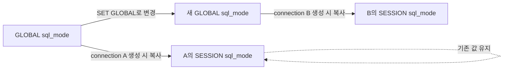

# 02-2.4.3 글로벌 변수와 세션 변수

## 읽은 위치

- 책: [[Real MySQL 8.0 1]]
- 범위: 02 설치와 설정 · 2.4.3 글로벌 변수와 세션 변수

## 내 메모 원문

> 일반적으로 세션 변수는 글로벌 변수와 세션변수로 동시에 존재하고, Var Scope에 Both로 표시
>
> 글로벌 범위 변수에는 InnoDB 버퍼풀 크기(innodb_buffer_pool_size) 또는 MyISAM의 키 캐시 크기 (key_buffer_size) 등이 가장 대표적인 글로벌 영역 시스템 변수
>
> Q. InnoDB 버퍼풀 크기/MyISAM의 키 캐시 크기 가 각각 뭘 의미하는가 (답까지 적어줘)
>
> 세션 변수 중 MySQL 서버 파일에 명시해 초기화할 수 있는 변수는 대부분 Both로 명시됨. Session으로 명시된 변수는 초깃값을 명시할 수 없음. 커넥션이 만들어지는 순간부터 해당 커넥션에서만 유효한 설정 변수를 의미함

## GLOBAL, SESSION, BOTH의 정확한 구분

| Scope | 값의 소유 단위 | 변경의 영향 | 예시 |
|---|---|---|---|
| `Global` | MySQL 서버 instance 하나 | 서버 전체와 모든 connection이 공유하는 동작·자원 | `innodb_buffer_pool_size`, `key_buffer_size`, `max_connections` |
| `Session` | client connection 하나 | 해당 connection이 살아 있는 동안에만 영향 | `insert_id` 등 connection 상태 변수 |
| `Both` | GLOBAL 값 하나와 connection별 SESSION 값 | GLOBAL은 새 SESSION의 기본값, SESSION은 현재 connection의 실제값 | `autocommit`, `sql_mode`, `transaction_isolation` |

많은 SESSION 설정은 `Both`다. 서버가 시작할 때 GLOBAL 값을 만들고, client가 연결될 때 그 시점의 GLOBAL 값을 복사해 SESSION 값을 초기화한다. 이후에는 별개의 값이므로 `SET GLOBAL`이 기존 SESSION에 소급되지 않는다.



## 질문 답: InnoDB 버퍼 풀은 무엇인가

`innodb_buffer_pool_size`는 **InnoDB가 공유하는 buffer pool의 전체 크기**다. buffer pool은 disk의 InnoDB table·index 내용을 page 단위로 memory에 cache하는 영역이며 모든 client connection이 함께 사용한다.

읽기 흐름은 다음과 같다.

```text
query가 InnoDB page 요청
  → buffer pool hit: memory에서 처리
  → miss: disk에서 page를 읽어 buffer pool에 적재
  → 공간 부족: LRU 계열 정책으로 다른 page를 축출
```

쓰기에서도 page를 buffer pool에서 변경하고 dirty page로 표시한 뒤 background flushing을 통해 disk에 반영한다. 따라서 단순한 SELECT 결과 cache가 아니라 **InnoDB가 data page와 index page를 읽고 수정하는 중심 작업 공간**이다.

`innodb_buffer_pool_size`가 Global인 이유는 connection마다 별도 buffer pool을 만드는 것이 아니라 서버의 모든 InnoDB workload가 하나의 큰 cache를 공유하기 때문이다. MySQL 8.0에서는 `Scope: Global`, `Dynamic: Yes`이므로 global-only라고 해서 반드시 static인 것은 아니다.

### 너무 작거나 큰 경우

- 너무 작음: cache miss와 page 교체가 늘어 disk read·latency가 증가한다.
- 너무 큼: OS와 connection buffer 등 다른 memory가 부족해 swap 또는 OOM 위험이 생긴다.
- 확인 지표: `Innodb_buffer_pool_read_requests`, `Innodb_buffer_pool_reads`, dirty page·free page, 실제 process memory와 disk IO

## 질문 답: MyISAM 키 캐시는 무엇인가

`key_buffer_size`는 **MyISAM index block을 저장하는 공유 key cache의 크기**다. 여러 thread가 같은 cache를 사용하며, 자주 쓰는 B-tree index block을 memory에서 찾아 disk index IO를 줄인다.

중요한 차이는 MyISAM의 key cache가 **index만** 전용으로 cache한다는 것이다. MyISAM data block에는 MySQL 자체의 별도 data cache를 쓰지 않고 OS filesystem cache에 의존한다.

```text
MyISAM index block → MySQL key cache
MyISAM data block  → OS filesystem cache
```

`key_buffer_size`도 `Scope: Global`, `Dynamic: Yes`다. MyISAM table을 거의 사용하지 않는 InnoDB 중심 서버에서 이 값을 크게 잡으면 query 성능에 도움 없이 memory만 점유할 수 있다.

### 관찰 지표

- `Key_read_requests`: key cache에서 index block을 읽으려 한 횟수
- `Key_reads`: disk에서 index block을 실제로 읽은 횟수
- `Key_write_requests`, `Key_writes`: index block write 요청과 실제 disk write

## 두 cache 비교

| 항목 | InnoDB buffer pool | MyISAM key cache |
|---|---|---|
| 설정 변수 | `innodb_buffer_pool_size` | `key_buffer_size` |
| 대상 engine | InnoDB | MyISAM |
| 주 cache 대상 | table data page와 index page | index block만 |
| data block 처리 | buffer pool에 cache | OS filesystem cache에 의존 |
| 공유 범위 | 서버의 모든 InnoDB connection | 서버의 모든 MyISAM 사용 thread |
| Scope / Dynamic | Global / Yes | Global / Yes |

둘 다 connection마다 따로 주는 memory가 아니라 engine이 서버 전체에서 공유하는 cache이므로 Global이다.

## `Session이면 설정 파일에서 초기화할 수 없다`의 최신 버전 보정

기본 원리는 다음과 같다.

- `Both`: GLOBAL 값을 option file에서 설정하고, 새 connection의 SESSION 초기값으로 사용한다.
- 순수 `Session`: 대응하는 GLOBAL 값이 없으므로 일반적인 `GLOBAL → SESSION 복사` 구조가 아니다.

하지만 **`Scope: Session`이면 무조건 option file에서 초기화할 수 없다고 단정하면 안 된다.** 최신 MySQL 8.0에는 `innodb_ddl_buffer_size`, `innodb_ddl_threads`처럼 `Scope: Session`이면서 `Cmd-Line: Yes`, `Option file: Yes`인 예외가 있다. 책이 다루는 초기 MySQL 8.0 이후 추가된 변수다.

따라서 각 속성을 독립적으로 확인한다.

```text
적용 단위는?             → Var Scope
startup 기본값 설정 가능? → Cmd-Line / Option file
실행 중 변경 가능?        → Dynamic
```

순수 SESSION 변수도 “초깃값이 없다”는 뜻은 아니다. 내장 기본값이나 connection 상태에서 값이 생기지만, 대응하는 GLOBAL system variable을 통해 복사되지 않는다는 뜻으로 이해한다.

## Spring·JDBC connection pool과 연결

Spring application의 요청마다 DB session을 새로 만드는 것이 아니다. HikariCP가 기존 JDBC connection을 재사용하면 그 connection의 SESSION 변수도 이어진다.

- `SET SESSION` 후 pool에 그대로 반환하면 다음 borrower가 변경된 상태를 물려받을 수 있다.
- `SET GLOBAL` 후에도 기존 pool connection은 예전 SESSION 값을 유지할 수 있다.
- 필요하면 connection 초기화 정책, pool 재생성, transaction 종료 시 상태 복구를 설계해야 한다.

## 지식 지도 연결

`서버 공유 cache 크기 → GLOBAL 변수 → engine 전체 IO 성능 → connection 생성 시 SESSION 초기화 → JDBC pool의 session 재사용`

- [[MySQL 시스템 변수의 scope와 생명주기]]
- [[InnoDB 버퍼 풀과 MyISAM 키 캐시는 무엇인가]]
- [[JDBC 커넥션 풀]]
- [[요청이 소비하는 리소스]]
- [[캐시와 Redis]]

## 공식 확인 자료

- GLOBAL과 SESSION의 관계: https://dev.mysql.com/doc/refman/8.0/en/using-system-variables.html
- InnoDB memory configuration: https://dev.mysql.com/doc/refman/8.0/en/innodb-init-startup-configuration.html
- `innodb_buffer_pool_size`: https://dev.mysql.com/doc/refman/8.0/en/innodb-parameters.html
- MyISAM key cache: https://dev.mysql.com/doc/refman/8.0/en/myisam-key-cache.html
- server system variable reference: https://dev.mysql.com/doc/refman/8.0/en/server-system-variable-reference.html

## 현재 진단

- 맞는 연결: 많은 SESSION 변수가 `Both`이며 connection 단위로 유효하다는 점, server 공유 memory가 Global 변수라는 점을 포착했다.
- 보완한 연결: `Both`의 GLOBAL 값이 connection 생성 시 SESSION 값으로 복사되는 과정과 두 storage engine cache의 정확한 대상을 연결했다.
- 교정한 연결: `Scope: Session`이라고 option file 설정이 항상 불가능한 것은 아니며 최신 MySQL 8.0에는 예외가 있다.
- level: 1 유지 — connection 단위라는 정의는 있으나 GLOBAL 변경 전후에 기존·신규 SESSION이 달라지는 과정을 자신의 말로 설명하지 않았다.

## 다음 확인 질문

[[MySQL GLOBAL 변수 변경은 기존 세션에 적용되는가]]
