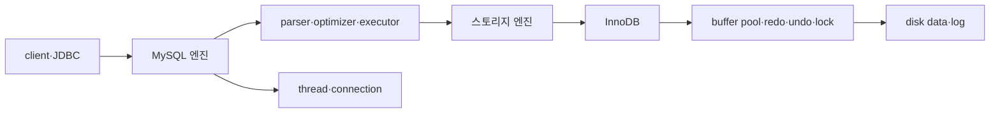

# 04 아키텍처 시작점

## 내일 시작 위치

- 책: [[Real MySQL 8.0 1]]
- 범위: 04 아키텍처
- 첫 진입: MySQL 서버의 전체 구조

## 이번 장의 큰 지도

## 읽으면서 채울 갈래

1. MySQL 엔진과 스토리지 엔진은 책임을 어떻게 나누는가?
2. client connection은 어떤 thread와 연결되는가?
3. global memory와 thread·session memory는 어떻게 구분되는가?
4. SQL은 parser·optimizer·executor를 어떻게 통과하는가?
5. InnoDB의 buffer pool·redo·undo·lock은 요청 생명주기 어디에 있는가?

## 내일 첫 질문

> MySQL 서버에서 MySQL 엔진과 스토리지 엔진은 각각 어떤 책임을 맡는가?

정답을 미리 외우지 않고 책의 전체 구조 그림을 본 뒤 자기 말로 설명한다.

## 완료 기준

- `JDBC 요청 → connection/thread → MySQL 엔진 → 스토리지 엔진 → memory·disk` 흐름을 설명한다.
- 두 엔진의 책임을 구분한다.
- 요청이 기다리거나 실패하는 지점과 확인할 지표를 하나 이상 연결한다.
