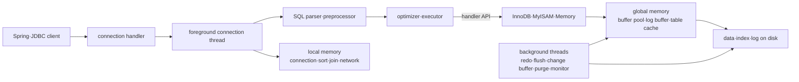
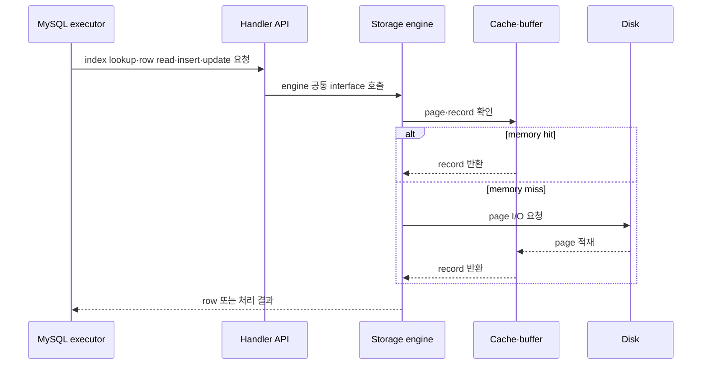
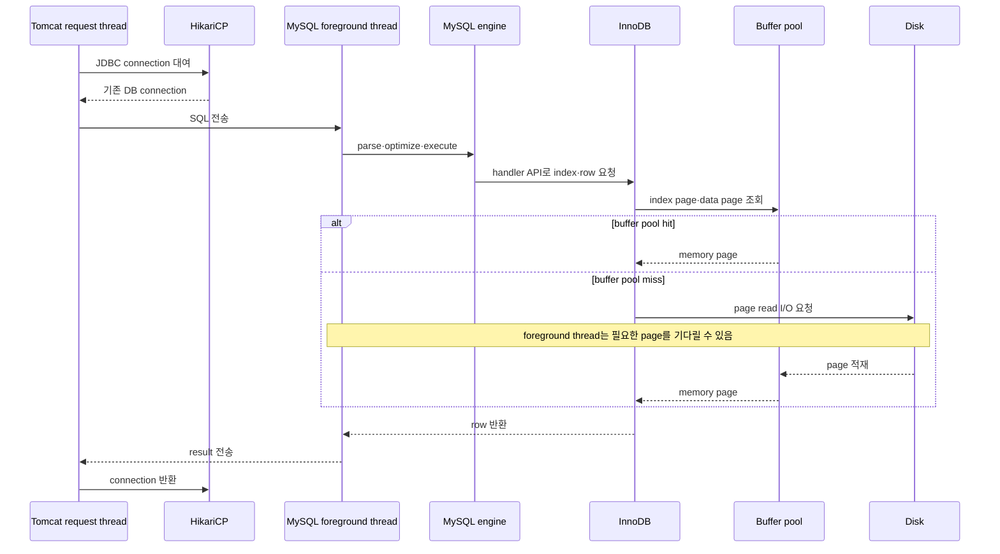
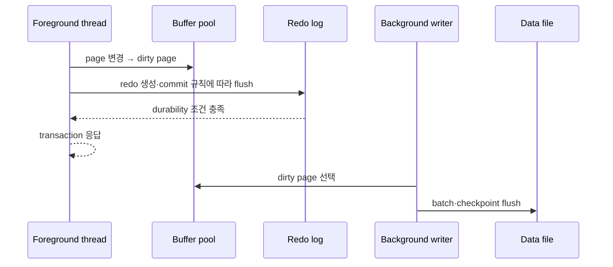
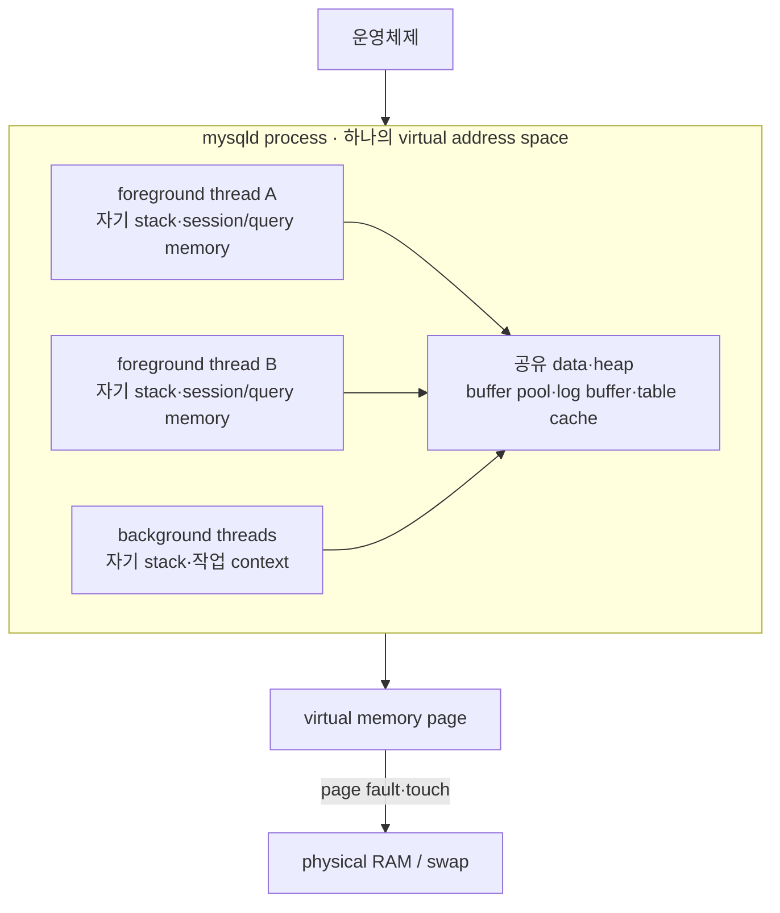

# 4.1 MySQL 엔진 아키텍쳐

> [!abstract] 이 절의 한 문장
> 클라이언트별 foreground thread가 local memory를 사용해 SQL을 처리하면 MySQL 엔진이 실행을 조정하고, 스토리지 엔진은 공유 global memory를 거쳐 레코드를 읽고 변경한다. InnoDB background thread는 redo·dirty page·change buffer 같은 미뤄도 되는 일을 memory에서 disk로 안전하게 이어 간다.

이 파일은 `04-아키텍쳐` 장 폴더 안의 `4.1 MySQL 엔진 아키텍쳐` canonical note다. 앞으로 `4.1.x`의 모든 하위 절과 사진을 이 파일에 이어 붙이고, `4.2`부터는 같은 장 폴더에 새 canonical note를 만든다.

<details>
<summary>이전 시작점 노트에서 통합한 학습 계획 펼치기</summary>

```text
내일 시작 위치

- 책: [[Real MySQL 8.0 1]]
- 범위: 04 아키텍처
- 첫 진입: MySQL 서버의 전체 구조

읽으면서 채울 갈래

1. MySQL 엔진과 스토리지 엔진은 책임을 어떻게 나누는가?
2. client connection은 어떤 thread와 연결되는가?
3. global memory와 thread·session memory는 어떻게 구분되는가?
4. SQL은 parser·optimizer·executor를 어떻게 통과하는가?
5. InnoDB의 buffer pool·redo·undo·lock은 요청 생명주기 어디에 있는가?

완료 기준

- `JDBC 요청 → connection/thread → MySQL 엔진 → 스토리지 엔진 → memory·disk` 흐름을 설명한다.
- 두 엔진의 책임을 구분한다.
- 요청이 기다리거나 실패하는 지점과 확인할 지표를 하나 이상 연결한다.
```

</details>

## 큰 지도(중요)



### 암기 비유

```text
MySQL 엔진 = 머리: 접속을 받고 SQL을 이해해 계획·지휘
handler API = 신경: 공통 명령을 스토리지 엔진으로 전달
스토리지 엔진 = 손발: engine 고유 방식으로 page·record를 읽고 씀
```

`손발`은 단순한 장치라는 뜻은 아니다. InnoDB는 transaction, MVCC, lock, buffer pool, redo·undo처럼 데이터 접근과 일관성의 핵심 동작도 담당한다.

## 사용자 정리 원문

### 2026-08-14 · 4.1.1 전체 구조와 4.1.2.1 foreground thread

<details>
<summary>보존된 원문 펼치기</summary>

```text
04 아키텍처
MySQL 엔진: 머리 역할
스토리지 엔진: 손발 역할 (핸들러 API를 만족하면 누구든지 스토리지 엔진을 구현해서 MySQL 서버에 추가해서 사용할 수 있음)


4.1 MySQL 엔진 아키텍쳐

-첨부한 이미지 사용

4.1.1.1 MySQL 엔진
클라이언트로부터의 접속 및 쿼리 요청을 처리하는 커넥션 핸들러와 SQL 파서 및 전처리기, 쿼리 최적화 실행을 위한 옵티마이저가 중심을 이룸

4.1.1.2 스토리지 엔진
실제 데이터를 디스크 스토리지에 저장하거나 디스크 스토리지로부터 데이터를 읽어오는 부분은 스토리지 엔진이 전담

MySQL 서버에서 MySQL엔진은 하나지만 스토리지 엔진은 여러개 동시 사용 가능

각 스토리지 엔진은 성능 향상을 위해 키 캐시(MyISAM 스토리이엔진)나 InnoDB 버퍼 풀 (InnoDB 스토리지 엔진)과 같은 기능을 내장하고 있다.

4.1.1.3 핸들러 API

핸들러 요청: MySQL엔진의 쿼리 실행기에서 데이터를 쓰거나 읽어야할 때 각 스토리지 엔진에 쓰기 또는 읽기를 요청
핸들러 API: 핸들러 요청할 때 사용하는API

SHOW GLOBAL STATUS LIKE 'Handler%'; 명령으로 이 핸들러 API를 통해 얼마나 많은 데이터(레코드) 작업이 있었는지 확인 가능


4.1.2 MySQL 스레딩 구조

MySQL은 프로세스 기반이 아니라 스레드 기반으로 작동하며, 크게 포그라운드 스레드와 백그라운드 스레드로 구분할 수 있다.

실행 중인 스레드 목록은 performance_schema 데이터 베이스의 threads 테이블을 통해 알 수 있다.

백그라운드 스레드가 대부분이고 포그라운드 스레드가 소수 (41: 3 비중)

포그라운드 스레드 중에 'thread/sql/one_connection' 스레드만 실제 사용자의 요청을 처리하는 포그라운드 스레드 (다른 스레드는 뭐하고 있는걸까)

백그라운드 스레드는 MySQL 서버 설정에 따라 가변적일 수 있음

동일한 이름의 스레드가 2개 이상씩 보이는 것은 MySQL 서버의 설정 내용에 의해 여러 스레드가 동일 작업을 병렬로 처리하는 경우

4.1.2.1 포그라운드 스레드(클라이언트 스레드)

**포그라운드 스레드는 최소한 MySQL 서버에 접속된 클라이언트 수만큼 존재하며, 주로 각 클라이언트 사용자가 요청하는 쿼리 문장을 처리**

**클라이언트 사용자가 작업을 마치고 커넥션을 종료하면 해당 커넥션을 담당하던 스레드는 다시 스레드 캐시(Thread cache)로 되돌아간다.**

**이때 이미 스레드 캐시에 일정 개수 이상의 대기 중인 스레드가 있으면 스레드 캐시에 넣지 않고 스레드를 종료시켜 일정 개수의 스레드만 스레드 캐시에 존재**

**이때 스레드 캐시에 유지할 수 있는 최대 스레드 개수는 thread\_cache\_size 시스템 변수로 설정**


포그라운드 스레드는 **데이터를 MySQL의 데이터 버퍼나 캐시로부터 가져오며, 버퍼나 캐시에 없는 경우에는 직접 디스크의 데이터나 인덱스 파일로부터 데이터를 읽어와서 작업을 처리한다.**
MyISAM 테이블은 디스크 쓰기 작업까지 포그라운드 스레드가 처리하지만(MyISAM도 지연된 쓰기가 있지만 일반적인 방식 x)
InnoDB 테이블은 데이터 버퍼나 캐시까지만 포그라운드 스레드가 처리하고, 나머지 버퍼로부터 디스크까지 기록되는 작업은 백그라운드 스레드가 처리함

(추가하면 좋을 내용: 데이터 버퍼나 캐시에서 데이터를 가져오고 없으면 데이터를 인덱스 파일로부터 읽어와서 작업을 처리한다고 했는데, 이 케이스를 스레드, 스레드 풀, 버퍼, 캐시, 인덱스, 디스크 를 포함한 각각의 데이터를 읽어오는 프로세스를 적으면 좋겠음)

*MySQL에서 사용자 스레드 = 포그라운드 스레드. 클라이언트가 MySQL 서버에 접속하면 MySQL서버는 그 클라이언트의 요청을 처리해줄 스레드를 생성해 그 클라이언트에게 할당함. 즉, DBMS 앞단에서 클라이언트와 통신하는 스레드이므로 포그라운드 스레드이며, 사용자 요청을 처리하기에 사용자 스레드라고함.
(추가하면 좋을 내용 스레드 고갈의 케이스, 스레드 풀의 스레드와 다른 것인지 등)
```

</details>

### 2026-08-14 · 4.1.2.2 background thread와 4.1.3 memory

<details>
<summary>보존된 원문 펼치기</summary>

```text
4.1.2.2 백그라운드 스레드

InnoDB의 경우 인서트 버퍼를 병합하는 스레드, 로그를 디스크로 기록하는 스레드, InnoDB 버퍼 풀의 데이터를 디스크에 기록하는 스레드, 데이터를 버퍼로 읽어오는 스레드, 잠금이나 데드락을 모니터링하는 스레드(이게 잠금을 보고잇구나....!)

가장 중요한 것: 로그 스레드, 버퍼 데이터를 디스크로 내려쓰기하는 작업 처리하는 스레드인 쓰기 스레드

InnoDB에서도 읽기 작업은 클라이언트 스레드에서 처리되기 때문에 읽기 스레드는 많이 설정할 필요가 없지만, 쓰기 스레드는 아주 많은 작업을 백그라운드로 처리하기 때문에 일반적인 내장 디스크를 사용할 때는 2~4 정도, DAS나 SAN과 같은 스토리지를 사용할 때는 디스크를 최적으로 사용할만큼 충분히 사용하는 것이 좋다. (DAS와 SAN이 뭐지)


쓰기 작업은 지연처리가 가능하지만, 읽기 작업은 절대 지연 될 수 없음(요청 결과를 10분 후에 주겠다는 DBMS는 없다)
그래서 쓰기는 버퍼링해서 일괄 처리하는 기능이 탑재됨
-> 그래서 InnoDB는 DCL로 데이터가 변경 처리되는 경우 데이터가 디스크 데이터 파일로 완전히 저장될 때까지 기다리지 않아도 된다.
(MyISAM 스토리지 엔진은 사용자 스레드가 쓰기 작업까지 함께해야해서 버퍼링 기능 x)

4.1.3 메모리 할당 및 사용 구조

메모리 공간은 크게 글로벌 메모리, 로컬 메모리로 구분
글로벌 메모리 영역의 모든 메모리 공간은 MySQL 서버가 시작되면서 운영체제로부터 할당
(100% 할당할 수도 있고, 그 공간만큼 예약해두고 필요할 때 조금씩 할당해주는 경우도 있다. 즉, 설정해둔만큼 할당)

4.1.3.1 글로벌 메모리 영역
클라이언트 스레드 수와 무관하게 하나의 메모리 공간만 할당
단, 필요에 따라 2개 이상의 메모리 공간을 할당받을 수도 있지만, 클라이언트의 스레드 수와 무관함
(OS에서 스레드와 메모리의 할당관계 첨부해줘)

대표적인 글로벌 메모리 영역
테이블 캐시
InnoDB 버퍼풀
InnoDB 어댑티브 해시 인덱스
InnoDB 리두 로그 버퍼

4.1.3.2 로컬 메모리 영역
= 세션 메모리 영역(클라이언트와 MySQL 서버와의 커넥션을 세션이라하기 때문)

MySQL 서버상에 존재하는 클라이언트 스레드가 쿼리를 처리하는데 사용하는 영역
커넥션 버퍼와 정렬 버퍼가 대표적

one_request_per_one_thread 에서 클라이언트가 사용하는 메모리 공간이라 클라이언트 메모리 영역이라고도 함

로컬 메모리(= 세션 메모리, 클라이언트 메모리)는 각 클라이언트 스레드별로 독립적으로 할당 / 절대 공유 x

글로벌에 비해 메모리 공간을 대략적으로 설정하지만, 희박함에도 적절한 공간 설정이 필요하다.

각 쿼리의 용도에 따라 메모리 할당을 할수도 있고 안 할수도 있음(필요할 때만 할당)
- 예: 정렬 버퍼, 조인 버퍼
로컬 메모리 공간은 열려있는 동안 계속 할당된 상태로 남아있는 공간도 있음
- 커넥션 버퍼나 결과 버퍼

*여기서 반복적으로 표현하는 버퍼가 어떤 의미인지 적어두기 메모리? OS에서의 내용인가

대표적인 로컬 메모리 영역
정렬 버퍼
조인 버퍼
바이너리 로그 캐시
네트워크 버퍼
```

</details>

## 4.1 MySQL 엔진 아키텍처

### 4.1.1 MySQL의 전체 구조

![[assets/book-photos/real-mysql-8-0-1/04-아키텍쳐/4.1-MySQL-엔진-아키텍쳐/04-01-MySQL-전체-구조.JPG]]

> [!note] 사진 읽는 순서
> `programming API → connection handler → parser·optimizer → storage engine API → storage engine cache·buffer → data·log file` 순으로 위에서 아래로 읽는다.

#### 4.1.1.1 MySQL 엔진

사용자의 정리처럼 MySQL 엔진은 서버의 `머리`에 해당한다.

- connection handler: client 접속, 인증된 connection과 session을 관리한다.
- SQL interface: client가 보낸 SQL 요청을 받는다.
- parser: SQL을 token과 syntax tree 형태로 해석하고 문법을 검사한다.
- preprocessor: table·column 존재, 권한과 semantic validity 등을 확인한다.
- optimizer: 가능한 실행 방법의 비용을 비교해 실행 계획을 선택한다.
- executor: 계획을 실행하면서 storage engine에 row 접근을 요청한다.

MySQL server instance에는 공통 server layer인 MySQL 엔진이 하나 있고, 그 아래에 여러 storage engine을 설치할 수 있다.

#### 4.1.1.2 스토리지 엔진

스토리지 엔진은 실제 data I/O와 engine 고유 기능을 담당한다.

| 엔진 | 대표 memory 계층 | 특징 |
|---|---|---|
| InnoDB | buffer pool | data·index page를 함께 cache하고 transaction·MVCC·row lock·redo·undo 지원 |
| MyISAM | key cache | 주로 index block을 cache하고 transaction을 지원하지 않음 |
| MEMORY | memory | data를 memory에 두며 재시작 후 영속성을 기대할 수 없음 |

여러 엔진을 동시에 사용한다는 뜻은 서로 다른 table이 서로 다른 engine을 선택할 수 있다는 의미다. 일반적으로 table 하나의 data 접근은 지정된 storage engine 하나가 담당한다.

스토리지 엔진은 공통 plugin·handler 계약을 구현해 추가할 수 있다. 다만 “누구든지 API만 맞추면 즉시 안전하게 사용할 수 있다”는 뜻은 아니다. transaction semantics, crash recovery, optimizer 통계, locking과 운영 검증까지 구현·확인해야 한다.

#### 4.1.1.3 Handler API



`SHOW GLOBAL STATUS LIKE 'Handler%';`는 handler layer의 **요청 횟수**를 보여 준다. byte 양이나 실제 physical disk I/O 횟수를 직접 나타내는 지표는 아니다.

| 지표 | 의미 | 해석 예시 |
|---|---|---|
| `Handler_read_key` | key를 이용한 row read 요청 | index lookup 사용량 |
| `Handler_read_next` | index 순서상 다음 row 요청 | range scan·index scan |
| `Handler_read_rnd_next` | data의 다음 row 요청 | 높으면 full table scan 가능성 확인 |
| `Handler_write` | row insert 요청 | write workload와 연결 |
| `Handler_update` | row update 요청 | update workload와 연결 |
| `Handler_delete` | row delete 요청 | delete workload와 연결 |

GLOBAL 값은 server 전체 누적이므로 workload 전후의 차이를 비교한다. 한 connection의 실험은 `SHOW SESSION STATUS LIKE 'Handler%';`가 구분하기 쉽다.

### 4.1.2 MySQL 스레딩 구조

![[assets/book-photos/real-mysql-8-0-1/04-아키텍쳐/4.1-MySQL-엔진-아키텍쳐/04-02-MySQL-스레딩-구조.JPG]]

MySQL server는 하나의 `mysqld` process 안에서 여러 thread가 역할을 나눠 동작한다. Performance Schema는 thread마다 한 row를 제공하며 `TYPE`을 `FOREGROUND`와 `BACKGROUND`로 구분한다.

```sql
SELECT TYPE, NAME, COUNT(*)
FROM performance_schema.threads
GROUP BY TYPE, NAME
ORDER BY TYPE, NAME;
```

#### 현재 realmysql 8.0.44 스냅샷

2026-08-14에 읽기 전용으로 확인한 결과다.

| TYPE | 개수 |
|---|---:|
| BACKGROUND | 35 |
| FOREGROUND | 4 |

사용자가 본 `41:3`과 현재 `35:4`가 다른 것은 정상이다. connection, MySQL 설정, enabled plugin, server 작업 상태에 따라 생성·종료되는 thread가 달라지므로 **비율은 외울 값이 아니다.**

foreground 4개는 다음과 같았다.

| NAME | 개수 | 역할 |
|---|---:|---|
| `thread/sql/one_connection` | 2 | classic protocol client connection 처리 |
| `thread/sql/event_scheduler` | 1 | scheduled event 실행을 관리하는 내부 thread |
| `thread/sql/compress_gtid_table` | 1 | GTID table 압축 관련 내부 작업 |

즉 `TYPE=FOREGROUND`가 모두 client query thread라는 뜻은 아니다. client session과 직접 대응하는 대표 이름이 `thread/sql/one_connection`이다. background thread는 `PROCESSLIST_ID`와 client user가 없으며 내부 server 작업을 수행한다.

#### 다른 background thread는 무엇을 하는가?

현재 실습 instance에서 다음 범주가 보였다.

| 범주 | 실제 이름 예 | 하는 일 |
|---|---|---|
| InnoDB data I/O | `io_read_thread`, `io_write_thread` | page read·write I/O 요청 처리 |
| dirty page flush | `page_flush_coordinator_thread` | buffer pool의 dirty page flushing 조정 |
| redo | `log_writer`, `log_flusher`, `log_checkpointer` | redo write·flush·checkpoint pipeline |
| purge·worker | `srv_purge_thread`, `srv_worker_thread` | 오래된 undo record 정리와 내부 병렬 작업 |
| 통계·FTS | `dict_stats_thread`, `fts_optimize_thread` | 통계 갱신·full-text index 유지 |
| server 운영 | `thread/sql/main`, `signal_handler` | server main loop·signal 처리 |
| MySQL X Protocol | `mysqlx/acceptor_network`, `mysqlx/worker` | X Protocol connection accept·처리 |

`io_read_thread`와 `io_write_thread`가 각각 4개처럼 같은 이름이 여러 번 보이면 동일 작업을 병렬 처리하도록 설정된 경우다. 정확한 종류와 개수는 version·설정·plugin에 따라 달라진다.

#### 4.1.2.1 포그라운드 스레드(클라이언트 스레드)

기본 `thread_handling=one-thread-per-connection` 모델에서는 client connection마다 connection thread가 대응해 statement를 처리한다. connection이 끝나면 thread를 바로 폐기하지 않고 `thread_cache_size` 한도 안에서 cache해 다음 connection에 재사용할 수 있다.

현재 실습값:

```text
thread_handling = one-thread-per-connection
thread_cache_size = 9
max_connections = 151
```

`thread_cache_size`는 동시 실행량을 제한하는 thread pool 크기가 아니다. **종료된 connection thread를 재사용하는 대기실의 최대 크기**다. cache가 비어 있을 때만 새 thread를 만든다.

효율은 다음을 함께 본다.

```sql
SHOW GLOBAL STATUS
WHERE Variable_name IN (
  'Connections', 'Threads_created', 'Threads_cached',
  'Threads_connected', 'Threads_running'
);
```

- `Connections`: 접속 시도 누적
- `Threads_created`: 새로 생성한 connection thread 누적
- `Threads_cached`: 현재 재사용 대기 thread
- `Threads_connected`: 현재 열린 connection
- `Threads_running`: sleep하지 않고 실행 중인 thread

#### thread cache, MySQL thread pool, HikariCP, Tomcat pool 차이

| 계층 | pool·cache 대상 | 목적 |
|---|---|---|
| Tomcat | HTTP request worker thread | 들어온 web request 실행량 관리 |
| HikariCP | JDBC connection | DB connection 생성 비용 절약과 application별 동시 DB 사용량 제한 |
| MySQL thread cache | 종료된 connection thread | 새 OS thread 생성 비용 절약; 실행 동시성 제어 아님 |
| MySQL Enterprise Thread Pool | statement execution thread group | 많은 connection과 실제 실행 thread를 분리해 server 내부 병렬성 제한 |

MySQL Community Server의 기본 모델은 one-thread-per-connection이다. 공식 MySQL Enterprise Thread Pool은 상용 plugin인 별도 실행 모델이다. 따라서 책의 `thread cache`를 일반적인 executor thread pool로 해석하면 안 된다.

#### cache·index·disk를 포함한 SELECT 흐름



index도 별도 마법 구조가 아니라 storage engine이 관리하는 page들이다. B-tree를 탐색할 때 필요한 root·branch·leaf page가 buffer pool에 있으면 memory에서 읽고, 없으면 disk에서 page를 읽어 buffer pool에 올린 뒤 계속 탐색한다.

Linux native AIO에서는 query thread가 I/O를 OS에 dispatch하고 InnoDB background thread가 completion event를 처리할 수 있다. 따라서 “foreground가 언제나 직접 blocking system call로 disk를 읽는다”로 고정해 이해하지 않는다. 핵심은 **query를 진행하려면 필요한 page가 memory에 올 때까지 해당 요청이 I/O wait를 겪는다**는 것이다.

#### InnoDB WRITE 흐름

```text
foreground thread
→ InnoDB buffer pool page 변경(dirty page)
→ undo·redo 생성
→ commit durability 규칙에 따라 redo flush
→ page cleaner·I/O background thread가 dirty page를 data file로 flush
```

commit 때마다 모든 data page를 즉시 data file에 쓰는 것이 아니다. redo log가 crash recovery를 보장하고, dirty data page는 background page cleaner가 checkpoint·dirty page 상태와 I/O capacity를 고려해 내려 쓴다.

MyISAM은 InnoDB 같은 buffer pool·redo·background flushing 구조를 사용하지 않는다. key cache는 주로 index block을 대상으로 하며, foreground thread의 data file I/O 책임이 더 직접적이다.

#### 스레드 고갈·과다 동시성

`thread cache가 비었다`와 `server가 동시 요청을 감당하지 못한다`는 다른 문제다.

| 상황 | 사용자 증상 | 확인 지표 | 먼저 할 일 |
|---|---|---|---|
| `max_connections` 도달 | 새 연결에 `Too many connections` | `Threads_connected`, `Connection_errors_max_connections` | Hikari pool 총합·connection leak·긴 transaction 확인 |
| active query 과다 | 전체 latency 상승·CPU 포화 | `Threads_running`, CPU, context switch, wait event | 느린 SQL·pool 크기·동시성 제한 |
| lock wait 증가 | connection은 있으나 처리 정체 | data lock wait, transaction age | transaction 범위·접근 순서·index 확인 |
| I/O queue 증가 | buffer miss 시 응답 급증 | I/O latency, buffer pool read, pending I/O | query plan·working set·storage 확인 |
| connection churn | 접속 순간 CPU 증가 | `Connections` 대비 `Threads_created` | Hikari 재사용과 `thread_cache_size` 확인 |
| thread별 memory 압박 | OOM·swap·급격한 latency | connection 수, thread stack, sort·join buffer | connection budget과 query별 memory 제한 |

`thread_cache_size`만 키워서는 max connection, 느린 query, lock, CPU·I/O 포화가 해결되지 않는다.

#### 4.1.2.2 백그라운드 스레드

foreground thread가 **지금 요청의 결과를 만드는 경로**라면, InnoDB background thread는 요청과 분리할 수 있는 I/O·정리·감시 작업을 계속 수행한다.

| 역할 | 무엇을 하는가 | 요청과의 관계 |
|---|---|---|
| change buffer merge | secondary index page가 buffer pool로 읽힐 때 미뤄 둔 변경을 실제 page에 병합 | 과거 명칭이 `insert buffer`; 현재는 insert·delete·purge까지 포괄하는 `change buffer` |
| redo log | redo record를 log buffer에서 redo file로 write·flush하고 checkpoint 진행 | commit durability의 핵심 경로 |
| page cleaner·write I/O | dirty page를 buffer pool에서 data file로 flush | data page write를 transaction 응답과 분리 |
| read I/O | read-ahead와 asynchronous page read 요청 처리 | 일반 query의 논리적 read는 foreground가 진행하지만 background read I/O도 존재 |
| purge | MVCC에서 더 이상 필요 없는 undo record와 delete-marked record 정리 | 오래 밀리면 undo·history가 커질 수 있음 |
| lock·deadlock | wait-for 관계를 검사하고 deadlock을 발견하면 victim transaction을 rollback | 최근 deadlock은 InnoDB Monitor에서 확인 가능 |

“잠금을 모니터링하는 background thread 하나가 모든 lock을 계속 감시한다”로 고정해 외우지는 않는다. InnoDB에는 내부 monitor와 deadlock detection mechanism이 있고, lock wait가 생길 때 wait-for graph를 검사해 cycle을 찾는다. `performance_schema.data_locks`·`data_lock_waits`는 현재 lock 관계, `SHOW ENGINE INNODB STATUS`는 최근 deadlock과 InnoDB 상태를 보는 관측 창이다.

> [!important] 가장 먼저 잡을 두 축
> **redo log thread는 변경 사실의 내구성**, **page cleaner·write I/O thread는 dirty data page의 후속 기록**을 맡는다. redo가 먼저 안전하게 남아 있으면 모든 data page를 commit 순간에 즉시 data file에 쓸 필요가 없다.

##### 읽기는 foreground인데 `innodb_read_io_threads`는 왜 있는가?

“읽기 작업은 client thread가 처리한다”는 말은 query의 index 탐색·row 처리·결과 반환 책임이 foreground 요청 경로에 있다는 뜻이다. buffer pool miss가 나면 요청은 필요한 page를 기다려야 하므로 read latency를 임의로 10분 뒤로 미룰 수 없다.

하지만 InnoDB에는 read-ahead와 asynchronous I/O completion을 담당하는 background read I/O thread도 있다. 따라서 다음 둘을 함께 기억한다.

```text
query의 논리적 read와 응답 책임 = foreground thread
page를 미리 읽거나 비동기 I/O를 처리하는 실행 계층 = background read I/O thread
```

MySQL 8.0의 `innodb_read_io_threads`와 `innodb_write_io_threads` 기본값은 각각 `4`이며, 각 background I/O thread는 최대 256개의 pending I/O request를 처리할 수 있다. 두 변수는 8.0에서 동적으로 바꿀 수 없으므로 설정 파일 변경과 재시작이 필요하다.

현재 `realmysql 8.0.44` 실습값:

```text
innodb_read_io_threads  = 4
innodb_write_io_threads = 4
innodb_io_capacity      = 200
```

thread 수를 스토리지 이름만 보고 늘리지 않는다. `SHOW ENGINE INNODB STATUS`의 pending read·write, 실제 device latency·IOPS·throughput, CPU 사용률을 보고 기본값으로 장치를 충분히 사용하지 못할 때 조정한다.

##### DAS와 SAN

| 구분 | 뜻 | OS에서 보이는 방식 | 대표 특성 |
|---|---|---|---|
| DAS | Direct Attached Storage | server에 SATA·SAS·NVMe·USB 등으로 직접 연결 | 단순하고 가까우며 한 server 중심 |
| SAN | Storage Area Network | Fibre Channel·iSCSI 같은 전용 network를 통해 block device로 제공 | 여러 server가 storage pool을 공유하고 확장·이중화하기 좋지만 구성 복잡 |

SAN이 언제나 단일 local disk보다 빠르다는 뜻은 아니다. 현대 NVMe DAS도 매우 빠르고, SAN도 fabric·controller·shared workload에 따라 latency가 달라진다. 책의 요지는 **병렬 I/O 능력이 큰 storage라면 background I/O concurrency로 그 능력을 충분히 활용할 수 있다**는 것이다.

##### 쓰기는 왜 지연할 수 있는가?



여기서 지연 가능한 것은 주로 **dirty data page를 data file에 기록하는 시점**이다. commit 응답 전에 redo까지 어디에 써야 하는지는 `innodb_flush_log_at_trx_commit` 같은 durability 설정에 따라 달라진다.

> [!warning] 원문의 표현과 구분
> `DCL로 데이터가 변경`은 문맥상 `DML(INSERT·UPDATE·DELETE)`이다. 원문은 그대로 보존하고 정리본에서만 구분했다. 또한 MyISAM도 OS cache와 key cache의 도움을 받을 수 있으므로 “buffering이 전혀 없다”보다는 **InnoDB의 buffer pool·redo·background checkpoint 구조가 없고 foreground write 책임이 더 직접적이다**라고 이해한다.

### 4.1.3 메모리 할당 및 사용 구조

![[assets/book-photos/real-mysql-8-0-1/04-아키텍쳐/4.1-MySQL-엔진-아키텍쳐/04-03-MySQL-메모리-할당-구조.JPG]]

> [!note] 사진 읽는 순서
> 왼쪽은 connection 수와 직접 비례하지 않는 server 공유 영역, 오른쪽은 connection·query마다 독립적으로 필요해지는 영역이다. 실제 구현은 component별 allocation 방식과 lifetime이 다르므로 “global은 무조건 하나, local은 접속 즉시 최대치 전부 할당”으로 고정하지 않는다.

| 구분 | 소유·공유 | 주된 lifetime | 위험 |
|---|---|---|---|
| global memory | mysqld process의 여러 thread가 공유 | server 또는 component lifetime | 너무 크면 server 시작·상시 RSS·다른 process memory 압박 |
| local memory | connection·session·thread 또는 statement별 논리적 전용 | connection·transaction·statement lifetime | 작은 설정도 동시 session·operation 수와 곱해져 순간 OOM 가능 |

#### OS에서 process·thread와 memory의 관계



POSIX thread들은 같은 process의 global data와 heap을 공유하지만 각자 stack을 가진다. MySQL의 `local memory`는 별도 process memory가 아니라 **같은 mysqld address space 안에서 특정 session·thread·statement가 논리적으로 소유하는 allocation**이다.

OS에서 memory를 받는 방식은 component별로 다르다. 예를 들어 InnoDB buffer pool은 MySQL 8.0에서 server 시작 시 설정 크기 전체를 `malloc()`으로 할당한다. 반면 Performance Schema와 sort buffer 같은 영역은 실제 load·statement에 따라 점진적으로 할당될 수 있다. virtual address 예약, 실제 RAM resident, MySQL 설정값을 같은 값으로 단정하지 않는다.

#### 4.1.3.1 글로벌 메모리 영역

대표적인 global 영역은 다음과 같다.

| 영역 | 역할 | 설정·주의 |
|---|---|---|
| InnoDB buffer pool | data·index page cache, dirty page 보관 | `innodb_buffer_pool_size`; 현재 실습 `128 MiB` |
| InnoDB redo log buffer | redo record를 redo file에 내리기 전 보관 | `innodb_log_buffer_size` |
| MyISAM key cache | MyISAM index block cache | `key_buffer_size` |
| table cache | 열린 table object 재사용 | `table_open_cache`; memory뿐 아니라 file descriptor도 사용 |
| adaptive hash index | 자주 접근하는 B-tree pattern을 hash로 가속 | global 성격이지만 buffer pool page를 바탕으로 하며 별도 고정 크기 pool로 외우지 않음 |

global 영역이 개념적으로 하나라는 말은 **client connection마다 하나씩 복제되지 않는다**는 뜻이다. contention을 줄이기 위해 buffer pool instance나 table cache instance처럼 내부적으로 여러 partition·instance로 나뉠 수 있다.

> [!tip] 이름이 비슷한 log memory
> InnoDB `redo log buffer`는 server 공유 global 영역이다. 반면 `binlog_cache_size`로 시작하는 **binary log transaction cache는 binary log가 활성화되고 transactional engine을 지원할 때 client별로 할당되는 local 영역**이다. 사진의 “바이너리 로그 버퍼”와 per-session “바이너리 로그 캐시”를 같은 대상으로 합치지 않는다.

#### 4.1.3.2 로컬 메모리 영역

MySQL 기본 `one-thread-per-connection` 모델에서 connection thread는 자기 session의 statement를 처리하면서 local memory를 사용한다. 원문의 `one_request_per_one_thread`는 이 문맥에서는 `one-thread-per-connection`으로 정리한다.

| 영역 | 언제 생기는가 | 언제까지 남는가 | 현재 실습 기본값 |
|---|---|---|---:|
| thread stack | thread 생성 | thread 종료 또는 thread cache 재사용 | `1 MiB` |
| connection·result buffer | connection 생성 | connection 동안 base buffer 유지; 필요 시 증가 | `16 KiB`에서 시작, packet에 따라 최대 `64 MiB` |
| sort buffer | sort가 필요한 statement | statement·sort operation 동안 | `256 KiB` 상한, 8.0.12+ 점진 할당 |
| join buffer | index를 쓰지 못하는 join·hash join 등 | join operation 동안; query 하나에 여러 개 가능 | `256 KiB` |
| read·random read buffer | sequential scan·정렬 후 임의 row read 등 | 해당 operation 동안 | `128 KiB`·`256 KiB` |
| binary log cache | binary log가 켜진 transactional 변경 | transaction 동안, 넘치면 temporary file 사용 가능 | `32 KiB` |

그래서 memory 예산을 단순히 `global + local 설정 하나`로 보면 안 된다.

```text
대략적인 peak memory
≈ global baseline
 + 동시 connection의 thread·network·session memory
 + 동시에 실행 중인 query의 sort·join·read·temporary memory
 + InnoDB·Performance Schema·plugin 등 동적 memory
```

`max_connections × (sort_buffer_size + join_buffer_size + ...)`는 모든 buffer가 항상 동시에 최대 할당된다는 뜻은 아니지만, **동시성에 따른 위험을 보는 보수적 경고선**으로는 쓸 수 있다. global 값을 무작정 키우는 것뿐 아니라 per-session 값을 global default로 크게 설정하는 것도 위험하다.

> [!question]- 여기서 반복되는 `buffer`는 메모리인가, OS의 개념인가?
> **답:** buffer는 생산자와 소비자의 속도 차이를 흡수하거나 작은 작업을 모으는 임시 저장 영역이라는 일반 개념이다. 이 절의 buffer pool·sort·join·network buffer는 주로 mysqld process가 OS로부터 할당받은 user-space memory다. 다만 실제 I/O 경로에는 OS page cache, storage controller cache 같은 별도 layer도 존재한다. `cache`는 재사용을 위해 사본을 두는 의미가 강하고 `buffer`는 흐름을 완충하는 의미가 강하지만, InnoDB buffer pool처럼 두 역할을 함께 하는 구조도 있다.

##### memory를 어디서 확인하는가?

Performance Schema memory instrument를 활성화한 환경에서는 다음처럼 global·thread별 memory를 볼 수 있다.

```sql
SELECT EVENT_NAME, CURRENT_NUMBER_OF_BYTES_USED
FROM performance_schema.memory_summary_global_by_event_name
WHERE CURRENT_NUMBER_OF_BYTES_USED > 0
ORDER BY CURRENT_NUMBER_OF_BYTES_USED DESC
LIMIT 20;

SELECT THREAD_ID, EVENT_NAME, CURRENT_NUMBER_OF_BYTES_USED
FROM performance_schema.memory_summary_by_thread_by_event_name
WHERE CURRENT_NUMBER_OF_BYTES_USED > 0
ORDER BY CURRENT_NUMBER_OF_BYTES_USED DESC
LIMIT 20;
```

memory instrument는 기본적으로 일부 비활성일 수 있고 startup allocation까지 관측하려면 server 시작 시 enable해야 한다.

## 암기 카드

```text
SQL의 머리: connection → parse → optimize → execute
데이터의 손발: handler → storage engine → buffer/cache → disk
연결 재사용: Hikari는 connection, thread cache는 종료된 MySQL thread
읽기: foreground가 결과를 책임지고 buffer miss를 기다림 + background read-ahead·AIO
쓰기: foreground가 dirty page·redo를 만들고 background가 data page를 나중에 flush
내구성: redo log를 먼저 안전하게, data page는 batch·checkpoint로 후속 기록
메모리: global은 server 공유, local은 session·statement 수와 곱해짐
OS 관계: thread는 heap을 공유하고 각자 stack을 가짐
buffer: mysqld user-space 완충 영역이 중심이며 OS·storage cache는 별도 layer
```

## 확인 질문

> [!question]- MySQL 엔진과 스토리지 엔진의 책임은 어떻게 다른가?
> **답:** MySQL 엔진은 접속, SQL parsing·전처리·최적화·실행 조정을 담당하고, storage engine은 handler API 요청에 따라 실제 record·page를 읽고 쓰며 engine 고유의 cache·transaction·locking 기능을 제공한다.

> [!question]- `Handler_read_rnd_next`가 높으면 disk I/O가 그만큼 발생했다는 뜻인가?
> **답:** 아니다. handler layer가 다음 data row를 요청한 횟수다. full scan 가능성을 의심할 단서지만 buffer pool·OS cache hit가 있을 수 있어 physical disk I/O 횟수와 같지 않다.

> [!question]- `thread_cache_size`와 MySQL thread pool은 무엇이 다른가?
> **답:** thread cache는 종료된 connection thread를 재사용해 생성 비용을 줄인다. thread pool은 많은 connection과 실제 statement 실행 thread를 분리하고 server 내부 동시 실행량을 제어하는 별도 실행 모델이다.

> [!question]- InnoDB index page가 buffer pool에 없으면 요청은 어떻게 진행되는가?
> **답:** foreground query가 handler API로 InnoDB에 page를 요청하고, InnoDB가 OS·I/O 계층에 read를 제출한다. page가 buffer pool에 적재될 때까지 요청은 I/O wait를 겪은 뒤 index 탐색을 계속한다.

> [!question]- connection이 많아 느릴 때 `thread_cache_size`부터 올리면 되는가?
> **답:** 아니다. 새 connection 실패는 `max_connections`, 실행 정체는 `Threads_running`, lock·CPU·I/O wait, application pool과 긴 transaction을 먼저 구분한다. thread cache는 connection churn에 따른 thread 생성 비용만 줄인다.

> [!question]- query read는 foreground가 처리하는데 `innodb_read_io_threads`는 왜 존재하는가?
> **답:** foreground는 index 탐색·row 처리·응답이라는 논리적 read를 진행하고 필요한 page를 기다린다. background read I/O thread는 read-ahead와 asynchronous I/O 요청·completion을 담당할 수 있다.

> [!question]- commit 응답 전에 변경된 data page가 반드시 data file에 기록되어야 하는가?
> **답:** 아니다. durability 설정에 맞게 redo가 안전하게 기록되면 dirty data page는 page cleaner·write I/O thread가 이후 batch·checkpoint로 flush할 수 있다.

> [!question]- DAS와 SAN의 차이만 보고 InnoDB I/O thread 수를 결정해도 되는가?
> **답:** 아니다. DAS는 server 직접 연결 storage, SAN은 전용 network를 통한 공유 block storage다. 실제 조정은 device 종류보다 pending I/O, latency, IOPS·throughput과 기본 thread가 장치를 충분히 활용하는지를 측정해 결정한다.

> [!question]- global memory와 local memory는 무엇이 다르며 왜 connection 수가 위험한가?
> **답:** global memory는 여러 thread가 공유해 connection마다 복제되지 않는다. local memory는 session·statement·operation별로 생기므로 동시 connection과 sort·join 수가 늘면 작은 설정도 곱해져 peak memory와 OOM 위험을 높인다.

> [!question]- InnoDB redo log buffer와 binary log cache는 같은 global buffer인가?
> **답:** 아니다. redo log buffer는 InnoDB가 공유하는 global 영역이다. binary log transaction cache는 조건이 맞을 때 client·transaction별로 할당되는 local 영역이다.

> [!question]- InnoDB가 deadlock을 보고 있다는 말은 어떤 의미인가?
> **답:** deadlock detection이 활성화되면 InnoDB가 transaction의 wait-for 관계를 검사해 cycle을 찾고 작은 transaction을 victim으로 골라 rollback한다. 최근 결과는 `SHOW ENGINE INNODB STATUS`의 `LATEST DETECTED DEADLOCK`에서 확인할 수 있다.

## 이어지는 내용

- 4.1.4 plugin storage engine model
- 4.1.5 component
- 4.1.6 query execution structure와 handler call
- 4.2 InnoDB architecture에서 buffer pool·redo·undo·lock을 더 깊게 연결

다음 `4.1.x` 입력도 이 파일의 해당 heading 아래에 원문과 정리본을 append한다. `4.2`가 시작되면 `04-아키텍쳐/` 아래에 별도 canonical note를 만든다.

## 공식 확인 자료

- [Storage Engine Architecture](https://dev.mysql.com/doc/refman/8.0/en/pluggable-storage-overview.html)
- [Performance Schema `threads`](https://dev.mysql.com/doc/refman/8.0/en/performance-schema-threads-table.html)
- [`thread_cache_size`·`thread_handling`](https://dev.mysql.com/doc/refman/8.0/en/server-system-variables.html)
- [MySQL Enterprise Thread Pool](https://dev.mysql.com/doc/refman/8.0/en/thread-pool.html)
- [Handler status](https://dev.mysql.com/doc/refman/8.0/en/server-status-variables.html)
- [InnoDB background I/O thread 수](https://dev.mysql.com/doc/refman/8.0/en/innodb-performance-multiple_io_threads.html)
- [Linux asynchronous I/O](https://dev.mysql.com/doc/refman/8.0/en/innodb-linux-native-aio.html)
- [Buffer pool flushing](https://dev.mysql.com/doc/refman/8.0/en/innodb-buffer-pool-flushing.html)
- [InnoDB deadlock detection](https://dev.mysql.com/doc/refman/8.0/en/innodb-deadlock-detection.html)
- [MySQL memory 사용 구조](https://dev.mysql.com/doc/refman/8.0/en/memory-use.html)
- [Performance Schema로 memory 관측](https://dev.mysql.com/doc/refman/8.0/en/monitor-mysql-memory-use.html)
- [Binary log cache](https://dev.mysql.com/doc/refman/8.0/en/replication-options-binary-log.html)
- [Linux process·thread memory 관계](https://man7.org/linux/man-pages/man7/pthreads.7.html)
- [IBM의 SAN·DAS 설명](https://www.ibm.com/think/topics/network-attached-storage#nas-vs-das-vs-san-data-architectures)
