# 4.1 MySQL 엔진 아키텍쳐

> [!abstract] 이 절의 한 문장
> connection과 실제 실행 thread의 관계를 먼저 정하고, MySQL 엔진이 SQL을 `parse → validate → optimize → execute`한 뒤 handler API로 스토리지 엔진에 record 작업을 요청한다. 플러그인·컴포넌트는 기능을 확장하고, InnoDB는 background I/O뿐 아니라 transactional data dictionary와 DDL log로 schema 변경도 성공 또는 rollback이라는 한 상태로 복구한다.

이 파일은 `04-아키텍쳐` 장 폴더 안의 `4.1 MySQL 엔진 아키텍쳐` canonical note다. 앞으로 `4.1.x`의 모든 하위 절과 사진을 이 파일에 이어 붙이고, `4.2`부터는 같은 장 폴더에 새 canonical note를 만든다.

<details>
<summary>이전 시작점 노트에서 통합한 학습 계획 펼치기</summary>

```text
내일 시작 위치

- 책: [[Real MySQL 8.0 1]]
- 범위: 04 아키텍처
- 첫 진입: MySQL 서버의 전체 구조

읽으면서 채울 갈래

1. MySQL 엔진과 스토리지 엔진은 책임을 어떻게 나누는가?
2. client connection은 어떤 thread와 연결되는가?
3. global memory와 thread·session memory는 어떻게 구분되는가?
4. SQL은 parser·optimizer·executor를 어떻게 통과하는가?
5. InnoDB의 buffer pool·redo·undo·lock은 요청 생명주기 어디에 있는가?

완료 기준

- `JDBC 요청 → connection/thread → MySQL 엔진 → 스토리지 엔진 → memory·disk` 흐름을 설명한다.
- 두 엔진의 책임을 구분한다.
- 요청이 기다리거나 실패하는 지점과 확인할 지표를 하나 이상 연결한다.
```

</details>

## 큰 지도(중요)

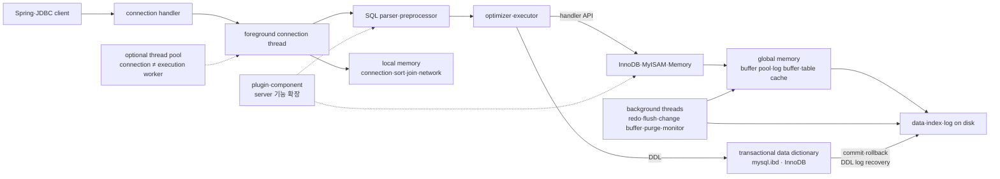

### 암기 비유

```text
MySQL 엔진 = 머리: 접속을 받고 SQL을 이해해 계획·지휘
handler API = 신경: 공통 명령을 스토리지 엔진으로 전달
스토리지 엔진 = 손발: engine 고유 방식으로 page·record를 읽고 씀
```

`손발`은 단순한 장치라는 뜻은 아니다. InnoDB는 transaction, MVCC, lock, buffer pool, redo·undo처럼 데이터 접근과 일관성의 핵심 동작도 담당한다.

## 사용자 정리 원문

### 2026-08-14 · 4.1.1 전체 구조와 4.1.2.1 foreground thread

<details>
<summary>보존된 원문 펼치기</summary>

```text
04 아키텍처
MySQL 엔진: 머리 역할
스토리지 엔진: 손발 역할 (핸들러 API를 만족하면 누구든지 스토리지 엔진을 구현해서 MySQL 서버에 추가해서 사용할 수 있음)


4.1 MySQL 엔진 아키텍쳐

-첨부한 이미지 사용

4.1.1.1 MySQL 엔진
클라이언트로부터의 접속 및 쿼리 요청을 처리하는 커넥션 핸들러와 SQL 파서 및 전처리기, 쿼리 최적화 실행을 위한 옵티마이저가 중심을 이룸

4.1.1.2 스토리지 엔진
실제 데이터를 디스크 스토리지에 저장하거나 디스크 스토리지로부터 데이터를 읽어오는 부분은 스토리지 엔진이 전담

MySQL 서버에서 MySQL엔진은 하나지만 스토리지 엔진은 여러개 동시 사용 가능

각 스토리지 엔진은 성능 향상을 위해 키 캐시(MyISAM 스토리이엔진)나 InnoDB 버퍼 풀 (InnoDB 스토리지 엔진)과 같은 기능을 내장하고 있다.

4.1.1.3 핸들러 API

핸들러 요청: MySQL엔진의 쿼리 실행기에서 데이터를 쓰거나 읽어야할 때 각 스토리지 엔진에 쓰기 또는 읽기를 요청
핸들러 API: 핸들러 요청할 때 사용하는API

SHOW GLOBAL STATUS LIKE 'Handler%'; 명령으로 이 핸들러 API를 통해 얼마나 많은 데이터(레코드) 작업이 있었는지 확인 가능


4.1.2 MySQL 스레딩 구조

MySQL은 프로세스 기반이 아니라 스레드 기반으로 작동하며, 크게 포그라운드 스레드와 백그라운드 스레드로 구분할 수 있다.

실행 중인 스레드 목록은 performance_schema 데이터 베이스의 threads 테이블을 통해 알 수 있다.

백그라운드 스레드가 대부분이고 포그라운드 스레드가 소수 (41: 3 비중)

포그라운드 스레드 중에 'thread/sql/one_connection' 스레드만 실제 사용자의 요청을 처리하는 포그라운드 스레드 (다른 스레드는 뭐하고 있는걸까)

백그라운드 스레드는 MySQL 서버 설정에 따라 가변적일 수 있음

동일한 이름의 스레드가 2개 이상씩 보이는 것은 MySQL 서버의 설정 내용에 의해 여러 스레드가 동일 작업을 병렬로 처리하는 경우

4.1.2.1 포그라운드 스레드(클라이언트 스레드)

**포그라운드 스레드는 최소한 MySQL 서버에 접속된 클라이언트 수만큼 존재하며, 주로 각 클라이언트 사용자가 요청하는 쿼리 문장을 처리**

**클라이언트 사용자가 작업을 마치고 커넥션을 종료하면 해당 커넥션을 담당하던 스레드는 다시 스레드 캐시(Thread cache)로 되돌아간다.**

**이때 이미 스레드 캐시에 일정 개수 이상의 대기 중인 스레드가 있으면 스레드 캐시에 넣지 않고 스레드를 종료시켜 일정 개수의 스레드만 스레드 캐시에 존재**

**이때 스레드 캐시에 유지할 수 있는 최대 스레드 개수는 thread\_cache\_size 시스템 변수로 설정**


포그라운드 스레드는 **데이터를 MySQL의 데이터 버퍼나 캐시로부터 가져오며, 버퍼나 캐시에 없는 경우에는 직접 디스크의 데이터나 인덱스 파일로부터 데이터를 읽어와서 작업을 처리한다.**
MyISAM 테이블은 디스크 쓰기 작업까지 포그라운드 스레드가 처리하지만(MyISAM도 지연된 쓰기가 있지만 일반적인 방식 x)
InnoDB 테이블은 데이터 버퍼나 캐시까지만 포그라운드 스레드가 처리하고, 나머지 버퍼로부터 디스크까지 기록되는 작업은 백그라운드 스레드가 처리함

(추가하면 좋을 내용: 데이터 버퍼나 캐시에서 데이터를 가져오고 없으면 데이터를 인덱스 파일로부터 읽어와서 작업을 처리한다고 했는데, 이 케이스를 스레드, 스레드 풀, 버퍼, 캐시, 인덱스, 디스크 를 포함한 각각의 데이터를 읽어오는 프로세스를 적으면 좋겠음)

*MySQL에서 사용자 스레드 = 포그라운드 스레드. 클라이언트가 MySQL 서버에 접속하면 MySQL서버는 그 클라이언트의 요청을 처리해줄 스레드를 생성해 그 클라이언트에게 할당함. 즉, DBMS 앞단에서 클라이언트와 통신하는 스레드이므로 포그라운드 스레드이며, 사용자 요청을 처리하기에 사용자 스레드라고함.
(추가하면 좋을 내용 스레드 고갈의 케이스, 스레드 풀의 스레드와 다른 것인지 등)
```

</details>

### 2026-08-14 · 4.1.2.2 background thread와 4.1.3 memory

<details>
<summary>보존된 원문 펼치기</summary>

```text
4.1.2.2 백그라운드 스레드

InnoDB의 경우 인서트 버퍼를 병합하는 스레드, 로그를 디스크로 기록하는 스레드, InnoDB 버퍼 풀의 데이터를 디스크에 기록하는 스레드, 데이터를 버퍼로 읽어오는 스레드, 잠금이나 데드락을 모니터링하는 스레드(이게 잠금을 보고잇구나....!)

가장 중요한 것: 로그 스레드, 버퍼 데이터를 디스크로 내려쓰기하는 작업 처리하는 스레드인 쓰기 스레드

InnoDB에서도 읽기 작업은 클라이언트 스레드에서 처리되기 때문에 읽기 스레드는 많이 설정할 필요가 없지만, 쓰기 스레드는 아주 많은 작업을 백그라운드로 처리하기 때문에 일반적인 내장 디스크를 사용할 때는 2~4 정도, DAS나 SAN과 같은 스토리지를 사용할 때는 디스크를 최적으로 사용할만큼 충분히 사용하는 것이 좋다. (DAS와 SAN이 뭐지)


쓰기 작업은 지연처리가 가능하지만, 읽기 작업은 절대 지연 될 수 없음(요청 결과를 10분 후에 주겠다는 DBMS는 없다)
그래서 쓰기는 버퍼링해서 일괄 처리하는 기능이 탑재됨
-> 그래서 InnoDB는 DML로 데이터가 변경 처리되는 경우 데이터가 디스크 데이터 파일로 완전히 저장될 때까지 기다리지 않아도 된다.
(MyISAM 스토리지 엔진은 사용자 스레드가 쓰기 작업까지 함께해야해서 버퍼링 기능 x)

4.1.3 메모리 할당 및 사용 구조

메모리 공간은 크게 글로벌 메모리, 로컬 메모리로 구분
글로벌 메모리 영역의 모든 메모리 공간은 MySQL 서버가 시작되면서 운영체제로부터 할당
(100% 할당할 수도 있고, 그 공간만큼 예약해두고 필요할 때 조금씩 할당해주는 경우도 있다. 즉, 설정해둔만큼 할당)

4.1.3.1 글로벌 메모리 영역
클라이언트 스레드 수와 무관하게 하나의 메모리 공간만 할당
단, 필요에 따라 2개 이상의 메모리 공간을 할당받을 수도 있지만, 클라이언트의 스레드 수와 무관함
(OS에서 스레드와 메모리의 할당관계 첨부해줘)

대표적인 글로벌 메모리 영역
테이블 캐시
InnoDB 버퍼풀
InnoDB 어댑티브 해시 인덱스
InnoDB 리두 로그 버퍼

4.1.3.2 로컬 메모리 영역
= 세션 메모리 영역(클라이언트와 MySQL 서버와의 커넥션을 세션이라하기 때문)

MySQL 서버상에 존재하는 클라이언트 스레드가 쿼리를 처리하는데 사용하는 영역
커넥션 버퍼와 정렬 버퍼가 대표적

one_request_per_one_thread 에서 클라이언트가 사용하는 메모리 공간이라 클라이언트 메모리 영역이라고도 함

로컬 메모리(= 세션 메모리, 클라이언트 메모리)는 각 클라이언트 스레드별로 독립적으로 할당 / 절대 공유 x

글로벌에 비해 메모리 공간을 대략적으로 설정하지만, 희박함에도 적절한 공간 설정이 필요하다.

각 쿼리의 용도에 따라 메모리 할당을 할수도 있고 안 할수도 있음(필요할 때만 할당)
- 예: 정렬 버퍼, 조인 버퍼
로컬 메모리 공간은 열려있는 동안 계속 할당된 상태로 남아있는 공간도 있음
- 커넥션 버퍼나 결과 버퍼

*여기서 반복적으로 표현하는 버퍼가 어떤 의미인지 적어두기 메모리? OS에서의 내용인가

대표적인 로컬 메모리 영역
정렬 버퍼
조인 버퍼
바이너리 로그 캐시
네트워크 버퍼
```

</details>

### 2026-08-14 · 4.1.4 plugin부터 4.1.9 thread pool

<details>
<summary>보존된 원문 펼치기</summary>

```text
4.1.4 플러그인 스토리지 엔진 모델
전문 검색 엔진을 위한 검색어 파서 플러그인 개발

비밀번호 검증, 커넥션 제어 등 다양한 플러그인이 있음


*핸들러를 통해 MySQL 엔진이 각 스토리지 엔진에게 데이터를 읽어오거나 저장하도록 명령할 수 있다는걸 기억하자

상태변수 중 Handler_로 시작하는게 많음 (이런 상태 변수는 MySQL 엔진이 각 스토리지엔진에 명령을 보낸 횟수를 의미하는 변수)

중요한 내용 (리딩 포인트): 하나의 쿼리 작업은 여러 하위 작업으로 나뉘는데, 각 하위 작업이 MySQL 엔진영역에서 처리되는지 스토리지 엔진영역에서 처리되는지 구분할 수 있어야한다

4.1.5 컴포넌트
8.0부터는 플러그인 아키텍쳐를 대체하기 위해 컴포넌트 아키텍쳐가 지원

플러그인의 단점을 개선한게 컴포넌트
플러그인 단점
- 오직 MySQL 서버와 인터페이스할 수 있음(?), 플러그인끼리 통신 불가능
- 플러그인은 MySQL 서버의 변수나 함수를 직접 호출하기 때문에 안전하지 않음(캡슐화 x)
- 플러그인은 상호 의존관계 설정이 불가능해 초기화 어려움

4.1.6 쿼리 실행 구조 (중요)

사진

4.1.6.1 쿼리 파서
사용자 요청으로 들어온 쿼리를 토큰으로 분리해 트리형태의 구조로 만드는 작업(MySQL이 인식가능한 최소단위(토큰)로 만드는 것)
문법 오류가 여기서 일어남

4.1.6.2 전처리기
파서 트리를 기반으로 쿼리 문장에 구조적 문제가 있는지 확인
각 토큰을 테이블 이름, 칼럼 이름, 내장 함수 같은 개체를 매핑해 해당 객체의 존재여부와 접근 권한 확인

4.1.6.3 옵티마이저
가장 저렴한 비용으로 가장 빠르게 처리할 수 있도록 처리 (DBMS의 두뇌)
(추후 더 자세히)

4.1.6.4 실행 엔진
옵티마이저가 계획한 일을 실행 엔진이 핸들러에게 전달
예: GROUP BY를 처리하기 위해 옵티마이저가 임시 테이블을 사용하기로 결정
1. 실행 엔진 -> 핸들러 : 임시테이블 만들라고 요청
2. 실행 엔진 -> 핸들러 : WHERE 절에 일치하는 레코드 읽어오라고 요청
3. 실행 엔진 -> 핸들러 : 읽어온 레코드를 1번에서 준비한 임시 테이블에 저장하라고 요청
4. 실행 엔진 -> 핸들러 : 준비된 임시 테이블에서 필요한 방식으로 데이터를 읽어오라고 요청
5. 실행 엔진 : 결과를 사용자나 다른 모듈로 넘김

4.1.6.5 핸들러(스토리지 엔진)
MySQL 실행 엔진의 요청에 따라 데이터를 디스크로 저장하고 읽어오는 역할
즉, 핸들러가 결국 스토리지 엔진을 의미하며 InnoDB 테이블을 조작하면 핸들러가 InnoDB 스토리지 엔진이 된다.


4.1.7 복제
16장에서 다시 다룰 예정

4.1.8 쿼리 캐시
SQL의 실행 결과를 메모리에 캐시하고, 동일 SQL 쿼리가 실행되면 테이블 읽지 않고 전달.
단, 데이터가 변경되면 캐시 삭제 후 전달하는 문제가 있어 여러 문제 유발로 인해 8.0은 완전히 삭제됨

4.1.9 스레드 풀 (중요)
커뮤니티에서는 엔터프라이즈에 있는 스레드 풀 기능을 사용하지 못하고 Percona Server 플러그인에서 제공하는 스레드 풀을 사용해야함 (그럼 내가 여태까지 사용한 MySQL은 다 엔터프라이즈였는지? AWS RDBS나 docker에 직접 띄우는 차이 궁금)

스레드 풀은 내부적으로 사용자의 요청을 처리하는 스레드 개수를 줄여서 동시 처리되는 요청이 많다하더라도 MySQL 서버의 CPUI가 제한된 개수의 스레드 처리에만 집중할 수 있게 해서 서버의 자원 소모를 줄이는 것이 목적

스레드 풀이 실제 서비스에서 눈에 띄는 성능향상을 보여주는 경우는 드물고, 동시에 실행 중인 스레드들을 CPU가 최대한 잘 처리할 수 있도록 줄여서 빨리 처리하는 기능이기 때문에(이해 잘 안 됐음) 스케줄링 과정에서 CPU 시간을 제대로 확보하지 못하는 경우에는 쿼리 처리가 더 느려지기도 함

물론 제한된 수의 스레드만으로 CPU가 처리하도록 적절히 유도하면 CPU의 Processor affinity도 높이고 불필요한 OS의 Context switch도 줄여 오버헤드를 줄일 수 있음


기본적으로 Percona Server의 스레드 풀은 CPU 코어 개수만큼 스레드 그룹을 생성하는데 스레드 그룹 수는 thread_pool_size 시스템 변수를 변경해서 조정할 수 있다. 일반적으로는 코어수에 맞추는게 Processor affinity에 좋다 (Processor affinity가 뭔지 적기)

이미 스레드 풀이 처리 중인 작업이 있으면 thread_pool_oversubscribe 시스템 변수(default: 3)에 설정된 수 만큼 추가로 더 받아서 처리한다.
이 값이 너무 크면 스케줄링할 스레드가 많아져 비효율적으로 작동할 수 있다.

스레드 그룹의 모든 스레드가 일을 처리하고 있다면, 스레드 풀은 해당 스레드 그룹에 새로운 작업 스레드(Worker thread)를 추가지, 아니면 기존 작업 스레드가 처리를 완료할 때까지 기다릴지 여부 판단
스레드 풀의 타이머 스레드는 주기적으로 스레드 그룹의 상태를 체크해서 thread_pool_stall_limit 시스템 변수에 정의된 밀리초만큼 작업 스레드가 지금 처리 중인 작업을 끝내지 못하면 새로운 스레드 생성 후 스레드 그룹에 추가
이때 전체 스레드 풀에 있는 스레드 개수는 thread_pool_max_threads 로 설정된 개수를 넘어설 수 없다. 즉, 모든 스레드 그룹의 스레드가 각자 작업을 처리하고 있는 상태에서 새로운 쿼리 요청이 들어오더라도 스레드 풀은 thread_pool_stall_limit 시간 동안 기다려야만 새로운 요청을 처리할 수 있다. 따라서 응답 시간에 아주 민감한 서비스면 thread_pool_stall_limit 시스템 변수를 적절히 낮춰서 설정해야함. 0은 권장하지 않음(그정도면 스레드 풀을 사용하지 않는게 맞음)

(매우 중요한 부분. mermaid로 시각화해야하고, 여기 나오지 않은 max까지 차고 thread_pool_stall_limit을 모두 기다렸을 때 어떻게 처리되는지 작성할것)

 Percona Server의 스레드 풀 플러그인은 선순위 큐와 후순위 큐를 이용해 특정 트랜잭션이나 쿼리를 우선적으로 처리할 수.있는 기능 제공. 먼저 시작된 트랜잭션 내 속한 SQL을 빨리 처리해주면 해당 트랜잭션이 가지고 있던 잠금이 빨리 해제되고, 잠금 경합을 낮춰서 전체적인 처리 성능을 향상시킬 수 있음
```

</details>

### 2026-08-14 · 4.1.10 transaction-supported metadata

<details>
<summary>보존된 원문 펼치기</summary>

```text
4.1.10 트랜잭션 지원 메타데이터

8.0부터 데이터 딕셔너리와 시스템 테이블이 모두 트랜잭션 기반의 InnoDB 스토리지 엔진에 저장되도록 개선되면서 이제 스키마 변경 작업 중간에 MySQL 서버가 비정상적으로 종료되더라도 완전한 성공 또는 실패로 정리된다
```

</details>

## 4.1 MySQL 엔진 아키텍처

### 4.1.1 MySQL의 전체 구조

![[assets/book-photos/real-mysql-8-0-1/04-아키텍쳐/4.1-MySQL-엔진-아키텍쳐/04-01-MySQL-전체-구조.JPG]]

> [!note] 사진 읽는 순서
> `programming API → connection handler → parser·optimizer → storage engine API → storage engine cache·buffer → data·log file` 순으로 위에서 아래로 읽는다.

#### 4.1.1.1 MySQL 엔진

사용자의 정리처럼 MySQL 엔진은 서버의 `머리`에 해당한다.

- connection handler: client 접속, 인증된 connection과 session을 관리한다.
- SQL interface: client가 보낸 SQL 요청을 받는다.
- parser: SQL을 token과 syntax tree 형태로 해석하고 문법을 검사한다.
- preprocessor: table·column 존재, 권한과 semantic validity 등을 확인한다.
- optimizer: 가능한 실행 방법의 비용을 비교해 실행 계획을 선택한다.
- executor: 계획을 실행하면서 storage engine에 row 접근을 요청한다.

MySQL server instance에는 공통 server layer인 MySQL 엔진이 하나 있고, 그 아래에 여러 storage engine을 설치할 수 있다.

#### 4.1.1.2 스토리지 엔진

스토리지 엔진은 실제 data I/O와 engine 고유 기능을 담당한다.

| 엔진 | 대표 memory 계층 | 특징 |
|---|---|---|
| InnoDB | buffer pool | data·index page를 함께 cache하고 transaction·MVCC·row lock·redo·undo 지원 |
| MyISAM | key cache | 주로 index block을 cache하고 transaction을 지원하지 않음 |
| MEMORY | memory | data를 memory에 두며 재시작 후 영속성을 기대할 수 없음 |

여러 엔진을 동시에 사용한다는 뜻은 서로 다른 table이 서로 다른 engine을 선택할 수 있다는 의미다. 일반적으로 table 하나의 data 접근은 지정된 storage engine 하나가 담당한다.

스토리지 엔진은 공통 plugin·handler 계약을 구현해 추가할 수 있다. 다만 “누구든지 API만 맞추면 즉시 안전하게 사용할 수 있다”는 뜻은 아니다. transaction semantics, crash recovery, optimizer 통계, locking과 운영 검증까지 구현·확인해야 한다.

#### 4.1.1.3 Handler API

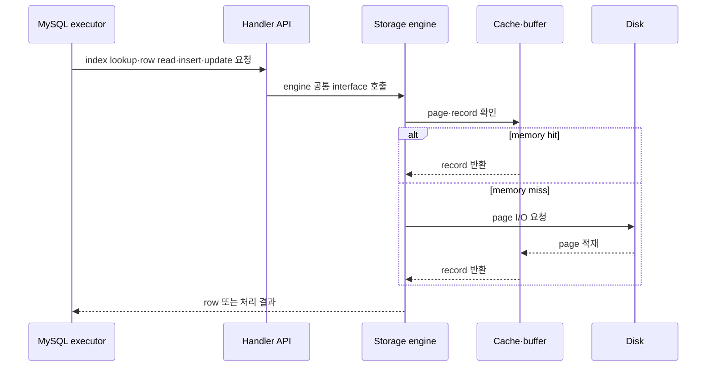

`SHOW GLOBAL STATUS LIKE 'Handler%';`는 handler layer의 **요청 횟수**를 보여 준다. byte 양이나 실제 physical disk I/O 횟수를 직접 나타내는 지표는 아니다.

| 지표 | 의미 | 해석 예시 |
|---|---|---|
| `Handler_read_key` | key를 이용한 row read 요청 | index lookup 사용량 |
| `Handler_read_next` | index 순서상 다음 row 요청 | range scan·index scan |
| `Handler_read_rnd_next` | data의 다음 row 요청 | 높으면 full table scan 가능성 확인 |
| `Handler_write` | row insert 요청 | write workload와 연결 |
| `Handler_update` | row update 요청 | update workload와 연결 |
| `Handler_delete` | row delete 요청 | delete workload와 연결 |

GLOBAL 값은 server 전체 누적이므로 workload 전후의 차이를 비교한다. 한 connection의 실험은 `SHOW SESSION STATUS LIKE 'Handler%';`가 구분하기 쉽다.

### 4.1.2 MySQL 스레딩 구조

![[assets/book-photos/real-mysql-8-0-1/04-아키텍쳐/4.1-MySQL-엔진-아키텍쳐/04-02-MySQL-스레딩-구조.JPG]]

MySQL server는 하나의 `mysqld` process 안에서 여러 thread가 역할을 나눠 동작한다. Performance Schema는 thread마다 한 row를 제공하며 `TYPE`을 `FOREGROUND`와 `BACKGROUND`로 구분한다.

```sql
SELECT TYPE, NAME, COUNT(*)
FROM performance_schema.threads
GROUP BY TYPE, NAME
ORDER BY TYPE, NAME;
```

#### 현재 realmysql 8.0.44 스냅샷

2026-08-14에 읽기 전용으로 확인한 결과다.

| TYPE | 개수 |
|---|---:|
| BACKGROUND | 35 |
| FOREGROUND | 4 |

사용자가 본 `41:3`과 현재 `35:4`가 다른 것은 정상이다. connection, MySQL 설정, enabled plugin, server 작업 상태에 따라 생성·종료되는 thread가 달라지므로 **비율은 외울 값이 아니다.**

foreground 4개는 다음과 같았다.

| NAME | 개수 | 역할 |
|---|---:|---|
| `thread/sql/one_connection` | 2 | classic protocol client connection 처리 |
| `thread/sql/event_scheduler` | 1 | scheduled event 실행을 관리하는 내부 thread |
| `thread/sql/compress_gtid_table` | 1 | GTID table 압축 관련 내부 작업 |

즉 `TYPE=FOREGROUND`가 모두 client query thread라는 뜻은 아니다. client session과 직접 대응하는 대표 이름이 `thread/sql/one_connection`이다. background thread는 `PROCESSLIST_ID`와 client user가 없으며 내부 server 작업을 수행한다.

#### 다른 background thread는 무엇을 하는가?

현재 실습 instance에서 다음 범주가 보였다.

| 범주 | 실제 이름 예 | 하는 일 |
|---|---|---|
| InnoDB data I/O | `io_read_thread`, `io_write_thread` | page read·write I/O 요청 처리 |
| dirty page flush | `page_flush_coordinator_thread` | buffer pool의 dirty page flushing 조정 |
| redo | `log_writer`, `log_flusher`, `log_checkpointer` | redo write·flush·checkpoint pipeline |
| purge·worker | `srv_purge_thread`, `srv_worker_thread` | 오래된 undo record 정리와 내부 병렬 작업 |
| 통계·FTS | `dict_stats_thread`, `fts_optimize_thread` | 통계 갱신·full-text index 유지 |
| server 운영 | `thread/sql/main`, `signal_handler` | server main loop·signal 처리 |
| MySQL X Protocol | `mysqlx/acceptor_network`, `mysqlx/worker` | X Protocol connection accept·처리 |

`io_read_thread`와 `io_write_thread`가 각각 4개처럼 같은 이름이 여러 번 보이면 동일 작업을 병렬 처리하도록 설정된 경우다. 정확한 종류와 개수는 version·설정·plugin에 따라 달라진다.

#### 4.1.2.1 포그라운드 스레드(클라이언트 스레드)

기본 `thread_handling=one-thread-per-connection` 모델에서는 client connection마다 connection thread가 대응해 statement를 처리한다. connection이 끝나면 thread를 바로 폐기하지 않고 `thread_cache_size` 한도 안에서 cache해 다음 connection에 재사용할 수 있다.

현재 실습값:

```text
thread_handling = one-thread-per-connection
thread_cache_size = 9
max_connections = 151
```

`thread_cache_size`는 동시 실행량을 제한하는 thread pool 크기가 아니다. **종료된 connection thread를 재사용하는 대기실의 최대 크기**다. cache가 비어 있을 때만 새 thread를 만든다.

효율은 다음을 함께 본다.

```sql
SHOW GLOBAL STATUS
WHERE Variable_name IN (
  'Connections', 'Threads_created', 'Threads_cached',
  'Threads_connected', 'Threads_running'
);
```

- `Connections`: 접속 시도 누적
- `Threads_created`: 새로 생성한 connection thread 누적
- `Threads_cached`: 현재 재사용 대기 thread
- `Threads_connected`: 현재 열린 connection
- `Threads_running`: sleep하지 않고 실행 중인 thread

#### thread cache, MySQL thread pool, HikariCP, Tomcat pool 차이

| 계층 | pool·cache 대상 | 목적 |
|---|---|---|
| Tomcat | HTTP request worker thread | 들어온 web request 실행량 관리 |
| HikariCP | JDBC connection | DB connection 생성 비용 절약과 application별 동시 DB 사용량 제한 |
| MySQL thread cache | 종료된 connection thread | 새 OS thread 생성 비용 절약; 실행 동시성 제어 아님 |
| MySQL Enterprise Thread Pool | statement execution thread group | 많은 connection과 실제 실행 thread를 분리해 server 내부 병렬성 제한 |

MySQL Community Server의 기본 모델은 one-thread-per-connection이다. 공식 MySQL Enterprise Thread Pool은 상용 plugin인 별도 실행 모델이다. 따라서 책의 `thread cache`를 일반적인 executor thread pool로 해석하면 안 된다.

#### cache·index·disk를 포함한 SELECT 흐름

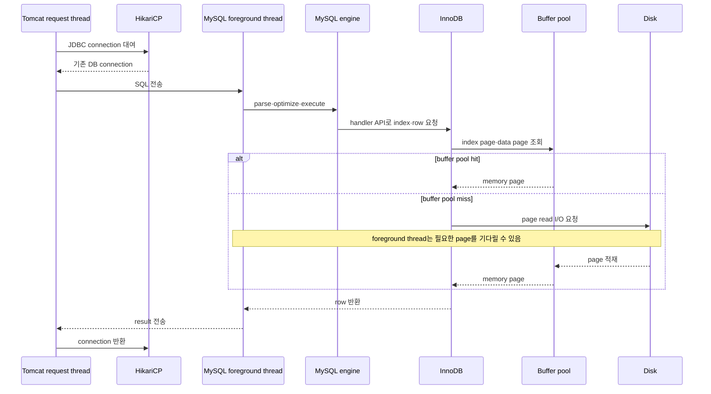

index도 별도 마법 구조가 아니라 storage engine이 관리하는 page들이다. B-tree를 탐색할 때 필요한 root·branch·leaf page가 buffer pool에 있으면 memory에서 읽고, 없으면 disk에서 page를 읽어 buffer pool에 올린 뒤 계속 탐색한다.

Linux native AIO에서는 query thread가 I/O를 OS에 dispatch하고 InnoDB background thread가 completion event를 처리할 수 있다. 따라서 “foreground가 언제나 직접 blocking system call로 disk를 읽는다”로 고정해 이해하지 않는다. 핵심은 **query를 진행하려면 필요한 page가 memory에 올 때까지 해당 요청이 I/O wait를 겪는다**는 것이다.

#### InnoDB WRITE 흐름

```text
foreground thread
→ InnoDB buffer pool page 변경(dirty page)
→ undo·redo 생성
→ commit durability 규칙에 따라 redo flush
→ page cleaner·I/O background thread가 dirty page를 data file로 flush
```

commit 때마다 모든 data page를 즉시 data file에 쓰는 것이 아니다. redo log가 crash recovery를 보장하고, dirty data page는 background page cleaner가 checkpoint·dirty page 상태와 I/O capacity를 고려해 내려 쓴다.

MyISAM은 InnoDB 같은 buffer pool·redo·background flushing 구조를 사용하지 않는다. key cache는 주로 index block을 대상으로 하며, foreground thread의 data file I/O 책임이 더 직접적이다.

#### 스레드 고갈·과다 동시성

`thread cache가 비었다`와 `server가 동시 요청을 감당하지 못한다`는 다른 문제다.

| 상황 | 사용자 증상 | 확인 지표 | 먼저 할 일 |
|---|---|---|---|
| `max_connections` 도달 | 새 연결에 `Too many connections` | `Threads_connected`, `Connection_errors_max_connections` | Hikari pool 총합·connection leak·긴 transaction 확인 |
| active query 과다 | 전체 latency 상승·CPU 포화 | `Threads_running`, CPU, context switch, wait event | 느린 SQL·pool 크기·동시성 제한 |
| lock wait 증가 | connection은 있으나 처리 정체 | data lock wait, transaction age | transaction 범위·접근 순서·index 확인 |
| I/O queue 증가 | buffer miss 시 응답 급증 | I/O latency, buffer pool read, pending I/O | query plan·working set·storage 확인 |
| connection churn | 접속 순간 CPU 증가 | `Connections` 대비 `Threads_created` | Hikari 재사용과 `thread_cache_size` 확인 |
| thread별 memory 압박 | OOM·swap·급격한 latency | connection 수, thread stack, sort·join buffer | connection budget과 query별 memory 제한 |

`thread_cache_size`만 키워서는 max connection, 느린 query, lock, CPU·I/O 포화가 해결되지 않는다.

#### 4.1.2.2 백그라운드 스레드

foreground thread가 **지금 요청의 결과를 만드는 경로**라면, InnoDB background thread는 요청과 분리할 수 있는 I/O·정리·감시 작업을 계속 수행한다.

| 역할 | 무엇을 하는가 | 요청과의 관계 |
|---|---|---|
| change buffer merge | secondary index page가 buffer pool로 읽힐 때 미뤄 둔 변경을 실제 page에 병합 | 과거 명칭이 `insert buffer`; 현재는 insert·delete·purge까지 포괄하는 `change buffer` |
| redo log | redo record를 log buffer에서 redo file로 write·flush하고 checkpoint 진행 | commit durability의 핵심 경로 |
| page cleaner·write I/O | dirty page를 buffer pool에서 data file로 flush | data page write를 transaction 응답과 분리 |
| read I/O | read-ahead와 asynchronous page read 요청 처리 | 일반 query의 논리적 read는 foreground가 진행하지만 background read I/O도 존재 |
| purge | MVCC에서 더 이상 필요 없는 undo record와 delete-marked record 정리 | 오래 밀리면 undo·history가 커질 수 있음 |
| lock·deadlock | wait-for 관계를 검사하고 deadlock을 발견하면 victim transaction을 rollback | 최근 deadlock은 InnoDB Monitor에서 확인 가능 |

“잠금을 모니터링하는 background thread 하나가 모든 lock을 계속 감시한다”로 고정해 외우지는 않는다. InnoDB에는 내부 monitor와 deadlock detection mechanism이 있고, lock wait가 생길 때 wait-for graph를 검사해 cycle을 찾는다. `performance_schema.data_locks`·`data_lock_waits`는 현재 lock 관계, `SHOW ENGINE INNODB STATUS`는 최근 deadlock과 InnoDB 상태를 보는 관측 창이다.

> [!important] 가장 먼저 잡을 두 축
> **redo log thread는 변경 사실의 내구성**, **page cleaner·write I/O thread는 dirty data page의 후속 기록**을 맡는다. redo가 먼저 안전하게 남아 있으면 모든 data page를 commit 순간에 즉시 data file에 쓸 필요가 없다.

##### 읽기는 foreground인데 `innodb_read_io_threads`는 왜 있는가?

“읽기 작업은 client thread가 처리한다”는 말은 query의 index 탐색·row 처리·결과 반환 책임이 foreground 요청 경로에 있다는 뜻이다. buffer pool miss가 나면 요청은 필요한 page를 기다려야 하므로 read latency를 임의로 10분 뒤로 미룰 수 없다.

하지만 InnoDB에는 read-ahead와 asynchronous I/O completion을 담당하는 background read I/O thread도 있다. 따라서 다음 둘을 함께 기억한다.

```text
query의 논리적 read와 응답 책임 = foreground thread
page를 미리 읽거나 비동기 I/O를 처리하는 실행 계층 = background read I/O thread
```

MySQL 8.0의 `innodb_read_io_threads`와 `innodb_write_io_threads` 기본값은 각각 `4`이며, 각 background I/O thread는 최대 256개의 pending I/O request를 처리할 수 있다. 두 변수는 8.0에서 동적으로 바꿀 수 없으므로 설정 파일 변경과 재시작이 필요하다.

현재 `realmysql 8.0.44` 실습값:

```text
innodb_read_io_threads  = 4
innodb_write_io_threads = 4
innodb_io_capacity      = 200
```

thread 수를 스토리지 이름만 보고 늘리지 않는다. `SHOW ENGINE INNODB STATUS`의 pending read·write, 실제 device latency·IOPS·throughput, CPU 사용률을 보고 기본값으로 장치를 충분히 사용하지 못할 때 조정한다.

##### DAS와 SAN

| 구분 | 뜻 | OS에서 보이는 방식 | 대표 특성 |
|---|---|---|---|
| DAS | Direct Attached Storage | server에 SATA·SAS·NVMe·USB 등으로 직접 연결 | 단순하고 가까우며 한 server 중심 |
| SAN | Storage Area Network | Fibre Channel·iSCSI 같은 전용 network를 통해 block device로 제공 | 여러 server가 storage pool을 공유하고 확장·이중화하기 좋지만 구성 복잡 |

SAN이 언제나 단일 local disk보다 빠르다는 뜻은 아니다. 현대 NVMe DAS도 매우 빠르고, SAN도 fabric·controller·shared workload에 따라 latency가 달라진다. 책의 요지는 **병렬 I/O 능력이 큰 storage라면 background I/O concurrency로 그 능력을 충분히 활용할 수 있다**는 것이다.

##### 쓰기는 왜 지연할 수 있는가?

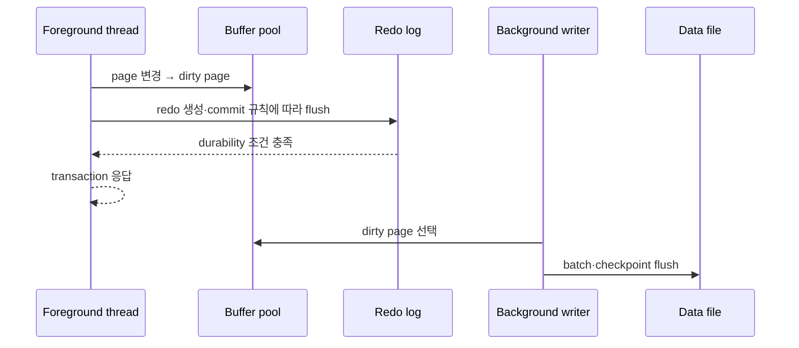

여기서 지연 가능한 것은 주로 **dirty data page를 data file에 기록하는 시점**이다. commit 응답 전에 redo까지 어디에 써야 하는지는 `innodb_flush_log_at_trx_commit` 같은 durability 설정에 따라 달라진다.

### 4.1.3 메모리 할당 및 사용 구조

![[assets/book-photos/real-mysql-8-0-1/04-아키텍쳐/4.1-MySQL-엔진-아키텍쳐/04-03-MySQL-메모리-할당-구조.JPG]]

> [!note] 사진 읽는 순서
> 왼쪽은 connection 수와 직접 비례하지 않는 server 공유 영역, 오른쪽은 connection·query마다 독립적으로 필요해지는 영역이다. 실제 구현은 component별 allocation 방식과 lifetime이 다르므로 “global은 무조건 하나, local은 접속 즉시 최대치 전부 할당”으로 고정하지 않는다.

| 구분 | 소유·공유 | 주된 lifetime | 위험 |
|---|---|---|---|
| global memory | mysqld process의 여러 thread가 공유 | server 또는 component lifetime | 너무 크면 server 시작·상시 RSS·다른 process memory 압박 |
| local memory | connection·session·thread 또는 statement별 논리적 전용 | connection·transaction·statement lifetime | 작은 설정도 동시 session·operation 수와 곱해져 순간 OOM 가능 |

#### OS에서 process·thread와 memory의 관계

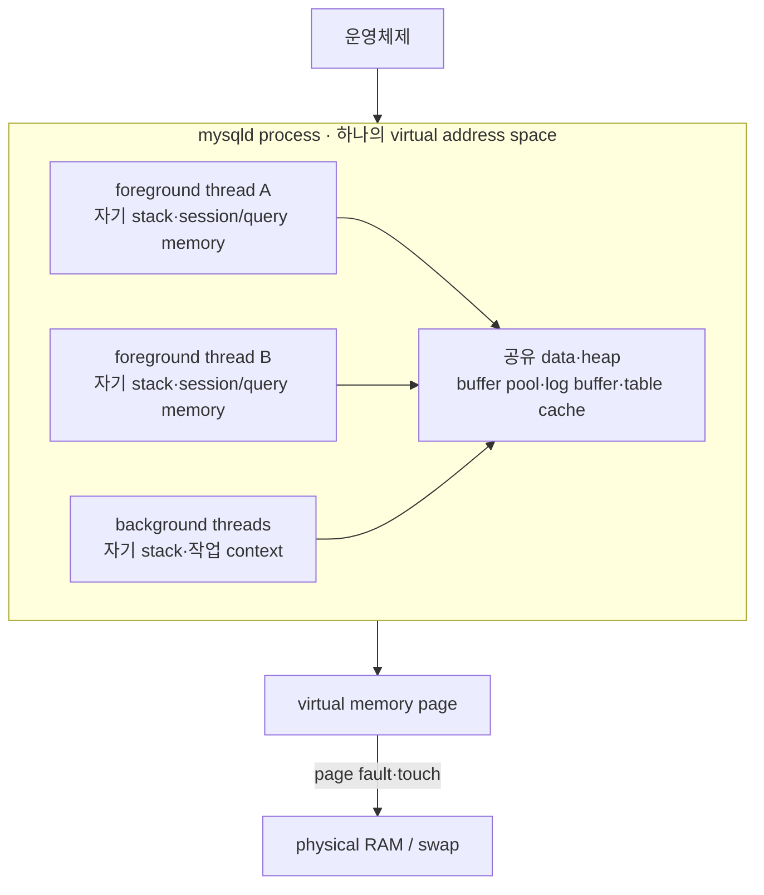

POSIX thread들은 같은 process의 global data와 heap을 공유하지만 각자 stack을 가진다. MySQL의 `local memory`는 별도 process memory가 아니라 **같은 mysqld address space 안에서 특정 session·thread·statement가 논리적으로 소유하는 allocation**이다.

OS에서 memory를 받는 방식은 component별로 다르다. 예를 들어 InnoDB buffer pool은 MySQL 8.0에서 server 시작 시 설정 크기 전체를 `malloc()`으로 할당한다. 반면 Performance Schema와 sort buffer 같은 영역은 실제 load·statement에 따라 점진적으로 할당될 수 있다. virtual address 예약, 실제 RAM resident, MySQL 설정값을 같은 값으로 단정하지 않는다.

#### 4.1.3.1 글로벌 메모리 영역

대표적인 global 영역은 다음과 같다.

| 영역 | 역할 | 설정·주의 |
|---|---|---|
| InnoDB buffer pool | data·index page cache, dirty page 보관 | `innodb_buffer_pool_size`; 현재 실습 `128 MiB` |
| InnoDB redo log buffer | redo record를 redo file에 내리기 전 보관 | `innodb_log_buffer_size` |
| MyISAM key cache | MyISAM index block cache | `key_buffer_size` |
| table cache | 열린 table object 재사용 | `table_open_cache`; memory뿐 아니라 file descriptor도 사용 |
| adaptive hash index | 자주 접근하는 B-tree pattern을 hash로 가속 | global 성격이지만 buffer pool page를 바탕으로 하며 별도 고정 크기 pool로 외우지 않음 |

global 영역이 개념적으로 하나라는 말은 **client connection마다 하나씩 복제되지 않는다**는 뜻이다. contention을 줄이기 위해 buffer pool instance나 table cache instance처럼 내부적으로 여러 partition·instance로 나뉠 수 있다.

> [!tip] 이름이 비슷한 log memory
> InnoDB `redo log buffer`는 server 공유 global 영역이다. 반면 `binlog_cache_size`로 시작하는 **binary log transaction cache는 binary log가 활성화되고 transactional engine을 지원할 때 client별로 할당되는 local 영역**이다. 사진의 “바이너리 로그 버퍼”와 per-session “바이너리 로그 캐시”를 같은 대상으로 합치지 않는다.

#### 4.1.3.2 로컬 메모리 영역

MySQL 기본 `one-thread-per-connection` 모델에서 connection thread는 자기 session의 statement를 처리하면서 local memory를 사용한다. 원문의 `one_request_per_one_thread`는 이 문맥에서는 `one-thread-per-connection`으로 정리한다.

| 영역 | 언제 생기는가 | 언제까지 남는가 | 현재 실습 기본값 |
|---|---|---|---:|
| thread stack | thread 생성 | thread 종료 또는 thread cache 재사용 | `1 MiB` |
| connection·result buffer | connection 생성 | connection 동안 base buffer 유지; 필요 시 증가 | `16 KiB`에서 시작, packet에 따라 최대 `64 MiB` |
| sort buffer | sort가 필요한 statement | statement·sort operation 동안 | `256 KiB` 상한, 8.0.12+ 점진 할당 |
| join buffer | index를 쓰지 못하는 join·hash join 등 | join operation 동안; query 하나에 여러 개 가능 | `256 KiB` |
| read·random read buffer | sequential scan·정렬 후 임의 row read 등 | 해당 operation 동안 | `128 KiB`·`256 KiB` |
| binary log cache | binary log가 켜진 transactional 변경 | transaction 동안, 넘치면 temporary file 사용 가능 | `32 KiB` |

그래서 memory 예산을 단순히 `global + local 설정 하나`로 보면 안 된다.

```text
대략적인 peak memory
≈ global baseline
 + 동시 connection의 thread·network·session memory
 + 동시에 실행 중인 query의 sort·join·read·temporary memory
 + InnoDB·Performance Schema·plugin 등 동적 memory
```

`max_connections × (sort_buffer_size + join_buffer_size + ...)`는 모든 buffer가 항상 동시에 최대 할당된다는 뜻은 아니지만, **동시성에 따른 위험을 보는 보수적 경고선**으로는 쓸 수 있다. global 값을 무작정 키우는 것뿐 아니라 per-session 값을 global default로 크게 설정하는 것도 위험하다.

> [!question]- 여기서 반복되는 `buffer`는 메모리인가, OS의 개념인가?
> **답:** buffer는 생산자와 소비자의 속도 차이를 흡수하거나 작은 작업을 모으는 임시 저장 영역이라는 일반 개념이다. 이 절의 buffer pool·sort·join·network buffer는 주로 mysqld process가 OS로부터 할당받은 user-space memory다. 다만 실제 I/O 경로에는 OS page cache, storage controller cache 같은 별도 layer도 존재한다. `cache`는 재사용을 위해 사본을 두는 의미가 강하고 `buffer`는 흐름을 완충하는 의미가 강하지만, InnoDB buffer pool처럼 두 역할을 함께 하는 구조도 있다.

##### memory를 어디서 확인하는가?

Performance Schema memory instrument를 활성화한 환경에서는 다음처럼 global·thread별 memory를 볼 수 있다.

```sql
SELECT EVENT_NAME, CURRENT_NUMBER_OF_BYTES_USED
FROM performance_schema.memory_summary_global_by_event_name
WHERE CURRENT_NUMBER_OF_BYTES_USED > 0
ORDER BY CURRENT_NUMBER_OF_BYTES_USED DESC
LIMIT 20;

SELECT THREAD_ID, EVENT_NAME, CURRENT_NUMBER_OF_BYTES_USED
FROM performance_schema.memory_summary_by_thread_by_event_name
WHERE CURRENT_NUMBER_OF_BYTES_USED > 0
ORDER BY CURRENT_NUMBER_OF_BYTES_USED DESC
LIMIT 20;
```

memory instrument는 기본적으로 일부 비활성일 수 있고 startup allocation까지 관측하려면 server 시작 시 enable해야 한다.

### 4.1.4 플러그인 스토리지 엔진 모델

MySQL의 plugin architecture는 server core를 다시 빌드하지 않고 기능을 추가하는 확장 지점이다. storage engine뿐 아니라 full-text parser, authentication, connection control, audit, clone 등 서로 다른 종류의 plugin이 존재한다.

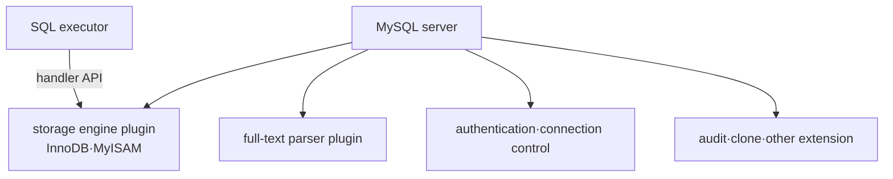

여기서 반드시 기억할 경계는 다음과 같다.

```text
MySQL 엔진이 SQL의 의미와 실행 순서를 결정
→ executor가 handler API로 record 작업을 요청
→ 선택된 storage engine이 index·page·lock·transaction 규칙으로 수행
```

`Handler_%` status는 이 경계에서 발생한 **row operation 요청 횟수**다. 예를 들어 `Handler_read_key`는 key 기반 row read 요청, `Handler_write`는 row insert 요청 횟수다. 하나의 SQL이 여러 row를 읽으면 handler 요청도 여러 번 발생할 수 있고, memory hit도 포함하므로 SQL 수·byte 수·physical I/O 수와 일치하지 않는다.

#### 리딩 포인트: 이 하위 작업은 어느 엔진의 일인가?

| 하위 작업 | 주 책임 영역 | 판단 근거 |
|---|---|---|
| SQL token화·문법 검사 | MySQL 엔진 | parser가 SQL 문법을 해석 |
| table·column·권한 확인 | MySQL 엔진 | preprocessor가 server metadata와 권한 검사 |
| access path·join order 선택 | MySQL 엔진 | optimizer가 비용 비교 |
| 계획 순서대로 다음 row 요청 | MySQL 엔진 | executor가 handler를 호출 |
| B-tree에서 page·record 찾기 | storage engine | InnoDB·MyISAM 고유 자료구조를 사용 |
| buffer pool·key cache 조회 | storage engine | engine별 cache 정책 |
| MVCC·row lock·redo·undo | InnoDB storage engine | transaction·recovery 구현 |
| 결과를 client protocol로 반환 | MySQL 엔진 | server·connection 계층 |

> [!important] handler와 storage engine의 관계
> 학습할 때는 “InnoDB table의 handler가 InnoDB storage engine을 호출한다”로 연결하면 된다. 엄밀히는 handler는 server가 table별 storage engine 구현을 호출하는 공통 interface·객체 계층이고, storage engine 전체 그 자체와 완전히 같은 단어는 아니다.

### 4.1.5 컴포넌트

MySQL 8.0은 plugin의 구조적 한계를 개선하기 위해 component infrastructure를 지원한다.

| plugin의 한계 | component의 개선 방향 |
|---|---|
| plugin은 server와 통신하지만 plugin끼리 직접 통신하기 어려움 | component가 제공·소비하는 named service API로 상호작용 |
| server symbol·function을 직접 호출할 수 있어 캡슐화가 약함 | registry에서 service를 찾아 명시된 interface로 호출 |
| 명시적 dependency 정보가 없어 초기화 순서 관리가 어려움 | 제공·소비 service를 명시해 dependency를 표현 |

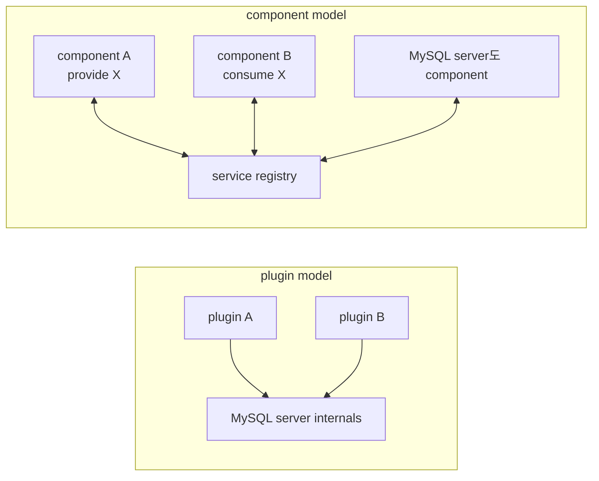

“8.0부터 component가 plugin을 전부 대체했다”는 뜻은 아니다. MySQL 8.0에는 두 infrastructure가 함께 존재하고, keyring처럼 plugin에서 component로 옮겨 가는 기능도 있다. 설치된 대상은 다음처럼 구분해서 확인한다.

```sql
SELECT PLUGIN_NAME, PLUGIN_STATUS, PLUGIN_TYPE
FROM INFORMATION_SCHEMA.PLUGINS;

SELECT * FROM mysql.component;
```

### 4.1.6 쿼리 실행 구조

![[assets/book-photos/real-mysql-8-0-1/04-아키텍쳐/4.1-MySQL-엔진-아키텍쳐/04-04-MySQL-쿼리-실행-구조.jpg]]

> [!note] 사진 읽는 순서
> `SQL 요청 → query parser → preprocessor → optimizer → executor → handler·storage engine → SQL 결과`다. 앞의 네 단계는 계획을 이해·검증·선택·지휘하고, 실제 record 접근은 handler 경계를 넘어간다.

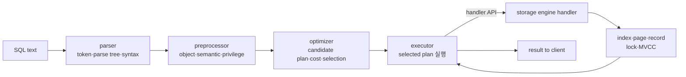

#### 4.1.6.1 쿼리 파서

parser는 SQL text를 MySQL이 인식하는 token으로 나누고 grammar에 맞는 parse tree를 만든다. keyword·identifier·literal·operator 등이 token의 예다. 괄호, keyword 순서, clause 문법 같은 **syntax error**는 이 단계에서 발견된다.

#### 4.1.6.2 전처리기

preprocessor는 parse tree의 token을 실제 schema object와 연결하고 구조적·의미적 유효성을 확인한다.

- table·column·function이 존재하는가?
- alias나 column reference가 모호하지 않은가?
- 사용자가 해당 object를 읽거나 변경할 권한이 있는가?

문법상 유효해도 없는 column을 참조하거나 권한이 없으면 이 경계를 통과하지 못한다.

#### 4.1.6.3 옵티마이저

optimizer는 SQL 결과를 직접 만들어 내는 실행자가 아니다. 가능한 access path, join order, join algorithm, temporary table·sort 사용 여부 등의 후보를 비교하고 **추정 비용이 가장 낮은 실행 계획**을 고른다. “가장 빠른 계획”은 실제 시간을 미래에 아는 것이 아니라 통계와 cost model에 따른 추정이다.

#### 4.1.6.4 실행 엔진

executor는 optimizer가 선택한 계획을 절차로 실행하면서 handler에 row operation을 요청한다. `GROUP BY`에 internal temporary table을 쓰는 계획을 단순화하면 다음과 같다.

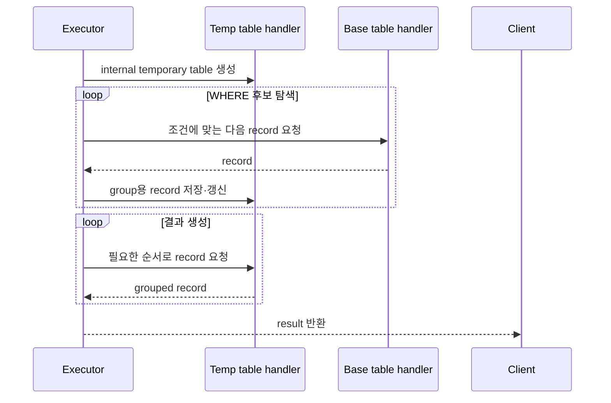

temporary table도 storage layer를 사용하지만 base table과 반드시 같은 engine을 쓰는 것은 아니다. MySQL 8.0의 internal temporary table은 조건에 따라 memory의 TempTable engine을 쓰다가 한계를 넘으면 disk의 InnoDB로 전환될 수 있다.

#### 4.1.6.5 핸들러(스토리지 엔진)

handler는 executor의 공통 요청을 table에 지정된 storage engine 구현으로 연결한다. InnoDB table이면 InnoDB handler가 index·page·record를 찾고 필요한 lock·MVCC·transaction 규칙을 적용한다. “disk에서 직접 읽는다”는 표현에는 buffer pool hit도 포함해야 한다. storage engine은 먼저 memory 계층을 확인하고 miss일 때 I/O를 수행한다.

### 4.1.7 복제

복제는 source의 변경을 binary log에 남기고 replica가 전달받아 적용하는 별도 생명주기다. 이 절에서는 architecture에 복제 기능이 연결된다는 위치만 기억하고, binary log format·GTID·replication thread·lag·failover는 16장에서 확장한다.

### 4.1.8 쿼리 캐시

MySQL 5.7까지의 query cache는 `SELECT text + result`를 server 공유 memory에 보관하고 동일한 query가 오면 parse·execute 없이 결과를 돌려주는 기능이었다. table data가 바뀌면 관련 cache entry를 무효화해야 하고, write가 많은 multi-core workload에서 contention과 확장성 문제가 커졌다. MySQL 8.0에서는 기능과 관련 system·status variable이 제거됐다.

| 이름 | 저장하는 것 | MySQL 8.0 |
|---|---|---|
| query cache | 동일 SQL의 완성된 result set | 제거됨 |
| InnoDB buffer pool | data·index page | 핵심 기능으로 유지 |
| prepared statement cache | parse된 statement·metadata 관련 구조 | query cache와 별개 |
| application·Redis·Proxy cache | 업무 의미의 result·object | DB 밖에서 TTL·invalidation 정책 운영 |

즉 `mysql:8.0`이나 RDS for MySQL 8.0에서 query cache 크기를 조절하려고 하면 안 된다. 반복 query 성능 문제는 먼저 execution plan·index·buffer pool을 보고, 결과 cache가 필요하면 application 또는 proxy 계층에서 일관성·TTL을 함께 설계한다.

### 4.1.9 스레드 풀

#### 내가 사용한 MySQL은 Enterprise였는가?

아니다. 현재 실습 container를 직접 확인한 결과는 다음과 같다.

```text
version_comment = MySQL Community Server - GPL
thread_handling = one-thread-per-connection
thread_pool_* variables = 없음
```

| 배포 방식 | 실제 engine·edition | 공식 MySQL Enterprise Thread Pool |
|---|---|---|
| 현재 `docker run ... mysql:8.0` | Oracle MySQL Community Server image | 포함되지 않음 |
| AWS RDS for MySQL 8.0·8.4 | AWS가 운영하는 MySQL Community Edition 기반 managed DB | Enterprise plugin이 아님; 임의 plugin 설치도 제한 |
| MySQL Enterprise Edition | Oracle 상용 edition | server plugin으로 포함 |
| Percona Server for MySQL | MySQL Community 기반 호환 fork | Percona 자체 native thread pool 사용 가능 |
| Amazon Aurora MySQL-Compatible | AWS가 별도로 구현·운영하는 MySQL-compatible engine | RDS for MySQL과 다른 제품이며 Enterprise edition 여부로 분류하지 않음 |

Docker는 포장·실행 방식일 뿐 edition을 결정하지 않는다. `mysql:8.0` image를 쓰면 Community이고, `percona/percona-server` 같은 다른 image를 명시하면 Percona가 된다. RDS도 “서버를 직접 설치했느냐”가 아니라 AWS가 Community 기반 engine의 OS·backup·patch·failover를 관리한다는 차이다.

#### 목적: connection 수와 실행 worker 수를 분리한다

기본 one-thread-per-connection은 열린 client connection마다 thread가 대응한다. thread pool은 connection을 유지하되 실제 statement를 실행하는 worker 수를 제한한다.

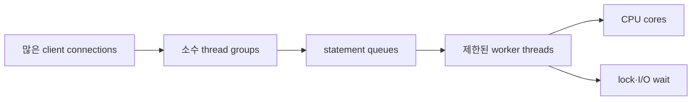

기대 효과는 다음 세 가지다.

1. 동시에 runnable한 thread와 thread stack footprint를 줄인다.
2. OS context switch와 scheduler 부담을 낮춘다.
3. InnoDB 내부 latch·mutex·lock을 두고 과도한 transaction이 경쟁하는 것을 제한한다.

하지만 **동시성을 줄이는 것 자체가 query를 빠르게 만드는 optimizer는 아니다.** 동시 실행이 이미 적거나 query가 CPU를 잘 쓰는 상황에서는 queue wait만 추가될 수 있다. worker가 long query·lock·I/O에 묶였는데 보상 worker를 충분히 만들지 못해도 tail latency가 악화된다. 그래서 “thread pool = 무조건 TPS 향상”이 아니라 높은 connection·동시 실행에서 자원 경합을 통제하는 장치로 본다.

#### Processor affinity란?

processor affinity는 thread가 실행될 수 있는 CPU 집합을 제한하는 OS scheduling 속성이다. 같은 CPU에서 계속 실행되면 이전에 사용한 data·instruction·thread stack이 CPU cache에 남아 있을 가능성이 커지고 CPU 사이 migration에 따른 cache invalidation 비용이 줄 수 있다.

`thread_pool_size`를 core 수에 맞추는 것은 runnable group 수를 hardware 병렬성에 맞추고 cache locality를 얻기 쉽게 하는 경험칙이지, worker를 core에 **고정 pinning**하는 설정은 아니다. hard affinity는 OS의 affinity API·도구가 별도로 필요하며 NUMA·container CPU quota까지 고려해야 한다.

#### Percona thread pool의 group·queue·worker 흐름

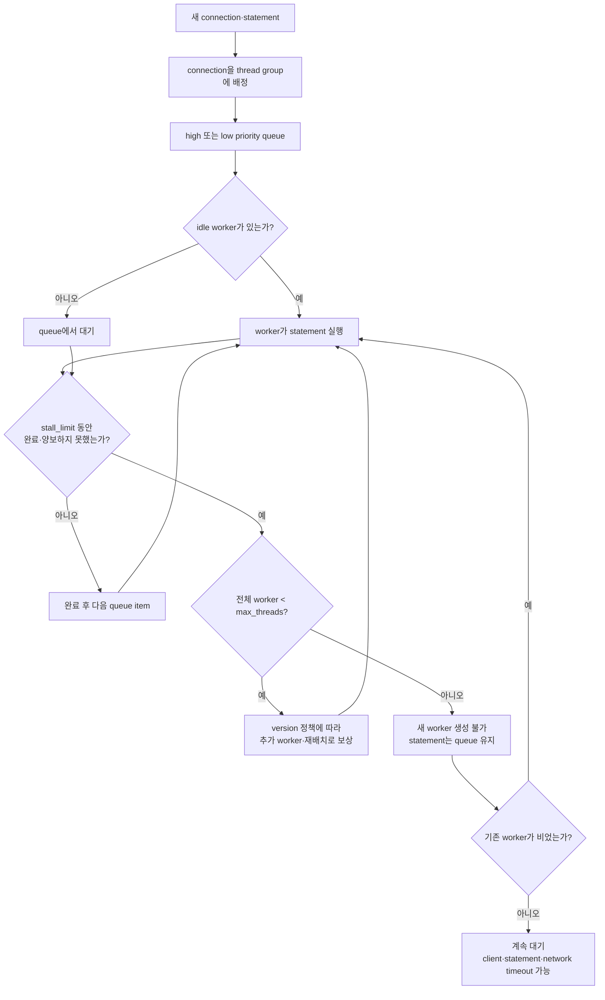

> [!important] `max_threads`까지 찬 뒤의 답
> `thread_pool_stall_limit`이 지났다고 query를 자동 실패시키거나 제한을 넘어 worker를 만들지 않는다. `thread_pool_max_threads`에 도달했다면 새 statement는 queue에 남고 기존 worker가 비어야 실행된다. 대기가 길어지면 별도의 client socket timeout, application query timeout, DB statement timeout 정책 등이 먼저 끊을 수 있다. `max_connections`는 애초에 connection을 받아 줄지 결정하는 별도 한도다.

현재 Percona Server 8.0 공식 reference 기준 핵심값은 다음과 같다. 책과 설치 version의 동작·default가 다를 수 있으므로 운영 환경 문서를 우선한다.

| 변수 | 현재 공식 default | 의미 | 조정 위험 |
|---|---:|---|---|
| `thread_handling` | `one-thread-per-connection` | `pool-of-threads`로 pool 활성화 | static·restart 필요 |
| `thread_pool_size` | 감지한 CPU core 수 | thread group 수 | 너무 작으면 queue, 너무 크면 병렬성·scheduler 부담 증가 |
| `thread_pool_oversubscribe` | `3` | group별 queue saturation·추가 실행 여유를 제어하는 기준 | 단순히 “요청 3개 더 수락”으로 해석하지 않음 |
| `thread_pool_stall_limit` | `500 ms` | 오래 막힌 실행을 감지·재조정하는 시간 | 너무 낮으면 worker·scheduling overhead, 너무 높으면 queue latency |
| `thread_pool_max_threads` | `100000` | 모든 group worker의 상한 | 실제 server capacity에 맞지 않는 큰 상한은 resource exhaustion 위험 |
| `thread_pool_high_prio_mode` | `transactions` | active transaction statement 우선 | low-priority starvation과 workload 특성 확인 |
| `thread_pool_high_prio_tickets` | `4294967295` | connection별 high-priority 실행 ticket | 새 connection 적용 여부와 version 확인 |

원문의 “stall되면 새 worker 생성”은 해당 책이 설명하는 Percona 구현을 이해하는 좋은 모델이다. 다만 현재 공식 문서는 stall 이후 `redistribute·reschedule`로 표현하고 있으므로 실제 조정 전에는 **설치한 Percona version의 문서와 status**를 확인한다.

#### 선순위·후순위 큐와 transaction lock

![[assets/book-photos/real-mysql-8-0-1/04-아키텍쳐/4.1-MySQL-엔진-아키텍쳐/04-05-Percona-스레드풀-우선순위-큐.jpg]]

사진 위쪽은 도착 순서 그대로, 아래쪽은 high·low priority 정책으로 재배치한 모습이다. Percona의 기본 `transactions` mode에서는 이미 transaction 안에서 실행되는 statement를 high-priority로 처리할 수 있다.

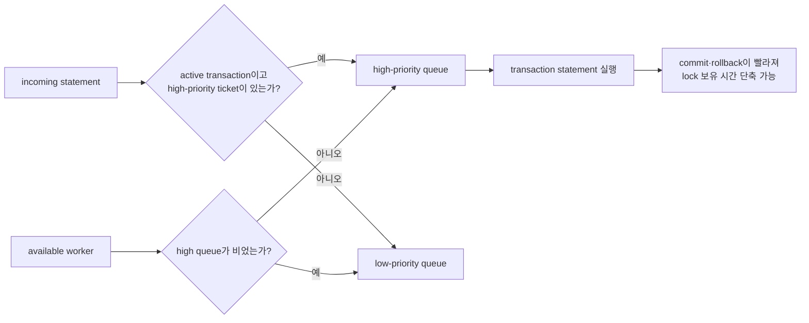

이미 시작된 transaction을 빨리 끝내면 그 transaction이 잡은 lock이 더 빨리 풀려 다른 transaction의 wait가 줄 수 있다. 반대로 high-priority workload가 계속 유입되면 low queue가 오래 기다릴 수 있으므로 ticket·mode와 queue 상태를 함께 본다.

#### 관측과 실험

```sql
SELECT @@version, @@version_comment;
SHOW VARIABLES LIKE 'thread_handling';
SHOW VARIABLES LIKE 'thread_pool%';
SHOW STATUS LIKE 'Threadpool%';
```

Community Server에서 `thread_pool_%`가 나오지 않는 것은 설정을 못 찾은 것이 아니라 해당 Percona·Enterprise implementation이 설치되지 않았기 때문일 수 있다. 실제 성능 판단은 connection 수만 보지 않고 queue wait, running worker, CPU utilization, context switch, lock·I/O wait와 p95·p99 latency를 부하 테스트로 비교한다.

### 4.1.10 트랜잭션 지원 메타데이터

#### 메타데이터도 복구 가능한 데이터가 되었다

data dictionary는 database·table·column·index·constraint·user 같은 object의 정의와 관계를 저장하는 **데이터에 대한 데이터**다. MySQL 5.7 이전에는 이 metadata가 `.frm` 같은 file, nontransactional system table, storage engine별 dictionary에 흩어져 있어 DDL 중 여러 번의 중간 commit이 필요했다. crash 시 table file과 metadata가 서로 다른 상태로 남을 여지가 있었다.

MySQL 8.0은 data dictionary를 `mysql` schema의 transactional InnoDB table로 통합했다. data dictionary table과 대부분의 MySQL system table은 data directory의 단일 InnoDB tablespace `mysql.ibd`에 저장되며, dictionary data도 user data처럼 commit·rollback·crash recovery 보호를 받는다.

| 구분 | 저장하는 정보 | 접근 방식 |
|---|---|---|
| data dictionary table | database·table·column·index·constraint 등 query 실행에 필요한 metadata | 보호된 내부 table이므로 주로 `SHOW`·`INFORMATION_SCHEMA` 사용 |
| system table | account·privilege, time zone, replication, optimizer cost 등 server 운영 정보 | `mysql` schema에서 목적별 table 조회 |
| `mysql.ibd` | 위 dictionary·system table이 위치하는 InnoDB system schema tablespace | server가 관리하며 임의 파일 조작 금지 |

> [!note] 원문의 “모두 InnoDB”를 읽는 방법
> 핵심은 8.0의 data dictionary와 주요 system table이 transactional InnoDB 기반으로 통합됐다는 것이다. 공식 문서는 system table에 대해 **별도 표기가 없는 한 InnoDB를 사용한다**고 표현한다. 모든 plugin·외부 engine의 모든 metadata operation까지 자동으로 atomic하다는 뜻은 아니다.

#### Atomic DDL: 성공 또는 실패 한 상태만 남긴다

MySQL 8.0의 atomic DDL은 한 DDL에 포함되는 다음 세 축을 하나의 atomic operation으로 묶는다.

```text
data dictionary update
+ storage engine operation
+ binary log write
= 전부 commit 또는 전부 rollback
```

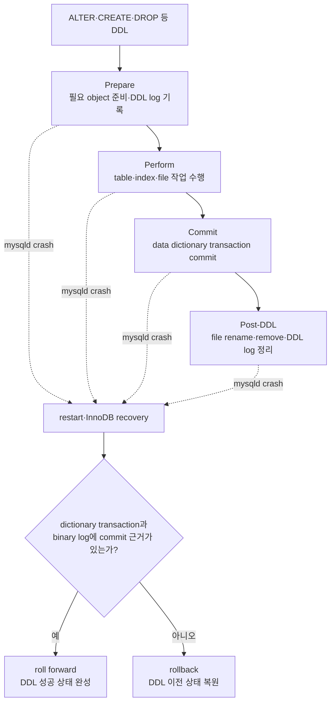

InnoDB는 hidden data dictionary table인 `mysql.innodb_ddl_log`에 roll forward·rollback에 필요한 DDL log를 기록한다. DDL 도중 server가 멈추면 restart recovery 때 남은 log를 replay하고 제거한다. 그래서 “table file은 생겼는데 dictionary에는 없거나, dictionary에는 있는데 file은 없는” 중간 상태를 정리할 수 있다.

#### Atomic DDL은 transactional DDL과 다르다

가장 중요한 주의점이다.

```sql
START TRANSACTION;
UPDATE account SET balance = balance - 100 WHERE id = 1;
ALTER TABLE account ADD COLUMN memo VARCHAR(100);
ROLLBACK;
```

`ROLLBACK`으로 `UPDATE`와 `ALTER TABLE`을 함께 취소할 수 있다고 생각하면 안 된다. MySQL DDL은 atomic 여부와 관계없이 현재 session의 active transaction을 암묵적으로 끝낸다. atomic DDL은 **DDL 하나의 내부 단계가 crash 후 반쪽 상태로 남지 않는다는 보장**이지, 사용자가 여러 DDL·DML을 `START TRANSACTION`으로 묶어 마음대로 rollback할 수 있다는 보장이 아니다.

| 개념 | 보장하는 것 | 보장하지 않는 것 |
|---|---|---|
| transaction DML | 사용자가 여러 DML을 commit·rollback 단위로 묶음 | schema operation 포함 |
| atomic DDL | 지원되는 DDL 하나의 dictionary·engine·binlog 변경이 전부 성공 또는 전부 실패 | 여러 DDL·DML의 사용자 transaction |
| online DDL | 지원되는 algorithm에서 read·write blocking을 줄임 | crash atomicity 자체 |

또한 atomic은 “잠금 없이 즉시 끝난다”는 뜻도 아니다. DDL은 metadata lock을 기다리거나 작업 중 다른 session을 block할 수 있고, table 크기와 선택 algorithm에 따라 CPU·I/O·temporary disk를 크게 사용할 수 있다.

#### 지원 범위와 예외

MySQL 8.0 공식 문서 기준으로 `CREATE`·`ALTER`·`DROP` database/table/tablespace/index와 `TRUNCATE TABLE` 등은 atomic DDL 범위에 포함된다. table 관련 atomic DDL은 storage engine 지원이 필요하며 현재 InnoDB가 지원한다.

반면 다음은 같은 보장을 일반화하면 안 된다.

- InnoDB 이외 storage engine이 관계된 table DDL
- `INSTALL PLUGIN`·`UNINSTALL PLUGIN`
- `INSTALL COMPONENT`·`UNINSTALL COMPONENT`
- `CREATE SERVER`·`ALTER SERVER`·`DROP SERVER`

account·role·privilege system table도 8.0에서 InnoDB가 되면서 `CREATE USER`·`GRANT` 같은 한 statement가 여러 account를 대상으로 할 때 전부 성공하거나 전부 rollback되는 방향으로 개선됐다.

#### 암기법

```text
메타데이터도 데이터다
→ InnoDB transaction으로 보호한다
→ DDL의 dictionary·engine·binlog를 같이 commit한다
→ crash 후 반쪽짜리 schema가 아니라 성공 또는 rollback만 남긴다

단, Atomic DDL ≠ 사용자가 ROLLBACK 가능한 Transactional DDL
```

## 암기 카드

```text
SQL의 머리: connection → parse → preprocess → optimize → execute
실행 경계: executor → handler API → storage engine → page·record
확장 방식: plugin은 server와 결합, component는 service registry로 제공·소비
연결 재사용: Hikari는 connection, thread cache는 종료된 MySQL thread
실행량 제어: thread pool은 connection 수와 statement worker 수를 분리
읽기: foreground가 결과를 책임지고 buffer miss를 기다림 + background read-ahead·AIO
쓰기: foreground가 dirty page·redo를 만들고 background가 data page를 나중에 flush
내구성: redo log를 먼저 안전하게, data page는 batch·checkpoint로 후속 기록
메모리: global은 server 공유, local은 session·statement 수와 곱해짐
OS 관계: thread는 heap을 공유하고 각자 stack을 가짐
buffer: mysqld user-space 완충 영역이 중심이며 OS·storage cache는 별도 layer
query cache: 완성 result cache였으며 MySQL 8.0에서 제거
CPU 조율: worker를 줄이면 context switch·contention 감소 가능, queue wait 증가 가능
stall과 max: 보상 worker 상한에 닿으면 query는 worker가 빌 때까지 queue
우선순위: active transaction을 먼저 끝내 lock 보유 시간을 줄일 수 있음
metadata: schema 정의도 mysql.ibd의 InnoDB transaction으로 보호
atomic DDL: dictionary + storage engine + binlog가 전부 commit 또는 rollback
주의: atomic DDL ≠ 여러 DDL·DML을 사용자가 ROLLBACK하는 transactional DDL
```

## 확인 질문

> [!question]- MySQL 엔진과 스토리지 엔진의 책임은 어떻게 다른가?
> **답:** MySQL 엔진은 접속, SQL parsing·전처리·최적화·실행 조정을 담당하고, storage engine은 handler API 요청에 따라 실제 record·page를 읽고 쓰며 engine 고유의 cache·transaction·locking 기능을 제공한다.

> [!question]- `Handler_read_rnd_next`가 높으면 disk I/O가 그만큼 발생했다는 뜻인가?
> **답:** 아니다. handler layer가 다음 data row를 요청한 횟수다. full scan 가능성을 의심할 단서지만 buffer pool·OS cache hit가 있을 수 있어 physical disk I/O 횟수와 같지 않다.

> [!question]- `thread_cache_size`와 MySQL thread pool은 무엇이 다른가?
> **답:** thread cache는 종료된 connection thread를 재사용해 생성 비용을 줄인다. thread pool은 많은 connection과 실제 statement 실행 thread를 분리하고 server 내부 동시 실행량을 제어하는 별도 실행 모델이다.

> [!question]- InnoDB index page가 buffer pool에 없으면 요청은 어떻게 진행되는가?
> **답:** foreground query가 handler API로 InnoDB에 page를 요청하고, InnoDB가 OS·I/O 계층에 read를 제출한다. page가 buffer pool에 적재될 때까지 요청은 I/O wait를 겪은 뒤 index 탐색을 계속한다.

> [!question]- connection이 많아 느릴 때 `thread_cache_size`부터 올리면 되는가?
> **답:** 아니다. 새 connection 실패는 `max_connections`, 실행 정체는 `Threads_running`, lock·CPU·I/O wait, application pool과 긴 transaction을 먼저 구분한다. thread cache는 connection churn에 따른 thread 생성 비용만 줄인다.

> [!question]- query read는 foreground가 처리하는데 `innodb_read_io_threads`는 왜 존재하는가?
> **답:** foreground는 index 탐색·row 처리·응답이라는 논리적 read를 진행하고 필요한 page를 기다린다. background read I/O thread는 read-ahead와 asynchronous I/O 요청·completion을 담당할 수 있다.

> [!question]- commit 응답 전에 변경된 data page가 반드시 data file에 기록되어야 하는가?
> **답:** 아니다. durability 설정에 맞게 redo가 안전하게 기록되면 dirty data page는 page cleaner·write I/O thread가 이후 batch·checkpoint로 flush할 수 있다.

> [!question]- DAS와 SAN의 차이만 보고 InnoDB I/O thread 수를 결정해도 되는가?
> **답:** 아니다. DAS는 server 직접 연결 storage, SAN은 전용 network를 통한 공유 block storage다. 실제 조정은 device 종류보다 pending I/O, latency, IOPS·throughput과 기본 thread가 장치를 충분히 활용하는지를 측정해 결정한다.

> [!question]- global memory와 local memory는 무엇이 다르며 왜 connection 수가 위험한가?
> **답:** global memory는 여러 thread가 공유해 connection마다 복제되지 않는다. local memory는 session·statement·operation별로 생기므로 동시 connection과 sort·join 수가 늘면 작은 설정도 곱해져 peak memory와 OOM 위험을 높인다.

> [!question]- InnoDB redo log buffer와 binary log cache는 같은 global buffer인가?
> **답:** 아니다. redo log buffer는 InnoDB가 공유하는 global 영역이다. binary log transaction cache는 조건이 맞을 때 client·transaction별로 할당되는 local 영역이다.

> [!question]- InnoDB가 deadlock을 보고 있다는 말은 어떤 의미인가?
> **답:** deadlock detection이 활성화되면 InnoDB가 transaction의 wait-for 관계를 검사해 cycle을 찾고 작은 transaction을 victim으로 골라 rollback한다. 최근 결과는 `SHOW ENGINE INNODB STATUS`의 `LATEST DETECTED DEADLOCK`에서 확인할 수 있다.

> [!question]- 하나의 `SELECT`에서 MySQL 엔진과 storage engine은 각각 무엇을 하는가?
> **답:** MySQL 엔진은 parse·object/권한 검사·plan 선택·실행 순서 제어를 담당한다. executor가 handler API로 다음 record를 요청하면 storage engine이 index·page·buffer·lock·MVCC 규칙으로 record를 찾아 돌려준다. 한 SQL 안에서 이 경계를 여러 번 왕복할 수 있다.

> [!question]- `Handler_read_key=1000`이면 disk를 1000번 읽었다는 뜻인가?
> **답:** 아니다. key 기반 row read를 handler에 1000번 요청했다는 뜻이다. InnoDB buffer pool hit도 포함하며 page 하나에서 여러 record를 읽을 수 있으므로 physical I/O는 `Innodb_buffer_pool_reads`, OS·storage 지표와 별도로 본다.

> [!question]- plugin과 component의 핵심 차이는 무엇인가?
> **답:** plugin은 server symbol을 직접 호출할 수 있고 plugin끼리 dependency·통신을 명시하기 어려워 결합도가 높다. component는 제공·소비할 named service API를 명시하고 service registry를 통해 상호작용해 캡슐화와 dependency 관리가 좋아진다. MySQL 8.0에서 둘은 공존한다.

> [!question]- parser와 preprocessor는 오류를 어떻게 나누어 발견하는가?
> **답:** parser는 token과 grammar를 다뤄 syntax error를 찾는다. preprocessor는 parse tree를 실제 table·column·function과 매핑하고 존재 여부, 참조의 의미, 접근 권한을 검사한다.

> [!question]- optimizer, executor, handler를 한 문장씩 구분하면?
> **답:** optimizer는 추정 비용으로 plan을 고르고, executor는 그 plan의 순서를 실행하며, handler는 executor의 record 요청을 지정 storage engine 구현에 연결한다.

> [!question]- MySQL 8.0의 query cache가 없어졌다면 buffer pool도 cache가 아닌가?
> **답:** 둘은 대상과 invalidation 범위가 다르다. query cache는 동일 SQL의 완성된 result set을 공유 저장했으며 8.0에서 제거됐다. buffer pool은 InnoDB data·index page를 cache하는 핵심 storage engine memory라 계속 사용된다.

> [!question]- 지금 Docker MySQL과 AWS RDS for MySQL을 사용했다면 Enterprise Thread Pool을 사용한 것인가?
> **답:** 아니다. 현재 `mysql:8.0` container는 `MySQL Community Server - GPL`, `one-thread-per-connection`으로 확인됐다. RDS for MySQL도 Community Edition 8.0·8.4 기반 managed service다. Oracle의 Enterprise Thread Pool은 상용 edition plugin이고, Percona thread pool은 Percona Server의 별도 구현이다.

> [!question]- thread pool은 왜 빠를 수도, 느릴 수도 있는가?
> **답:** runnable worker를 제한하면 thread stack·context switch·InnoDB contention이 줄 수 있다. 반면 worker가 부족하거나 long query·lock·I/O에 막히면 statement가 queue에서 기다려 latency가 늘어난다. workload와 tail latency를 부하 테스트로 비교해야 한다.

> [!question]- processor affinity와 `thread_pool_size=CPU core 수`는 같은 설정인가?
> **답:** 아니다. affinity는 OS가 thread의 실행 가능 CPU 집합을 제한하는 기능이다. group 수를 core 수에 맞추는 것은 hardware 병렬성과 cache locality를 맞추는 경험칙일 뿐 worker를 특정 core에 고정하지 않는다.

> [!question]- 모든 worker가 막히고 `stall_limit`이 지났으며 `max_threads`에도 도달했다면 어떻게 되는가?
> **답:** 상한을 넘는 worker는 만들지 않는다. 새 statement는 queue에 남아 기존 worker가 빌 때까지 기다린다. 대기 중 별도 client·statement·network timeout이 먼저 발생할 수 있으며, connection admission을 막는 `max_connections`와는 다른 단계다.

> [!question]- active transaction의 statement를 high-priority queue에서 먼저 처리하면 왜 전체 성능이 좋아질 수 있는가?
> **답:** 이미 시작된 transaction을 빨리 commit·rollback시키면 보유 lock이 일찍 풀려 다른 transaction의 lock wait가 줄 수 있다. 다만 high-priority 요청이 계속되면 low queue starvation이 생길 수 있어 ticket·mode·queue wait를 함께 관측한다.

> [!question]- data dictionary와 system table은 무엇이 다른가?
> **답:** data dictionary는 database·table·column·index·constraint처럼 SQL 실행에 필요한 object metadata를 저장한다. system table은 account·privilege, time zone, replication, optimizer cost 같은 server 운영 정보를 저장한다. 8.0에서는 data dictionary와 별도 표기가 없는 system table이 InnoDB 기반 `mysql` system schema에 통합됐다.

> [!question]- DDL 중 mysqld가 종료돼도 반쪽짜리 schema가 남지 않는 이유는 무엇인가?
> **답:** MySQL 8.0이 data dictionary update, InnoDB storage operation, binary log write를 하나의 atomic DDL로 조정하고 `mysql.innodb_ddl_log`에 복구 정보를 남기기 때문이다. restart 시 commit 근거가 있으면 roll forward하고, 없으면 rollback한다.

> [!question]- atomic DDL이면 `START TRANSACTION` 안에서 `ALTER TABLE`을 실행하고 `ROLLBACK`할 수 있는가?
> **답:** 아니다. atomic DDL은 DDL 하나의 내부 변경이 전부 성공하거나 실패한다는 뜻이다. MySQL DDL은 active transaction을 암묵적으로 끝내므로 DML과 DDL을 하나의 사용자 transaction으로 묶어 rollback하는 transactional DDL과 다르다.

> [!question]- atomic DDL이면 schema 변경이 lock 없이 online으로 수행되는가?
> **답:** 아니다. atomicity는 crash 후 최종 상태의 일관성이고, online 여부는 허용되는 concurrent read·write와 algorithm의 문제다. DDL은 metadata lock을 기다리거나 다른 session을 block하고 CPU·I/O·temporary disk를 사용할 수 있다.

> [!question]- 모든 MySQL DDL이 atomic한가?
> **답:** 아니다. table 관련 atomic DDL은 storage engine 지원이 필요하며 현재 InnoDB가 지원한다. non-InnoDB table DDL과 plugin·component 설치·제거, `CREATE/ALTER/DROP SERVER` 등은 공식 atomic DDL 지원 범위 밖이다.

## 이어지는 내용

- 4.1 MySQL engine architecture 완료
- 4.2 InnoDB storage engine architecture를 같은 `04-아키텍쳐/` 폴더의 새 canonical note에서 시작
- 4.2에서 buffer pool·redo·undo·lock과 atomic DDL recovery를 더 깊게 연결
- 9장 optimizer에서 statistics·cost model·execution plan을 확장
- 16장 replication에서 binary log·GTID·replication thread를 확장

다음 `4.1.x` 입력도 이 파일의 해당 heading 아래에 원문과 정리본을 append한다. `4.2`가 시작되면 `04-아키텍쳐/` 아래에 별도 canonical note를 만든다.

## 공식 확인 자료

- [Storage Engine Architecture](https://dev.mysql.com/doc/refman/8.0/en/pluggable-storage-overview.html)
- [MySQL Server Plugins](https://dev.mysql.com/doc/refman/8.0/en/server-plugins.html)
- [MySQL Components](https://dev.mysql.com/doc/refman/8.0/en/components.html)
- [Component subsystem이 개선한 plugin 한계](https://dev.mysql.com/doc/dev/mysql-server/8.0.42/PAGE_COMPONENTS.html)
- [Performance Schema `threads`](https://dev.mysql.com/doc/refman/8.0/en/performance-schema-threads-table.html)
- [`thread_cache_size`·`thread_handling`](https://dev.mysql.com/doc/refman/8.0/en/server-system-variables.html)
- [MySQL Enterprise Thread Pool](https://dev.mysql.com/doc/refman/8.0/en/thread-pool.html)
- [Handler status](https://dev.mysql.com/doc/refman/8.0/en/server-status-variables.html)
- [Internal Temporary Table](https://dev.mysql.com/doc/refman/8.0/en/internal-temporary-tables.html)
- [MySQL 8.0 Query Cache 제거 배경](https://dev.mysql.com/blog-archive/mysql-8-0-retiring-support-for-the-query-cache/)
- [Percona Server 8.0 Thread Pool](https://docs.percona.com/percona-server/8.0/threadpool.html)
- [RDS for MySQL은 Community Edition 지원](https://aws.amazon.com/rds/mysql/)
- [Docker Official MySQL Image](https://hub.docker.com/_/mysql/)
- [Linux processor affinity · `sched_setaffinity`](https://man7.org/linux/man-pages/man2/sched_setaffinity.2.html)
- [Atomic Data Definition Statement Support](https://dev.mysql.com/doc/refman/8.0/en/atomic-ddl.html)
- [Transactional Storage of Dictionary Data](https://dev.mysql.com/doc/refman/8.0/en/data-dictionary-transactional-storage.html)
- [`mysql` System Schema와 InnoDB system table](https://dev.mysql.com/doc/refman/8.0/en/system-schema.html)
- [InnoDB background I/O thread 수](https://dev.mysql.com/doc/refman/8.0/en/innodb-performance-multiple_io_threads.html)
- [Linux asynchronous I/O](https://dev.mysql.com/doc/refman/8.0/en/innodb-linux-native-aio.html)
- [Buffer pool flushing](https://dev.mysql.com/doc/refman/8.0/en/innodb-buffer-pool-flushing.html)
- [InnoDB deadlock detection](https://dev.mysql.com/doc/refman/8.0/en/innodb-deadlock-detection.html)
- [MySQL memory 사용 구조](https://dev.mysql.com/doc/refman/8.0/en/memory-use.html)
- [Performance Schema로 memory 관측](https://dev.mysql.com/doc/refman/8.0/en/monitor-mysql-memory-use.html)
- [Binary log cache](https://dev.mysql.com/doc/refman/8.0/en/replication-options-binary-log.html)
- [Linux process·thread memory 관계](https://man7.org/linux/man-pages/man7/pthreads.7.html)
- [IBM의 SAN·DAS 설명](https://www.ibm.com/think/topics/network-attached-storage#nas-vs-das-vs-san-data-architectures)
