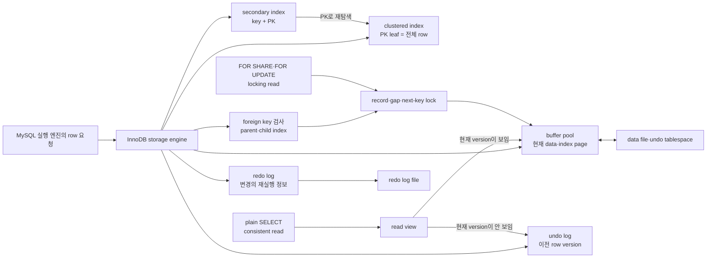
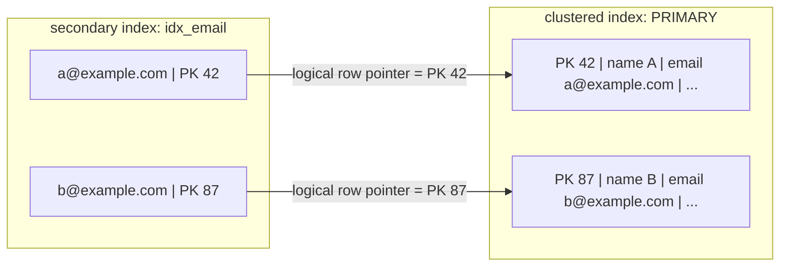
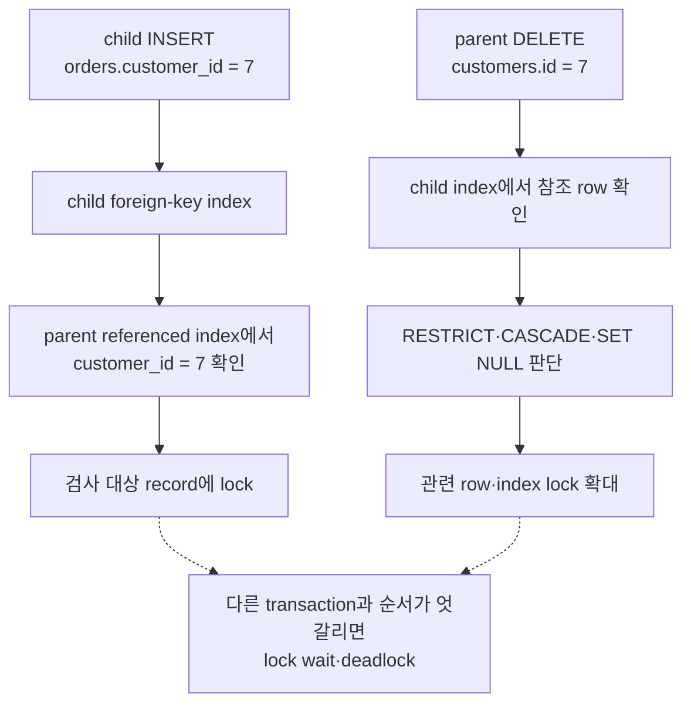
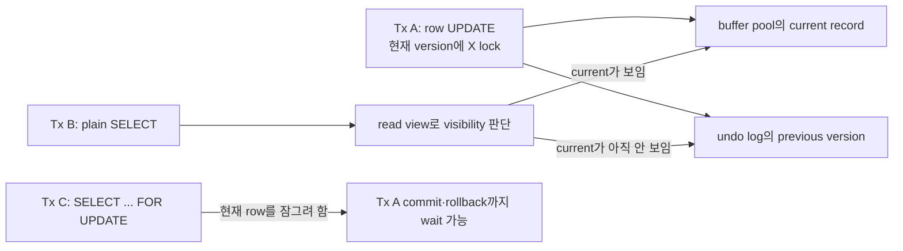
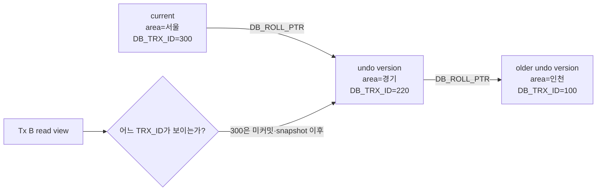
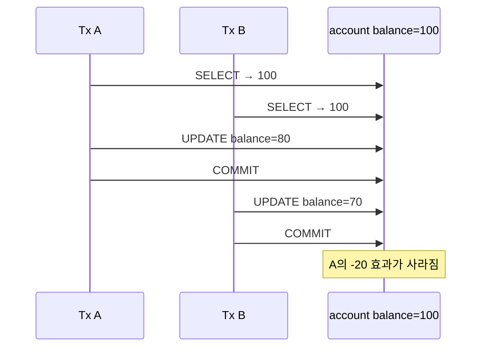

# 4.2 InnoDB 스토리지 엔진 아키텍쳐

> [!abstract] 이 절의 한 문장
> InnoDB는 clustered index를 데이터의 기준 주소로 삼고, foreign key 검사에는 관련 index와 lock을 사용하며, MVCC에서는 read view와 undo version으로 **일반 `SELECT`가 writer를 기다리지 않는 consistent read**를 제공한다. 다만 MVCC는 read-modify-write 경쟁까지 자동으로 직렬화하지 않으므로 atomic DML·optimistic locking·locking read를 상황에 맞게 선택해야 한다.

이 파일은 `04-아키텍쳐` 장 폴더 안의 `4.2 InnoDB 스토리지 엔진 아키텍쳐` canonical note다. 앞으로 `4.2.x`의 모든 하위 절과 사진을 이 파일에 번호 순서대로 누적한다.

## 큰 지도(중요)

![[assets/book-photos/real-mysql-8-0-1/04-아키텍쳐/4.2-InnoDB-스토리지-엔진-아키텍쳐/04-06-InnoDB-전체-구조.JPG]]



사진의 `buffer pool·change buffer·adaptive hash index·log buffer·background thread·data file·transaction log`은 앞으로 4.2 전체에서 하나씩 확장한다. 이번 범위의 중심은 **row를 어떤 index로 찾는가**, **관계 검사가 어떤 lock을 만드는가**, **동시에 변경 중인 row를 어떤 version으로 읽는가**다.

## 사용자 정리 원문

### 2026-08-14 · 4.2.1부터 4.2.3

<details>
<summary>보존된 원문 펼치기</summary>

```text
4.2 InnoDB 스토리지 엔진 아키텍쳐

4.2.1 프라이머리 키에 의한 클러스터링
InnoDB의 모든 테이블은 기본적으로 PK를 기준으로 클러스터링되어 저장됨. 즉, PK 값의 순서대로 디스크에 저장되며, 모든 세컨더리 인덱스는 레코드 주소 대신 PK의 값을 논리적 주소로 사용함 (시각화)

PK가 클러스터링 인텍스이기 때문에 PK를 이용한 레인지 스캔이 빠른 처리 가능
결과적으로 쿼리의 실행 계획에서 PK는 기본적으로 다른 보조 인덱스에 비해 비중이 높게 설정

4.2.2 외래 키 지원
InnoDB에서 외래 키는 부모 테이블과 자식 테이블 모두 해당 컬럼에 인덱스 생성이 필요하고, 변경 시에는 반드시 부모 테이블이나 자식 테이블에 데이터가 있는지 체크하는 작업이 필요함. -> 잠금이 여러 테이블로 전파되고 데드락이 발생할 수 있음

foreign_key_checks 시스템 변수를 OFF로 하면 외래 키 관계에 대한 체크 작업을 멈출 수 있다. (빠른 대응이 필요한 경우)

4.2.3 MVCC(Multi Version Concurrency Control) (중요)
MVCC의 가장 큰 목적은 잠금을 사용하지 않는 일관된 읽기 제공

격리 수준에 따라 READ_COMMITTED 이상부터는 커밋되기 전의 데이터인 언두 로그를 읽고, 그 외에는 InnoDB 버퍼풀을 읽는다. 

MVCC는 write lock과 read lock 상황에서 대기 없이 읽어오는 성능의 이점을 얻기 위해 적용되는것이고 commit 이후 시점에 데이터를 각 격리수준에 따라 읽어온다는 특징이 있다. 

즉, lost update나 write screw 같은 문제는 아직 해결하지 못 한 상태이므로 이를 해결하기 위해서는 locking read가 필요하다. 

이를 좀더 잘 이해하기 위해. MVCC가 어떤 상황에서 강점이 있는건지 정리하고. 아래의 4개 영상은 내가 이 내용을 이해하기 위해 항상봤던 강의인데, 

https://www.youtube.com/watch?v=bLLarZTrebU&list=PLcXyemr8ZeoREWGhhZi5FZs6cvymjIBVe&index=17
https://www.youtube.com/watch?v=0PScmeO3Fig&list=PLcXyemr8ZeoREWGhhZi5FZs6cvymjIBVe&index=18
https://www.youtube.com/watch?v=wiVvVanI3p4&list=PLcXyemr8ZeoREWGhhZi5FZs6cvymjIBVe&index=19
https://www.youtube.com/watch?v=-kJ3fxqFmqA&list=PLcXyemr8ZeoREWGhhZi5FZs6cvymjIBVe&index=20

이걸 요약한 자료를 다시 정리(MySQL만 정리)
```

</details>

### 첨부한 격리 수준·MVCC 요약 원문

첨부한 380줄 요약도 표현을 바꾸지 않고 아래 local reference로 보존했다. 이 note의 정리본은 그중 MySQL에 해당하는 부분만 다시 조직한 것이다.

![[assets/reference-notes/real-mysql-8-0-1/04-아키텍쳐/4.2-InnoDB-스토리지-엔진-아키텍쳐/트랜잭션-격리수준과-MVCC-강의-요약.txt]]

## 정리본

### 4.2.1 프라이머리 키에 의한 클러스터링

#### clustered index는 별도 “주소표”가 아니라 row 자체의 저장 구조다

InnoDB의 clustered B+Tree에서 leaf record는 PK와 나머지 row column을 함께 가진다. 따라서 PK로 leaf까지 찾아가면 row를 얻고, PK 범위를 스캔하면 서로 가까운 leaf page를 순서대로 읽을 수 있어 range query에 유리하다.



`WHERE email = 'a@example.com'`에서 secondary index를 사용하면 보통 다음 두 번의 B+Tree 탐색이 이어진다.

```text
secondary B+Tree에서 email 검색
→ leaf에서 PK 42 획득
→ clustered B+Tree에서 PK 42 검색
→ 전체 row 반환
```

필요한 column이 secondary index leaf에 모두 있다면 covering index가 되어 두 번째 clustered lookup을 생략할 수 있다.

#### PK가 없을 때와 “디스크 순서”의 정확한 뜻

InnoDB는 다음 순서로 clustered index를 정한다.

1. 명시한 `PRIMARY KEY`
2. PK가 없으면 모든 column이 `NOT NULL`인 첫 번째 `UNIQUE INDEX`
3. 둘 다 없으면 InnoDB가 6-byte hidden row ID를 만들고 `GEN_CLUST_INDEX`로 사용

원문의 “PK 값 순서대로 디스크에 저장”은 **clustered B+Tree의 leaf가 key 순서로 논리적으로 연결되고 row가 그 leaf에 저장된다**는 뜻이다. 파일의 byte가 PK 순으로 완전히 연속되어 고정된다는 뜻은 아니다. page split·merge·flush·tablespace 배치로 physical page 위치는 달라질 수 있다.

#### PK가 실행 계획에서 유리한 이유와 한계

PK lookup·range scan은 leaf에 row가 있어 secondary index의 추가 PK lookup을 피한다. 그래서 cost가 낮게 추정되기 쉽다. 그러나 optimizer가 언제나 PK에 고정 가중치를 주는 규칙은 아니다. 선택도, 읽을 page 수, covering 여부, 정렬, 통계에 따라 secondary index나 table scan을 선택할 수 있다.

PK는 모든 secondary index에 함께 저장되므로 짧고 안정적인 값이 유리하다.

| PK 설계 | 장점 | 비용·주의 |
|---|---|---|
| 짧은 정수·순차 증가 | 작은 secondary index, 좋은 insert locality | 매우 높은 동시 insert에서 우측 끝 page 경합 가능 |
| 긴 문자열·복합 PK | 업무 식별자를 직접 표현 | 모든 secondary index가 커져 memory·I/O 증가 |
| 완전 random UUID | 분산 생성이 쉬움 | locality 저하, page split·cache 효율 저하 가능 |

> [!tip] 암기법
> **보조 index의 종착지는 PK, PK index의 종착지는 row.** 그래서 PK가 길면 모든 보조 index가 같이 무거워진다.

### 4.2.2 외래 키 지원

#### 관계 확인이 index 탐색과 lock을 추가한다

child insert·update에서는 parent key가 존재하는지 확인하고, parent update·delete에서는 참조하는 child row가 있는지 확인한다. 이 검사가 table scan이 되지 않도록 foreign key column과 referenced key에 usable index가 필요하다. child 쪽 index가 없으면 MySQL이 자동 생성한다.



foreign key가 곧 deadlock을 만든다는 뜻은 아니다. **한 DML의 잠금 범위가 parent·child table로 넓어지고**, 여러 transaction이 서로 다른 순서로 관계를 변경하면 cycle이 생길 가능성이 커진다는 뜻이다. 관련 transaction은 같은 table·row 순서로 접근하고 짧게 유지하며 deadlock retry를 준비한다.

#### `foreign_key_checks=OFF`는 빠른 장애 대응 버튼이 아니다

```sql
SET SESSION foreign_key_checks = 0;
-- 관계 순서가 뒤섞인 dump restore·통제된 bulk load·일부 DDL
SET SESSION foreign_key_checks = 1;
```

이 변수는 dynamic이며 GLOBAL·SESSION scope를 지원하지만, 작업 범위를 줄이려면 보통 전용 session에서만 끈다. 정상 traffic 중 constraint 오류를 우회하려고 끄면 orphan row를 만들 수 있다.

가장 중요한 함정은 **다시 `ON`으로 바꿔도 OFF 동안 들어온 기존 row를 자동으로 전수 검사하지 않는다**는 점이다. 따라서 사전에 입력 자료를 검증하고, 작업 뒤 orphan 검증 query와 row count·checksum을 수행한 다음 traffic을 연다.

```sql
SELECT c.*
FROM child c
LEFT JOIN parent p ON p.id = c.parent_id
WHERE c.parent_id IS NOT NULL
  AND p.id IS NULL;
```

### 4.2.3 MVCC(Multi-Version Concurrency Control)

#### 핵심: lock을 없애는 기술이 아니라 read와 write의 충돌을 줄이는 version 선택 기술

MVCC의 대표 이점은 일반 `SELECT`가 writer의 exclusive lock이 풀리기를 기다리지 않고, 자신의 read view에 보이는 committed version을 읽는 것이다. writer도 일반 consistent reader 때문에 update를 기다리지 않는다.



강점이 큰 상황은 다음과 같다.

- 조회 traffic과 수정 traffic이 동시에 많은 OLTP: plain reader와 writer의 상호 block을 크게 줄인다.
- `REPEATABLE READ`의 여러 조회로 일관된 보고서·검증을 만들 때: 같은 read view를 유지한다.
- hot row가 수정 중이어도 과거 committed version으로 조회 응답을 계속해야 할 때

하지만 다음 문제는 별도로 남는다.

- writer끼리 같은 row를 변경하면 row lock을 두고 기다린다.
- application이 읽은 값을 토대로 나중에 덮어쓰면 lost update가 생길 수 있다.
- 서로 다른 row를 갱신하면서 table 전체 invariant를 깨는 write skew를 자동 방지하지 못할 수 있다.
- 오래 열린 transaction은 old read view를 붙잡아 undo purge를 늦추고 history를 키운다.

#### InnoDB가 row version을 이어 가는 방법

InnoDB clustered record에는 내부적으로 다음 정보가 붙는다.

| 내부 field | 의미 |
|---|---|
| `DB_TRX_ID` | 마지막으로 row를 insert·update한 transaction ID |
| `DB_ROLL_PTR` | 이전 값을 재구성할 undo log record의 pointer |
| `DB_ROW_ID` | 사용자 PK·적절한 UNIQUE key가 없을 때 hidden clustered key에 사용 |

`DB_ROLL_PTR`를 따라 undo record를 거슬러 올라가면 같은 row의 이전 version chain을 재구성할 수 있다. read view는 active transaction 목록과 transaction ID 경계를 이용해 어느 version까지 보여도 되는지 판단한다.



#### 책 사진으로 따라가는 `경기 → 서울` UPDATE

##### 1. UPDATE 전

![[assets/book-photos/real-mysql-8-0-1/04-아키텍쳐/4.2-InnoDB-스토리지-엔진-아키텍쳐/04-07-MVCC-UPDATE-이전.jpg]]

buffer pool과 data file에서 `m_id=12`의 `m_area`가 `서울`로 보이는 UPDATE 전 예시다. 사진은 책의 단계 맥락을 그대로 보존했으며, 아래 UPDATE에서 변경 전 값은 책 설명대로 `경기`로 읽는다.

##### 2. UPDATE 실행

![[assets/book-photos/real-mysql-8-0-1/04-아키텍쳐/4.2-InnoDB-스토리지-엔진-아키텍쳐/04-08-MVCC-UPDATE-문장.jpg]]

```sql
UPDATE member
SET m_area = '경기'
WHERE m_id = 12;
```

##### 3. commit 전의 current version과 undo version

![[assets/book-photos/real-mysql-8-0-1/04-아키텍쳐/4.2-InnoDB-스토리지-엔진-아키텍쳐/04-09-MVCC-UPDATE-이후-버퍼풀-언두.jpg]]

UPDATE가 실행되면 current clustered record는 새 값으로 바뀌고 X lock을 보유한다. 변경 전 값은 undo log에 남는다. data page가 disk data file에 언제 flush되는지는 commit 여부와 별개이므로, disk file 그림의 값만 보고 다른 transaction에 무엇이 보일지 결정하면 안 된다. **visibility는 buffer pool인가 disk인가가 아니라 transaction 상태·read view·undo chain으로 결정한다.**

##### 4. 다른 transaction의 SELECT

![[assets/book-photos/real-mysql-8-0-1/04-아키텍쳐/4.2-InnoDB-스토리지-엔진-아키텍쳐/04-10-MVCC-격리수준별-SELECT.jpg]]

```sql
SELECT * FROM member WHERE m_id = 12;
```

Tx A의 UPDATE가 아직 commit되지 않았다고 가정한다.

| Tx B 격리 수준·읽기 방식 | 보이는 값·행동 |
|---|---|
| `READ UNCOMMITTED` plain `SELECT` | uncommitted current version을 볼 수 있어 dirty read 가능 |
| `READ COMMITTED` plain `SELECT` | statement 시작 시점의 read view에서 committed version을 선택; 보이지 않는 current면 undo의 이전 committed version |
| `REPEATABLE READ` plain `SELECT` | transaction의 첫 consistent read가 만든 read view를 재사용; current가 보이지 않으면 undo version |
| `SELECT ... FOR UPDATE` | snapshot의 과거 version이 아니라 최신 row를 잠그는 current·locking read; 다른 transaction의 X lock이 있으면 보통 commit·rollback을 기다림 |

> [!warning] 원문을 보존하면서 바로잡기
> “READ COMMITTED 이상은 undo, 그 외에는 buffer pool”처럼 둘을 양자택일로 나누지 않는다. buffer pool은 current data·index page를 cache하는 공간이고 undo도 page 형태로 memory에 올라올 수 있다. RC·RR consistent read는 read view를 먼저 보고, current version이 보이지 않을 때 undo chain으로 이전 version을 재구성한다. RU는 consistent snapshot을 보장하지 않아 dirty read가 가능하다.

#### MySQL의 격리 수준을 MVCC 관점으로만 다시 정리

| 격리 수준 | plain `SELECT`의 snapshot | 대표 허용 현상 | InnoDB에서 기억할 것 |
|---|---|---|---|
| `READ UNCOMMITTED` | 일관되지 않은 nonlocking read | dirty read 포함 | uncommitted version을 볼 수 있음 |
| `READ COMMITTED` | consistent read마다 새 read view | 같은 transaction 안 non-repeatable read·phantom 가능 | 대부분의 gap lock을 줄여 concurrency가 높지만 같은 SELECT 결과가 달라질 수 있음 |
| `REPEATABLE READ` | 첫 consistent read가 만든 read view를 transaction 동안 재사용 | SQL 표준상 phantom 가능 | MySQL 기본값. plain consistent read는 snapshot으로 반복 결과를 유지하고, locking range read·DML은 next-key lock으로 phantom insert를 막음 |
| `SERIALIZABLE` | RR 기반 + locking 강화 | 직렬 실행에 가까운 결과 | autocommit이 꺼진 transaction에서 plain `SELECT`를 `FOR SHARE`처럼 처리해 block·deadlock 가능성이 커짐 |

`REPEATABLE READ`의 “첫 snapshot”은 `START TRANSACTION` 문장 자체가 아니라 보통 **첫 consistent read 시점**에 만들어진다. transaction 시작과 동시에 고정하려면 `START TRANSACTION WITH CONSISTENT SNAPSHOT`을 사용한다.

#### consistent read와 locking read

| 방식 | 읽는 기준 | lock | 용도 |
|---|---|---|---|
| plain `SELECT` | read view에 보이는 version | row lock 없음 | 조회·report·화면 응답 |
| `SELECT ... FOR SHARE` | latest available row | shared lock | 읽은 row가 transaction 중 삭제·변경되지 않게 보호 |
| `SELECT ... FOR UPDATE` | latest available row | exclusive lock | 이어서 update할 row를 선점 |
| `UPDATE`·`DELETE` | current row | exclusive record·range lock | 직접 변경 |

locking read는 반드시 명시적 transaction 안에서 사용하고, 필요한 index를 만들어 scan·lock 범위를 좁힌다. `REPEATABLE READ`에서 range 조건이면 record뿐 아니라 gap을 포함한 next-key lock이 잡힐 수 있다.

#### lost update와 write skew: MVCC 다음에 선택할 전략

원문의 `write screw`는 동시성 문맥상 **write skew**를 뜻한다. 원문은 그대로 두고 개념명만 이곳에서 바로잡는다.

##### Lost update

두 요청이 `balance=100`을 plain SELECT로 읽고 각각 계산한 절대값을 저장하면 늦게 쓴 값이 먼저 쓴 값을 덮을 수 있다.



상황별 우선순위는 다음과 같다.

1. 계산을 한 SQL로 만들 수 있으면 atomic DML: `UPDATE account SET balance = balance - 20 WHERE id = 1 AND balance >= 20`
2. 충돌이 드물고 재시도가 가능하면 optimistic locking: `... WHERE id=? AND version=?`, affected rows가 0이면 재시도
3. 읽은 뒤 여러 작업을 같은 row 기준으로 묶어야 하면 `SELECT ... FOR UPDATE`

즉 모든 update에 locking read를 먼저 붙일 필요는 없다. `SET balance = balance - ?` 같은 direct relative UPDATE는 row X lock 아래 current value를 사용하므로 stale application read를 다시 쓰는 패턴과 다르다.

##### Write skew

두 transaction이 같은 invariant를 snapshot으로 확인한 뒤 **서로 다른 row**를 수정하면 row lock이 직접 충돌하지 않아 규칙이 깨질 수 있다. 예를 들어 “항상 당직 의사 한 명 이상”인데 두 의사가 서로를 보고 각자의 row를 `off_call`로 바꾸는 경우다.

해결은 invariant를 대표하는 모든 row·range를 같은 순서로 `FOR UPDATE`해 잠그거나, invariant를 한 row로 모델링하고 atomic update·constraint를 사용하거나, 비용을 감수하고 `SERIALIZABLE`을 선택하는 것이다. 단일 row 하나만 잠그면 여러 row predicate의 write skew를 막지 못한다.

#### 네 강의를 MySQL 관점으로 다시 연결

| 강의 | MySQL에서 남길 핵심 | 이 절과의 연결 |
|---|---|---|
| [BJ.44 transaction isolation level·이상 현상·snapshot isolation](https://www.youtube.com/watch?v=bLLarZTrebU) | dirty read·non-repeatable read·phantom은 isolation이 어떤 read view를 제공하는지 비교하는 언어다. lost update·write skew는 세 수준만으로 설명이 끝나지 않는다. | RC는 statement별 snapshot, RR은 transaction snapshot |
| [BJ.45 LOCK과 2PL](https://www.youtube.com/watch?v=0PScmeO3Fig) | S/X lock, compatibility, lock 순서, deadlock을 이해한다. InnoDB는 DML·locking read에 record·gap·next-key lock을 사용하고 deadlock victim을 rollback한다. | MVCC가 피하지 못한 current-row 경쟁을 lock이 조정 |
| [BJ.46-1 MVCC 개념과 격리 수준](https://www.youtube.com/watch?v=wiVvVanI3p4) | 한 row의 여러 version과 read view가 reader마다 보이는 값을 고른다. MySQL 구현은 clustered record의 transaction ID·roll pointer와 undo log를 사용한다. | buffer pool current version + undo previous version |
| [BJ.46-2 MVCC와 `SELECT ... FOR UPDATE`](https://www.youtube.com/watch?v=-kJ3fxqFmqA) | plain SELECT는 consistent read, `FOR UPDATE`는 latest row를 잠그는 locking read다. read-then-write에는 의도에 따라 atomic DML·optimistic lock·locking read를 선택한다. | lost update·write skew 방지 전략 |

첨부 요약에 있는 PostgreSQL·Oracle·SQL Server 구현 비교는 이번 canonical note에서 제외했다. 여기서는 SQL 표준 이름을 배경으로만 쓰고, 실제 결론은 MySQL 8.0 InnoDB의 read view·undo·locking 규칙에 맞췄다.

#### 운영에서 MVCC 비용을 확인하는 지점

긴 transaction이 오래된 read view를 잡고 있으면 update undo를 purge할 수 없어 history가 쌓인다. 따라서 “MVCC라 reader가 안 막힌다”에서 끝내지 않고 transaction age와 undo history를 본다.

```sql
SELECT trx_id, trx_state, trx_started,
       TIMESTAMPDIFF(SECOND, trx_started, NOW()) AS trx_age_seconds,
       trx_rows_modified, trx_query
FROM information_schema.innodb_trx
ORDER BY trx_started;

SHOW ENGINE INNODB STATUS;

SELECT * FROM performance_schema.data_lock_waits;
```

| 신호 | 의미 |
|---|---|
| 오래된 `trx_started` | long transaction이 old read view·lock을 보유할 가능성 |
| `History list length` 증가 | purge가 따라가지 못하고 old row version이 누적되는 단서 |
| `data_lock_waits` | MVCC로 피하지 못한 locking read·DML의 blocker/waiter 관계 |
| deadlock log | parent·child·range 접근 순서가 cycle을 만든 근거 |

## 암기 카드

```text
clustered leaf = PK + 전체 row
secondary leaf = secondary key + PK
보조 index의 종착지는 PK, PK index의 종착지는 row
PK 없음 = UNIQUE NOT NULL 첫 index, 그것도 없음 = hidden row ID
FK 검사 = parent·child index 탐색 + 관련 record lock
foreign_key_checks ON 복귀 ≠ OFF 동안 row 재검증
MVCC = read view가 current·undo version 중 보이는 것을 선택
buffer pool = 현재 page cache, undo = 이전 version 재구성 정보
RC = consistent read마다 새 snapshot
RR = 첫 consistent read snapshot 재사용(MySQL 기본)
plain SELECT = consistent read, FOR UPDATE = current locking read
MVCC는 reader-writer block을 줄이지만 writer-writer 경쟁은 남김
lost update = atomic DML·version check·FOR UPDATE 중 의도에 맞게 해결
write skew = invariant에 참여하는 row·range 전체를 보호
긴 transaction = undo purge 지연 + history list 증가
```

## 확인 질문

> [!question]- InnoDB의 clustered index leaf에는 무엇이 저장되는가?
> **답:** PK와 나머지 row column이 함께 저장된다. 그래서 PK lookup은 leaf에 도달하면 row를 얻고, PK range scan은 인접 leaf를 순서대로 읽기 좋다.

> [!question]- secondary index가 physical row address 대신 PK를 저장하면 조회는 어떻게 되는가?
> **답:** secondary B+Tree leaf에서 PK를 얻은 뒤 clustered B+Tree를 다시 찾아 전체 row를 읽는다. 필요한 column이 secondary leaf에 모두 있으면 covering index로 두 번째 lookup을 생략할 수 있다.

> [!question]- PK가 없는 InnoDB table에는 clustered index가 없는가?
> **답:** 아니다. 모든 column이 `NOT NULL`인 첫 UNIQUE index를 사용하고, 그것도 없으면 hidden 6-byte row ID로 `GEN_CLUST_INDEX`를 만든다.

> [!question]- optimizer는 언제나 PK에 고정적으로 더 높은 점수를 주는가?
> **답:** 아니다. clustered lookup이 추가 row lookup을 피하므로 비용이 낮게 나올 가능성이 크지만, optimizer는 선택도·page 수·covering·정렬·통계를 함께 계산한다.

> [!question]- foreign key를 만들 때 child index가 없으면 어떻게 되는가?
> **답:** MySQL이 foreign key column이 선두가 되는 index를 자동 생성한다. parent의 referenced key에도 usable index가 필요하다.

> [!question]- `foreign_key_checks`를 다시 ON으로 바꾸면 OFF 동안 생긴 orphan row도 자동 검사되는가?
> **답:** 아니다. 재활성화해도 기존 row 전수 검증은 수행하지 않는다. 통제된 session에서만 사용하고 별도의 orphan 검증 query를 실행해야 한다.

> [!question]- MVCC가 가장 강점을 보이는 상황은 무엇인가?
> **답:** update 중인 row가 있어도 일반 SELECT가 writer의 X lock을 기다리지 않고 자신에게 보이는 committed version을 읽어야 하는 read·write 혼합 OLTP다. reader-writer block을 줄이지만 writer-writer lock wait는 없애지 않는다.

> [!question]- `READ COMMITTED 이상은 undo, READ UNCOMMITTED는 buffer pool`이라고 나눠도 되는가?
> **답:** 아니다. buffer pool은 current page cache이고 undo는 old version을 만드는 정보다. RC·RR은 read view로 visibility를 판단하고 필요할 때 undo chain을 따라가며, RU는 uncommitted version을 볼 수 있어 consistent snapshot이 아니다.

> [!question]- READ COMMITTED와 REPEATABLE READ의 read view 차이는 무엇인가?
> **답:** RC는 consistent SELECT마다 새 read view를 만들어 직전에 commit된 변경을 다음 SELECT에서 볼 수 있다. RR은 첫 consistent read의 read view를 transaction 동안 재사용해 같은 plain SELECT 결과를 유지한다.

> [!question]- plain SELECT와 `SELECT ... FOR UPDATE`는 무엇이 다른가?
> **답:** plain SELECT는 snapshot의 visible version을 읽고 row lock을 잡지 않는다. `FOR UPDATE`는 최신 row를 읽으며 exclusive lock을 획득하고, 다른 transaction이 이미 수정 중이면 commit·rollback을 기다릴 수 있다.

> [!question]- lost update를 막으려면 항상 `SELECT ... FOR UPDATE`가 필요한가?
> **답:** 아니다. 한 SQL의 relative·conditional UPDATE가 가능하면 먼저 atomic DML을 쓴다. 충돌이 드물면 version column을 이용한 optimistic locking, 여러 후속 작업을 같은 row와 묶어야 하면 `FOR UPDATE`를 선택한다.

> [!question]- write skew는 한 row를 `FOR UPDATE`하면 해결되는가?
> **답:** invariant가 여러 row·range에 걸쳐 있으면 한 row lock만으로 부족하다. invariant에 참여하는 전체 row·range를 같은 순서로 잠그거나, invariant 대표 row·constraint·SERIALIZABLE 같은 설계가 필요하다.

> [!question]- InnoDB REPEATABLE READ에서는 phantom이 항상 발생하는가?
> **답:** SQL 표준 표만 보면 허용될 수 있지만 MySQL InnoDB plain consistent read는 같은 snapshot을 재사용해 반복 SELECT에 새 row가 나타나지 않는다. locking range read·DML은 기본적으로 next-key lock으로 범위 insert를 막는다. consistent read와 locking read를 섞을 때는 서로 다른 시야임을 기억한다.

> [!question]- 오래 열린 read-only transaction도 MVCC에 비용을 만들 수 있는가?
> **답:** 그렇다. old read view가 필요한 update undo version의 purge를 막아 history list와 undo 사용량을 키울 수 있다. `INNODB_TRX`의 transaction age와 `SHOW ENGINE INNODB STATUS`의 `History list length`를 본다.

## 이어지는 내용

- 다음 시작점: 4.2.4 잠금 없는 일관된 읽기(Non-Locking Consistent Read)
- 4.2.5 자동 데드락 감지에서 `data_lock_waits`·deadlock victim 선택을 확장
- 4.2.7 InnoDB buffer pool에서 current page의 caching·flush·LRU를 확장
- 4.2.9 undo log에서 version chain·purge·long transaction 비용을 확장
- 5장 transaction과 lock에서 record·gap·next-key lock과 isolation level을 실험
- 8장 index에서 clustered·secondary·covering·page split을 실행 계획과 연결
- 연결 개념: [[트랜잭션 락과 격리 수준]], [[동시성 경쟁 조건]], [[인덱스와 실행 계획]]

다음 `4.2.x` 입력도 이 파일의 해당 번호 heading에 원문과 정리본을 append하고, 암기 카드·확인 질문·이어지는 내용·공식 자료를 전체 범위 기준으로 갱신한다.

## 공식 확인 자료

- [InnoDB Clustered and Secondary Indexes](https://dev.mysql.com/doc/refman/8.0/en/innodb-index-types.html)
- [Optimizing InnoDB Queries](https://dev.mysql.com/doc/refman/8.0/en/optimizing-innodb-queries.html)
- [InnoDB FOREIGN KEY Constraints와 `foreign_key_checks`](https://dev.mysql.com/doc/refman/8.0/en/create-table-foreign-keys.html)
- [InnoDB Multi-Versioning](https://dev.mysql.com/doc/refman/8.0/en/innodb-multi-versioning.html)
- [Consistent Nonlocking Reads](https://dev.mysql.com/doc/refman/8.0/en/innodb-consistent-read.html)
- [InnoDB Transaction Isolation Levels](https://dev.mysql.com/doc/refman/8.0/en/innodb-transaction-isolation-levels.html)
- [InnoDB Locking Reads](https://dev.mysql.com/doc/refman/8.0/en/innodb-locking-reads.html)
- [Locks Set by Different SQL Statements](https://dev.mysql.com/doc/refman/8.0/en/innodb-locks-set.html)
- [InnoDB Deadlocks](https://dev.mysql.com/doc/refman/8.0/en/innodb-deadlocks.html)
- [Performance Schema `data_lock_waits`](https://dev.mysql.com/doc/refman/8.0/en/performance-schema-data-lock-waits-table.html)

## 학습 강의

- [쉬운코드 BJ.44 · transaction isolation level과 이상 현상·snapshot isolation](https://www.youtube.com/watch?v=bLLarZTrebU)
- [쉬운코드 BJ.45 · LOCK을 활용한 concurrency control과 2PL](https://www.youtube.com/watch?v=0PScmeO3Fig)
- [쉬운코드 BJ.46-1 · MVCC와 isolation level](https://www.youtube.com/watch?v=wiVvVanI3p4)
- [쉬운코드 BJ.46-2 · MVCC와 `SELECT ... FOR UPDATE`](https://www.youtube.com/watch?v=-kJ3fxqFmqA)
