# 4.2 InnoDB 스토리지 엔진 아키텍쳐

> [!abstract] 이 절의 한 문장
> InnoDB는 clustered index와 MVCC·lock으로 row를 관리하고, buffer pool·redo·page cleaner로 읽기 cache와 지연 쓰기를 구현한다. flush list는 checkpoint를 전진시키고 LRU flush는 새 page가 들어갈 free frame을 만든다. 재시작 때는 buffer pool의 page 목록으로 warmup을 줄이며, Doublewrite는 data page가 절반만 기록되는 torn page를 복구한다.

이 파일은 `04-아키텍쳐` 장 폴더 안의 `4.2 InnoDB 스토리지 엔진 아키텍쳐` canonical note다. 앞으로 `4.2.x`의 모든 하위 절과 사진을 이 파일에 번호 순서대로 누적한다.

## 큰 지도(중요)

![[assets/book-photos/real-mysql-8-0-1/04-아키텍쳐/4.2-InnoDB-스토리지-엔진-아키텍쳐/04-06-InnoDB-전체-구조.JPG]]

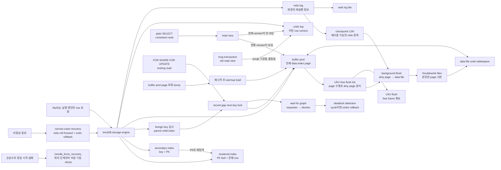

사진의 `buffer pool·change buffer·adaptive hash index·log buffer·background thread·data file·transaction log`은 4.2 전체에서 하나씩 확장한다. 현재까지의 중심은 **row와 version 선택**, **lock wait cycle**, **crash recovery**, **memory page와 redo 공간의 순환**, **flush 속도 제어**, **재시작 warmup**, **torn page 방어**다.

## 사용자 정리 원문

### 2026-08-14 · 4.2.1부터 4.2.3

<details>
<summary>보존된 원문 펼치기</summary>

```text
4.2 InnoDB 스토리지 엔진 아키텍쳐

4.2.1 프라이머리 키에 의한 클러스터링
InnoDB의 모든 테이블은 기본적으로 PK를 기준으로 클러스터링되어 저장됨. 즉, PK 값의 순서대로 디스크에 저장되며, 모든 세컨더리 인덱스는 레코드 주소 대신 PK의 값을 논리적 주소로 사용함 (시각화)

PK가 클러스터링 인텍스이기 때문에 PK를 이용한 레인지 스캔이 빠른 처리 가능
결과적으로 쿼리의 실행 계획에서 PK는 기본적으로 다른 보조 인덱스에 비해 비중이 높게 설정

4.2.2 외래 키 지원
InnoDB에서 외래 키는 부모 테이블과 자식 테이블 모두 해당 컬럼에 인덱스 생성이 필요하고, 변경 시에는 반드시 부모 테이블이나 자식 테이블에 데이터가 있는지 체크하는 작업이 필요함. -> 잠금이 여러 테이블로 전파되고 데드락이 발생할 수 있음

foreign_key_checks 시스템 변수를 OFF로 하면 외래 키 관계에 대한 체크 작업을 멈출 수 있다. (빠른 대응이 필요한 경우)

4.2.3 MVCC(Multi Version Concurrency Control) (중요)
MVCC의 가장 큰 목적은 잠금을 사용하지 않는 일관된 읽기 제공

격리 수준에 따라 READ_COMMITTED 이상부터는 커밋되기 전의 데이터인 언두 로그를 읽고, 그 외에는 InnoDB 버퍼풀을 읽는다. 

MVCC는 write lock과 read lock 상황에서 대기 없이 읽어오는 성능의 이점을 얻기 위해 적용되는것이고 commit 이후 시점에 데이터를 각 격리수준에 따라 읽어온다는 특징이 있다. 

즉, lost update나 write screw 같은 문제는 아직 해결하지 못 한 상태이므로 이를 해결하기 위해서는 locking read가 필요하다. 

이를 좀더 잘 이해하기 위해. MVCC가 어떤 상황에서 강점이 있는건지 정리하고. 아래의 4개 영상은 내가 이 내용을 이해하기 위해 항상봤던 강의인데, 

https://www.youtube.com/watch?v=bLLarZTrebU&list=PLcXyemr8ZeoREWGhhZi5FZs6cvymjIBVe&index=17
https://www.youtube.com/watch?v=0PScmeO3Fig&list=PLcXyemr8ZeoREWGhhZi5FZs6cvymjIBVe&index=18
https://www.youtube.com/watch?v=wiVvVanI3p4&list=PLcXyemr8ZeoREWGhhZi5FZs6cvymjIBVe&index=19
https://www.youtube.com/watch?v=-kJ3fxqFmqA&list=PLcXyemr8ZeoREWGhhZi5FZs6cvymjIBVe&index=20

이걸 요약한 자료를 다시 정리(MySQL만 정리)
```

</details>

### 2026-08-14 · 4.2.4와 4.2.5

<details>
<summary>보존된 원문 펼치기</summary>

```text
4.2.4 잠금 없는 일관된 읽기(Non-Locking Consistent Read)
InnoDB 스토리지 엔진은 MVCC 기술을 이용해 잠금을 걸지 않고 읽기 작업을 수행한다. 

격리 수준이 SERIALIZABLE이 아닌 READ_UNCOMMITTED나 READ_COMMITTED, REPEATABLE_READ 수준인 경우 INSERT와 연결되지 않는 순수한 읽기 작업은 다른 트랜잭션의 변경작업을 대기 하지 않고 바로 실행된다.

InnoDB에서는 변경 전의 데이터를 읽기 위해 언두 로그에서 데이터를 읽는다

오랜 시간 활성 상태인 트랜잭션으로 인해 MySQL 서버가 느려지거나 문제가 발생할 때가 있는데 이는 언두 로그를 삭제하지 못하고 유지해야하기 때문이다.

4.2.5 자동 데드락 감지

InnoDB 스토리지 엔진은 내부적으로 잠금이 교착 상태에 빠지지 않았는지 체크하기 위해 잠금 대기 목록을 그래프(Wait-for List) 형태로 관리한다.

InnoDB 스토리지 엔진은 데드락 감지 스레드를 가지고 있어서 데드락 감지 스레드가 주기적으로 잠금 대기 그래프를 검사해 교착 상태에 빠진 트랜잭션들을 찾아서 그중 하나를 강제 종료한다.

이때 종료의 판단 기준은 언두로그 레코드를 더 적게 가진 트랜잭션이다. (강제 롤백으로 인한 서버 부하나 내용이 적기 때문)

*innodb_table_locks 시스템 변수를 활성화하면 InnoDB 스토리지 엔진 내부의 레코드 잠금 뿐아니라 테이블 레벨 잠금까지 감지가 가능하므로 가능한 켜두자. (원래는 상위 레이어인 MySQL 엔진에서 관리되는 테이블 잠금은 볼 수 없음)

일반적인 서비스에서는 데드락 감지 스레드가 트랜잭션의 잠금 목록을 검사해서 데드락을 찾아내는 작업은 크게 부담이 없지만, 동시 처리 스레드가 매우 많아지거나 각 트랜잭션이 가진 잠금의 개수가 많아지면 데드락 감지 스레드가 느려진다.

데드락 감지 스레드는 잠금 목록을 검사해야하기 때문에 잠금 상태가 변경되지 않도록 잠금 목록이 저장된 리스트에 새로운 잠금을 걸고 데드락 스레드를 찾게 된다. 데드락 감지 스레드가 느려지면, 서비스 쿼리를 처리 중인 스레드는 더 작업을 못하게 되고, 대기하면서 서비스에 악영향을 준다.
이렇게 동시 처리 스레드개 매우 많은 경우 데드락 감지 스레드는 더 많은 CPU 자원을 소모하게 된다.
-> 이를 해결하기 위ㅣ해 innodb_deadlock detect 시스템 변수를 OFF로 하면 데드락 감지 스레드가 작동하지 않게 된다. -> InnoDB 스토리지 엔진 내부에서 2개 이상의 트랜잭션이 상대방이 가진 잠금을 요구하는 상황(데드락)에도 무한정 대기하게 된다. 
-> innodb_lock_wait_timeout 시스템 변수를 활성화하면, 이런 데드락 상황에서 일정 시간이 지나면 자동으로 요청이 실패하고, 에러 메세지를 반환한다.
(중요한 내용)
```

</details>

### 2026-08-14 · 4.2.6과 4.2.7.1부터 4.2.7.3

<details>
<summary>보존된 원문 펼치기</summary>

```text
4.2.6 자동화된 장애 복구

보통 잘 고장나지 않는데, 디스크나 서버 하드웨어 이슈로 자동 복구하지 못하는 문제가 생길 수 있음 ->
innodb_force_recovery 시스템 변수 설정으로 MySQL 서버를 시작하면 자도 복구한다 -> InnoDB 스토리지 엔진이 데이터 파일이나 로그 파일의 손상 여부 검사 과정을 선별적으로 진행 가능
- InnoDB의 로그 파일이 손상됐다면, 6으로 설정하고 MySQL 서버를 기동한다.
- InnoDB 테이블의 데이터 파일이 손상됐다면 1로 설정하고기동
- 모두 해결이 안 된다면 1 ~ 6까지 변경해보면서 진행. 값이 클 수록 심각한 상황..

각 상황은 사진으로 첨부(이 사진은 따로 관리하지 않아도 됨)

4.2.7 InnoDB 버퍼풀
InnoDB 스토리지 엔진에서 가장 핵심적인 부분으로 디스크의 데이터 파일이나 인덱스 정보를 메모리에 캐시해두는 공간이다.
쓰기 작업을 지연시켜 일괄 작업으로 처리할 수 있게 해주는 버퍼 역할도 같이한다.
(일괄작업이 효과적인 이유는 랜덤한 디스크 작업을 줄일 수 있기 때문이다.)

4.2.7.1 버퍼 풀의 크기 설정
단순히 80%로 설정하면 안 되고, 운영체제와 각 클라이언트 스레드가 사용할 메모리도 충분히 고려해서 설정해야한다.

MySQL 서버 내 메모리를 필요로하는 부분이 크게 없지만, 레코드 버퍼는 독특한 경우 상당한 메모리를 사용하기도함
레코드 버퍼란 각 클라이언트 세션에서 테이블의 레코드를 읽고 쓸 때 버퍼로 사용하는 공간을 말하는데, 커넥션이 많고 사용하는 테이블도 많다면 레코드 버퍼 용도로 사용되는 메모리 공간이 꽤 많이 필요해질 수 있다. MySQL 서버가 사용하는 레코드 버퍼 공간을 별도로 설정할 수 없으며, 전체 커넥션 개수와 각 커넥션에서 읽고 쓰는 테이블의 개수에 따라 결정된다. 또한, 이 버퍼 공간은 동적으로 해제되기도 하므로 정확히 필요한 메모리 공간의 크기를 계산할 수가 없다.

5.7버전 부터 InnoDB 버퍼 풀의 크기를 조절할 수 있음.
이미 사용하고 있는 서버가 있다면, 해당 DB서버의 메모리 설정을 기준으로 InnoDB 버퍼 풀의 크기를 조정하면 된다.

다만 처음 서버를 준비한다면

운영체제 전체 메모리 공간이 8GB 미만이면 50% 정도만 InnoDB 버퍼풀로 설정하고, 나머지 메모리 공간은 MySQL 서버와 운영체제, 그리고 다른 프로그램이 사용할 수 있는 공간으로 확보하는게 좋다.

전체 메모리 공간이 그 이 상이라면 InnoDB 버퍼 풀의 크기를 전체 메모리의 50%부터 시작해서 조금씩 올려간다.

OS의 전체 메모리 공간이 50GB 이상이라면, 대략 15GB에서 30GB 정도를 남겨두고 나머지를 모두 InnoDB 버퍼풀로 할당하자

innodb_buffer_pool_size 시스템 변수로 크기 설정이 가능함. (동적 가능)

버퍼풀 조정은 DB가 한가할 때 할것
줄이는 작업은 하지말것 (서비스 영향도가 매우큼)
128MB 단위로 처리되며 자세한건 메뉴얼을 반드시 확인할것

InnoDB 버퍼풀은 세마포어 잠금으로 이뤄지면 경합을 줄이기 위해 여러 작은 버퍼풀로 쪼개서 관리한다. innodb_buffer_pool_instances 시스템 변수로 여러 개로 분리해서 관리할 수 있는데 각 버퍼풀을 버퍼풀 인스턴스라고함
기본적으로 버퍼풀 인스턴스 개수는 8개로 초기화되는데, 전체 버퍼 풀을 위한 메모리 크기가 1GB 미만이면 버퍼풀 인스턴스는 1개만 생성됨
버퍼풀로 할당가능한 메모리 공간이 40GB 이하 수준이면 기본인 8을 유지하고, 메모리가 크면 5GB당 인스턴스 수로 설정하자

4.2.7.2 버퍼 풀의 구조
InnoDB 스토리지 엔진은 버퍼 풀이라는 거대한 메모리 공간을 페이지 크기(innodb_page_size)의 조각으로 쪼개어 InnoDB 스토리지 엔진이 데이터를 필요로할 때 해당 데이터 페이지를 읽어서 각 조각에 저장한다.

페이지 크기 조각 관리에 LRU(Least Recently Used) 리스트와 플러시(Flush) 리스트, 프리(Free) 리스트라는 3개의 자료 구조를 관리한다.

(InnoDB 스토리지 엔진에서 데이터를 찾는 과정 사진으로 첨부. 사진 추출후 제거)


4.2.7.3 버퍼 풀과 리두 로그
모든 디스크의 데이터를 버퍼풀에 적재하지 않는 크기라면 버퍼풀을 늘릴 수록 쿼리 속도는 향상될 것이다.

하지만, InnoDB 버퍼 풀은 DB 서버 성능 향상을 위해 데이터 캐시와 쓰기 버퍼링이라는 두 가지 용도가 있는데, 버퍼 풀의 크기를 늘리는건 캐시의 성능만 향상하는 것이다.

버퍼풀의 쓰기 버퍼링 기능까지 향상 시키기 위해서는 리두 로그와의 관계를 이해해야한다

InnoDB 버퍼 풀은 디스크 데이터 그대로의 클린 페이지와 DML로 변경이 더티 페이지가 있는데, 더티 페이지는 버퍼 풀에 무한정 머무를 수 없다.

InnoDB 스토리지 엔진에서 리두 로그는 1개 이상의 고정 파일 크기를 연결해 순환 고리처럼 사용하며 계속 덮어쓴다.
그래서 InnoDB 스토리지 엔진은 전체 리두 로그 파일에서 재사용 가능한 공간과 당장 재사용 불가능한 공간을 구분하는데 4.14 그림 처럼 화살표를 가진 엔트리들이 활성 로그 공간인것이다.

리두 로그 공간이 재사용될 때마다 LSN(Log Sequence Number)가 증가하는데 .. 이 내용도 사진으로 첨부함
```

</details>

### 2026-08-14 · 4.2.7.4부터 4.2.8은 중요 내용 중심으로

<details>
<summary>보존된 원문 펼치기</summary>

```text
이 내용들은 한번 가볍게 읽어볼건데, 나중에 중요한 부분만 읽어보기 좋게 정리해줘. 시스템 변수들은 특히 잘 정리해주고
```

</details>

### 첨부한 격리 수준·MVCC 요약 원문

첨부한 380줄 요약도 표현을 바꾸지 않고 아래 local reference로 보존했다. 이 note의 정리본은 그중 MySQL에 해당하는 부분만 다시 조직한 것이다.

![[assets/reference-notes/real-mysql-8-0-1/04-아키텍쳐/4.2-InnoDB-스토리지-엔진-아키텍쳐/트랜잭션-격리수준과-MVCC-강의-요약.txt]]

## 정리본

### 4.2.1 프라이머리 키에 의한 클러스터링

#### clustered index는 별도 “주소표”가 아니라 row 자체의 저장 구조다

InnoDB의 clustered B+Tree에서 leaf record는 PK와 나머지 row column을 함께 가진다. 따라서 PK로 leaf까지 찾아가면 row를 얻고, PK 범위를 스캔하면 서로 가까운 leaf page를 순서대로 읽을 수 있어 range query에 유리하다.

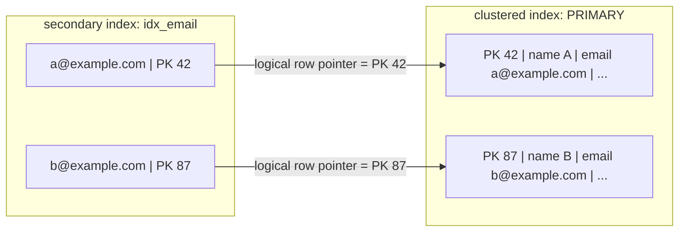

`WHERE email = 'a@example.com'`에서 secondary index를 사용하면 보통 다음 두 번의 B+Tree 탐색이 이어진다.

```text
secondary B+Tree에서 email 검색
→ leaf에서 PK 42 획득
→ clustered B+Tree에서 PK 42 검색
→ 전체 row 반환
```

필요한 column이 secondary index leaf에 모두 있다면 covering index가 되어 두 번째 clustered lookup을 생략할 수 있다.

#### PK가 없을 때와 “디스크 순서”의 정확한 뜻

InnoDB는 다음 순서로 clustered index를 정한다.

1. 명시한 `PRIMARY KEY`
2. PK가 없으면 모든 column이 `NOT NULL`인 첫 번째 `UNIQUE INDEX`
3. 둘 다 없으면 InnoDB가 6-byte hidden row ID를 만들고 `GEN_CLUST_INDEX`로 사용

원문의 “PK 값 순서대로 디스크에 저장”은 **clustered B+Tree의 leaf가 key 순서로 논리적으로 연결되고 row가 그 leaf에 저장된다**는 뜻이다. 파일의 byte가 PK 순으로 완전히 연속되어 고정된다는 뜻은 아니다. page split·merge·flush·tablespace 배치로 physical page 위치는 달라질 수 있다.

#### PK가 실행 계획에서 유리한 이유와 한계

PK lookup·range scan은 leaf에 row가 있어 secondary index의 추가 PK lookup을 피한다. 그래서 cost가 낮게 추정되기 쉽다. 그러나 optimizer가 언제나 PK에 고정 가중치를 주는 규칙은 아니다. 선택도, 읽을 page 수, covering 여부, 정렬, 통계에 따라 secondary index나 table scan을 선택할 수 있다.

PK는 모든 secondary index에 함께 저장되므로 짧고 안정적인 값이 유리하다.

| PK 설계 | 장점 | 비용·주의 |
|---|---|---|
| 짧은 정수·순차 증가 | 작은 secondary index, 좋은 insert locality | 매우 높은 동시 insert에서 우측 끝 page 경합 가능 |
| 긴 문자열·복합 PK | 업무 식별자를 직접 표현 | 모든 secondary index가 커져 memory·I/O 증가 |
| 완전 random UUID | 분산 생성이 쉬움 | locality 저하, page split·cache 효율 저하 가능 |

> [!tip] 암기법
> **보조 index의 종착지는 PK, PK index의 종착지는 row.** 그래서 PK가 길면 모든 보조 index가 같이 무거워진다.

### 4.2.2 외래 키 지원

#### 관계 확인이 index 탐색과 lock을 추가한다

child insert·update에서는 parent key가 존재하는지 확인하고, parent update·delete에서는 참조하는 child row가 있는지 확인한다. 이 검사가 table scan이 되지 않도록 foreign key column과 referenced key에 usable index가 필요하다. child 쪽 index가 없으면 MySQL이 자동 생성한다.

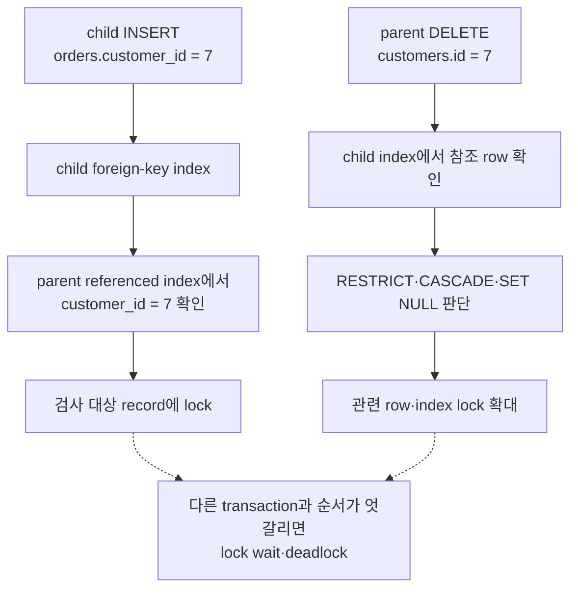

foreign key가 곧 deadlock을 만든다는 뜻은 아니다. **한 DML의 잠금 범위가 parent·child table로 넓어지고**, 여러 transaction이 서로 다른 순서로 관계를 변경하면 cycle이 생길 가능성이 커진다는 뜻이다. 관련 transaction은 같은 table·row 순서로 접근하고 짧게 유지하며 deadlock retry를 준비한다.

#### `foreign_key_checks=OFF`는 빠른 장애 대응 버튼이 아니다

```sql
SET SESSION foreign_key_checks = 0;
-- 관계 순서가 뒤섞인 dump restore·통제된 bulk load·일부 DDL
SET SESSION foreign_key_checks = 1;
```

이 변수는 dynamic이며 GLOBAL·SESSION scope를 지원하지만, 작업 범위를 줄이려면 보통 전용 session에서만 끈다. 정상 traffic 중 constraint 오류를 우회하려고 끄면 orphan row를 만들 수 있다.

가장 중요한 함정은 **다시 `ON`으로 바꿔도 OFF 동안 들어온 기존 row를 자동으로 전수 검사하지 않는다**는 점이다. 따라서 사전에 입력 자료를 검증하고, 작업 뒤 orphan 검증 query와 row count·checksum을 수행한 다음 traffic을 연다.

```sql
SELECT c.*
FROM child c
LEFT JOIN parent p ON p.id = c.parent_id
WHERE c.parent_id IS NOT NULL
  AND p.id IS NULL;
```

### 4.2.3 MVCC(Multi-Version Concurrency Control)

#### 핵심: lock을 없애는 기술이 아니라 read와 write의 충돌을 줄이는 version 선택 기술

MVCC의 대표 이점은 일반 `SELECT`가 writer의 exclusive lock이 풀리기를 기다리지 않고, 자신의 read view에 보이는 committed version을 읽는 것이다. writer도 일반 consistent reader 때문에 update를 기다리지 않는다.

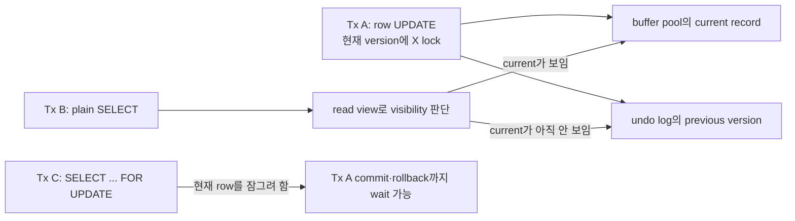

강점이 큰 상황은 다음과 같다.

- 조회 traffic과 수정 traffic이 동시에 많은 OLTP: plain reader와 writer의 상호 block을 크게 줄인다.
- `REPEATABLE READ`의 여러 조회로 일관된 보고서·검증을 만들 때: 같은 read view를 유지한다.
- hot row가 수정 중이어도 과거 committed version으로 조회 응답을 계속해야 할 때

하지만 다음 문제는 별도로 남는다.

- writer끼리 같은 row를 변경하면 row lock을 두고 기다린다.
- application이 읽은 값을 토대로 나중에 덮어쓰면 lost update가 생길 수 있다.
- 서로 다른 row를 갱신하면서 table 전체 invariant를 깨는 write skew를 자동 방지하지 못할 수 있다.
- 오래 열린 transaction은 old read view를 붙잡아 undo purge를 늦추고 history를 키운다.

#### InnoDB가 row version을 이어 가는 방법

InnoDB clustered record에는 내부적으로 다음 정보가 붙는다.

| 내부 field | 의미 |
|---|---|
| `DB_TRX_ID` | 마지막으로 row를 insert·update한 transaction ID |
| `DB_ROLL_PTR` | 이전 값을 재구성할 undo log record의 pointer |
| `DB_ROW_ID` | 사용자 PK·적절한 UNIQUE key가 없을 때 hidden clustered key에 사용 |

`DB_ROLL_PTR`를 따라 undo record를 거슬러 올라가면 같은 row의 이전 version chain을 재구성할 수 있다. read view는 active transaction 목록과 transaction ID 경계를 이용해 어느 version까지 보여도 되는지 판단한다.

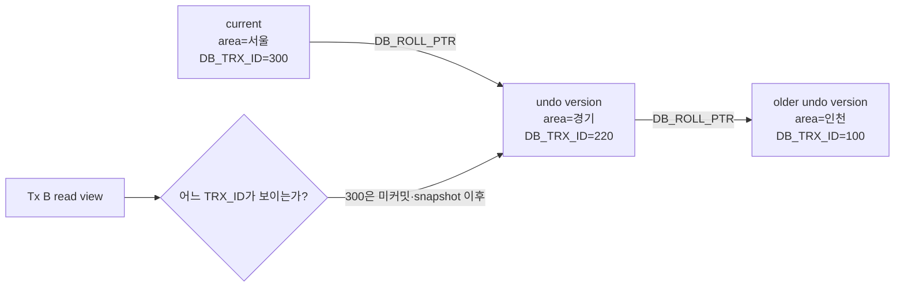

#### 책 사진으로 따라가는 `경기 → 서울` UPDATE

##### 1. UPDATE 전

![[assets/book-photos/real-mysql-8-0-1/04-아키텍쳐/4.2-InnoDB-스토리지-엔진-아키텍쳐/04-07-MVCC-UPDATE-이전.jpg]]

buffer pool과 data file에서 `m_id=12`의 `m_area`가 `서울`로 보이는 UPDATE 전 예시다. 사진은 책의 단계 맥락을 그대로 보존했으며, 아래 UPDATE에서 변경 전 값은 책 설명대로 `경기`로 읽는다.

##### 2. UPDATE 실행

![[assets/book-photos/real-mysql-8-0-1/04-아키텍쳐/4.2-InnoDB-스토리지-엔진-아키텍쳐/04-08-MVCC-UPDATE-문장.jpg]]


```sql
UPDATE member
SET m_area = '경기'
WHERE m_id = 12;
```

##### 3. commit 전의 current version과 undo version

![[assets/book-photos/real-mysql-8-0-1/04-아키텍쳐/4.2-InnoDB-스토리지-엔진-아키텍쳐/04-09-MVCC-UPDATE-이후-버퍼풀-언두.jpg]]

UPDATE가 실행되면 current clustered record는 새 값으로 바뀌고 X lock을 보유한다. 변경 전 값은 undo log에 남는다. data page가 disk data file에 언제 flush되는지는 commit 여부와 별개이므로, disk file 그림의 값만 보고 다른 transaction에 무엇이 보일지 결정하면 안 된다. **visibility는 buffer pool인가 disk인가가 아니라 transaction 상태·read view·undo chain으로 결정한다.**

##### 4. 다른 transaction의 SELECT

![[assets/book-photos/real-mysql-8-0-1/04-아키텍쳐/4.2-InnoDB-스토리지-엔진-아키텍쳐/04-10-MVCC-격리수준별-SELECT.jpg]]

```sql
SELECT * FROM member WHERE m_id = 12;
```

Tx A의 UPDATE가 아직 commit되지 않았다고 가정한다.

| Tx B 격리 수준·읽기 방식 | 보이는 값·행동 |
|---|---|
| `READ UNCOMMITTED` plain `SELECT` | uncommitted current version을 볼 수 있어 dirty read 가능 |
| `READ COMMITTED` plain `SELECT` | statement 시작 시점의 read view에서 committed version을 선택; 보이지 않는 current면 undo의 이전 committed version |
| `REPEATABLE READ` plain `SELECT` | transaction의 첫 consistent read가 만든 read view를 재사용; current가 보이지 않으면 undo version |
| `SELECT ... FOR UPDATE` | snapshot의 과거 version이 아니라 최신 row를 잠그는 current·locking read; 다른 transaction의 X lock이 있으면 보통 commit·rollback을 기다림 |

> [!warning] 원문을 보존하면서 바로잡기
> “READ COMMITTED 이상은 undo, 그 외에는 buffer pool”처럼 둘을 양자택일로 나누지 않는다. buffer pool은 current data·index page를 cache하는 공간이고 undo도 page 형태로 memory에 올라올 수 있다. RC·RR consistent read는 read view를 먼저 보고, current version이 보이지 않을 때 undo chain으로 이전 version을 재구성한다. RU는 consistent snapshot을 보장하지 않아 dirty read가 가능하다.

#### MySQL의 격리 수준을 MVCC 관점으로만 다시 정리

| 격리 수준 | plain `SELECT`의 snapshot | 대표 허용 현상 | InnoDB에서 기억할 것 |
|---|---|---|---|
| `READ UNCOMMITTED` | 일관되지 않은 nonlocking read | dirty read 포함 | uncommitted version을 볼 수 있음 |
| `READ COMMITTED` | consistent read마다 새 read view | 같은 transaction 안 non-repeatable read·phantom 가능 | 대부분의 gap lock을 줄여 concurrency가 높지만 같은 SELECT 결과가 달라질 수 있음 |
| `REPEATABLE READ` | 첫 consistent read가 만든 read view를 transaction 동안 재사용 | SQL 표준상 phantom 가능 | MySQL 기본값. plain consistent read는 snapshot으로 반복 결과를 유지하고, locking range read·DML은 next-key lock으로 phantom insert를 막음 |
| `SERIALIZABLE` | RR 기반 + locking 강화 | 직렬 실행에 가까운 결과 | autocommit이 꺼진 transaction에서 plain `SELECT`를 `FOR SHARE`처럼 처리해 block·deadlock 가능성이 커짐 |

`REPEATABLE READ`의 “첫 snapshot”은 `START TRANSACTION` 문장 자체가 아니라 보통 **첫 consistent read 시점**에 만들어진다. transaction 시작과 동시에 고정하려면 `START TRANSACTION WITH CONSISTENT SNAPSHOT`을 사용한다.

#### consistent read와 locking read

| 방식 | 읽는 기준 | lock | 용도 |
|---|---|---|---|
| plain `SELECT` | read view에 보이는 version | row lock 없음 | 조회·report·화면 응답 |
| `SELECT ... FOR SHARE` | latest available row | shared lock | 읽은 row가 transaction 중 삭제·변경되지 않게 보호 |
| `SELECT ... FOR UPDATE` | latest available row | exclusive lock | 이어서 update할 row를 선점 |
| `UPDATE`·`DELETE` | current row | exclusive record·range lock | 직접 변경 |

locking read는 반드시 명시적 transaction 안에서 사용하고, 필요한 index를 만들어 scan·lock 범위를 좁힌다. `REPEATABLE READ`에서 range 조건이면 record뿐 아니라 gap을 포함한 next-key lock이 잡힐 수 있다.

#### lost update와 write skew: MVCC 다음에 선택할 전략

원문의 `write screw`는 동시성 문맥상 **write skew**를 뜻한다. 원문은 그대로 두고 개념명만 이곳에서 바로잡는다.

##### Lost update

두 요청이 `balance=100`을 plain SELECT로 읽고 각각 계산한 절대값을 저장하면 늦게 쓴 값이 먼저 쓴 값을 덮을 수 있다.

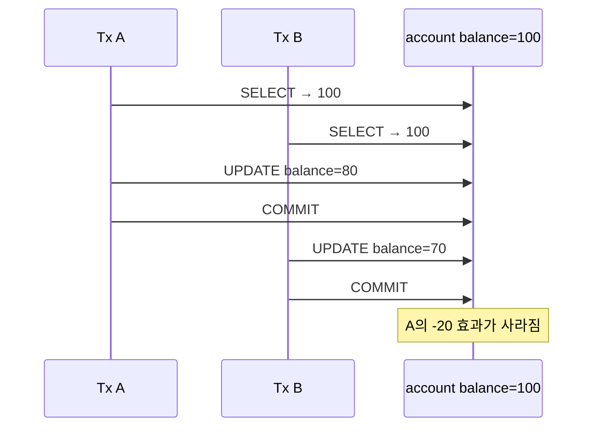

상황별 우선순위는 다음과 같다.

1. 계산을 한 SQL로 만들 수 있으면 atomic DML: `UPDATE account SET balance = balance - 20 WHERE id = 1 AND balance >= 20`
2. 충돌이 드물고 재시도가 가능하면 optimistic locking: `... WHERE id=? AND version=?`, affected rows가 0이면 재시도
3. 읽은 뒤 여러 작업을 같은 row 기준으로 묶어야 하면 `SELECT ... FOR UPDATE`

즉 모든 update에 locking read를 먼저 붙일 필요는 없다. `SET balance = balance - ?` 같은 direct relative UPDATE는 row X lock 아래 current value를 사용하므로 stale application read를 다시 쓰는 패턴과 다르다.

##### Write skew

두 transaction이 같은 invariant를 snapshot으로 확인한 뒤 **서로 다른 row**를 수정하면 row lock이 직접 충돌하지 않아 규칙이 깨질 수 있다. 예를 들어 “항상 당직 의사 한 명 이상”인데 두 의사가 서로를 보고 각자의 row를 `off_call`로 바꾸는 경우다.

해결은 invariant를 대표하는 모든 row·range를 같은 순서로 `FOR UPDATE`해 잠그거나, invariant를 한 row로 모델링하고 atomic update·constraint를 사용하거나, 비용을 감수하고 `SERIALIZABLE`을 선택하는 것이다. 단일 row 하나만 잠그면 여러 row predicate의 write skew를 막지 못한다.

#### 네 강의를 MySQL 관점으로 다시 연결

| 강의 | MySQL에서 남길 핵심 | 이 절과의 연결 |
|---|---|---|
| [BJ.44 transaction isolation level·이상 현상·snapshot isolation](https://www.youtube.com/watch?v=bLLarZTrebU) | dirty read·non-repeatable read·phantom은 isolation이 어떤 read view를 제공하는지 비교하는 언어다. lost update·write skew는 세 수준만으로 설명이 끝나지 않는다. | RC는 statement별 snapshot, RR은 transaction snapshot |
| [BJ.45 LOCK과 2PL](https://www.youtube.com/watch?v=0PScmeO3Fig) | S/X lock, compatibility, lock 순서, deadlock을 이해한다. InnoDB는 DML·locking read에 record·gap·next-key lock을 사용하고 deadlock victim을 rollback한다. | MVCC가 피하지 못한 current-row 경쟁을 lock이 조정 |
| [BJ.46-1 MVCC 개념과 격리 수준](https://www.youtube.com/watch?v=wiVvVanI3p4) | 한 row의 여러 version과 read view가 reader마다 보이는 값을 고른다. MySQL 구현은 clustered record의 transaction ID·roll pointer와 undo log를 사용한다. | buffer pool current version + undo previous version |
| [BJ.46-2 MVCC와 `SELECT ... FOR UPDATE`](https://www.youtube.com/watch?v=-kJ3fxqFmqA) | plain SELECT는 consistent read, `FOR UPDATE`는 latest row를 잠그는 locking read다. read-then-write에는 의도에 따라 atomic DML·optimistic lock·locking read를 선택한다. | lost update·write skew 방지 전략 |

첨부 요약에 있는 PostgreSQL·Oracle·SQL Server 구현 비교는 이번 canonical note에서 제외했다. 여기서는 SQL 표준 이름을 배경으로만 쓰고, 실제 결론은 MySQL 8.0 InnoDB의 read view·undo·locking 규칙에 맞췄다.

#### 운영에서 MVCC 비용을 확인하는 지점

긴 transaction이 오래된 read view를 잡고 있으면 update undo를 purge할 수 없어 history가 쌓인다. 따라서 “MVCC라 reader가 안 막힌다”에서 끝내지 않고 transaction age와 undo history를 본다.

```sql
SELECT trx_id, trx_state, trx_started,
       TIMESTAMPDIFF(SECOND, trx_started, NOW()) AS trx_age_seconds,
       trx_rows_modified, trx_query
FROM information_schema.innodb_trx
ORDER BY trx_started;

SHOW ENGINE INNODB STATUS;

SELECT * FROM performance_schema.data_lock_waits;
```

| 신호 | 의미 |
|---|---|
| 오래된 `trx_started` | long transaction이 old read view·lock을 보유할 가능성 |
| `History list length` 증가 | purge가 따라가지 못하고 old row version이 누적되는 단서 |
| `data_lock_waits` | MVCC로 피하지 못한 locking read·DML의 blocker/waiter 관계 |
| deadlock log | parent·child·range 접근 순서가 cycle을 만든 근거 |

### 4.2.4 잠금 없는 일관된 읽기(Non-Locking Consistent Read)

#### 사진의 핵심: 같은 row라도 transaction마다 보이는 version이 다르다

![[assets/book-photos/real-mysql-8-0-1/04-아키텍쳐/4.2-InnoDB-스토리지-엔진-아키텍쳐/04-11-잠금-없는-일관된-읽기.JPG]]

사진에서 한 transaction이 `member`의 4번 row를 `서울 → 경기`로 UPDATE한 뒤 아직 commit하지 않았다. 다른 transaction의 plain SELECT는 그 X lock을 획득하려 하지 않으므로 다음처럼 진행한다.

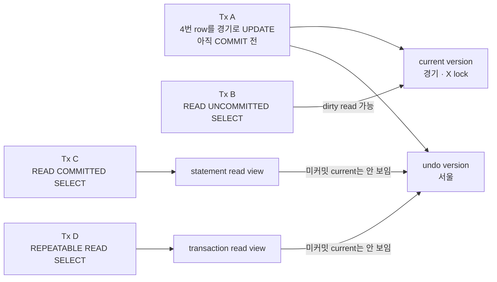

> [!warning] `READ UNCOMMITTED`도 “일관된 읽기”인가?
> 잠금은 사용하지 않지만 uncommitted version을 볼 수 있어 dirty read가 가능하므로 엄밀한 consistent snapshot은 아니다. `READ COMMITTED`와 `REPEATABLE READ`의 plain SELECT가 read view와 undo version으로 일관된 nonlocking read를 제공한다. `READ UNCOMMITTED`는 **nonlocking이지만 inconsistent할 수 있는 read**로 구분한다.

#### “순수한 SELECT는 기다리지 않는다”의 적용 범위

| SQL·상황 | 일반적인 동작 |
|---|---|
| RC·RR의 plain `SELECT` | row lock을 잡지 않고 read view에 보이는 version을 읽음 |
| RU의 plain `SELECT` | lock 없이 읽지만 dirty read 가능 |
| `SELECT ... FOR SHARE·FOR UPDATE` | consistent read가 아닌 locking read라 blocker를 기다릴 수 있음 |
| autocommit이 꺼진 `SERIALIZABLE` plain `SELECT` | `FOR SHARE`처럼 locking read가 되어 기다릴 수 있음 |
| `INSERT ... SELECT`·`CREATE TABLE ... SELECT`의 source read | RR에서는 statement-based recovery 재현성을 위해 shared next-key lock을 사용할 수 있음. RC에서는 source를 consistent read로 읽음 |
| `UPDATE ... WHERE ...`·`DELETE ... WHERE ...` | current record·range를 잠그는 DML이므로 lock wait 가능 |

따라서 원문의 “INSERT와 연결되지 않는 순수한 읽기”는 plain SELECT를 기억하기 좋은 표현이다. 다만 `INSERT ... SELECT`뿐 아니라 locking clause, `SERIALIZABLE`, DML subquery 같은 예외도 같이 본다.

#### undo에서 읽는다는 뜻

InnoDB가 모든 SELECT를 처음부터 undo tablespace에서 실행한다는 뜻은 아니다.

```text
clustered current record의 DB_TRX_ID 확인
→ read view에 보이면 current version 반환
→ 보이지 않으면 DB_ROLL_PTR로 undo record 추적
→ 보이는 previous version을 memory에서 재구성해 반환
```

current page와 undo page 모두 buffer pool에 있을 수 있고, 없으면 storage I/O가 발생할 수 있다. “잠금 없이 읽는다”는 **lock wait를 피한다**는 말이지 CPU·memory·disk I/O 비용이 0이라는 뜻은 아니다. version chain이 길면 여러 undo record를 따라가야 해 읽기 비용도 증가한다.

#### long transaction이 undo purge를 막는 흐름

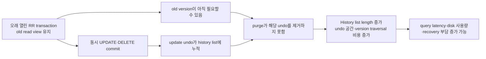

대표적인 원인은 `autocommit=0`인 session에서 SELECT 후 commit·rollback을 잊는 경우, 긴 API transaction, `mysqldump --single-transaction` 중 많은 DML이 발생하는 경우다.

```sql
SELECT trx_mysql_thread_id, trx_state, trx_started,
       TIMESTAMPDIFF(SECOND, trx_started, NOW()) AS age_seconds,
       trx_rows_modified, trx_query
FROM information_schema.innodb_trx
ORDER BY trx_started;

SHOW ENGINE INNODB STATUS; -- TRANSACTIONS의 History list length 확인
```

`History list length`의 절대 정상값 하나를 외우기보다 평소 baseline과 증가 추세, 가장 오래된 transaction age, write traffic을 함께 본다. Spring에서는 DB transaction 안에 외부 API 호출·긴 계산·사용자 입력 대기를 넣지 않고 transaction boundary를 짧게 유지한다.

### 4.2.5 자동 데드락 감지

#### wait-for graph에서 cycle을 찾는다

node는 transaction, `A → B` edge는 “A가 B의 lock을 기다린다”는 뜻이다.

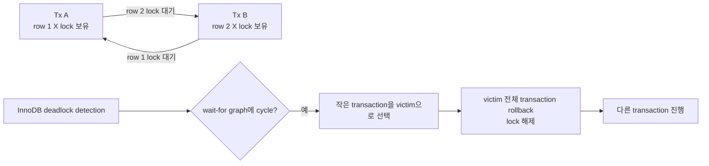

공식 문서가 보장하는 핵심은 InnoDB가 deadlock을 자동 감지해 cycle을 끊는다는 것이다. “전용 thread가 주기적으로만 검사한다”는 구현 세부를 동작 계약처럼 외우기보다, **새 lock wait 관계에서 wait-for graph를 탐색하고 deadlock이면 즉시 victim을 rollback한다**고 이해한다.

#### victim은 정확히 무엇이 작은 transaction인가?

원문의 “undo log record가 적은 transaction”은 rollback 비용이 작은 쪽이라는 방향은 맞다. MySQL 공식 설명은 transaction 크기를 **insert·update·delete한 row 수**로 판단해 작은 transaction을 선택한다고 표현한다. 이는 항상 늦게 시작한 transaction이나 lock을 적게 가진 transaction을 고른다는 뜻이 아니다.

탐색 자체에도 안전 한도가 있다. wait-for list가 200 transaction에 도달하거나 탐색 과정에서 1,000,000개가 넘는 lock을 확인해야 하면 InnoDB는 탐색을 시도한 transaction을 rollback하고 `TOO DEEP OR LONG SEARCH...`를 deadlock 정보에 남길 수 있다.

#### `innodb_table_locks`의 정확한 범위

`innodb_table_locks=ON`은 기본값이다. `autocommit=0`이고 MySQL 상위 layer가 InnoDB row lock을 알고 있을 때 InnoDB가 `LOCK TABLES`로 얻은 table lock까지 인지하는 데 관여한다.

이 설정이 MySQL metadata lock이나 다른 storage engine lock을 전부 InnoDB wait-for graph에 넣는 만능 스위치는 아니다. InnoDB가 알지 못하는 table lock·다른 engine이 포함된 deadlock은 자동 감지가 불가능할 수 있어 timeout으로 해소해야 한다. 일반적인 InnoDB application에서는 명시적 `LOCK TABLES`보다 transaction과 row-level locking을 사용한다.

#### detector ON과 OFF의 trade-off

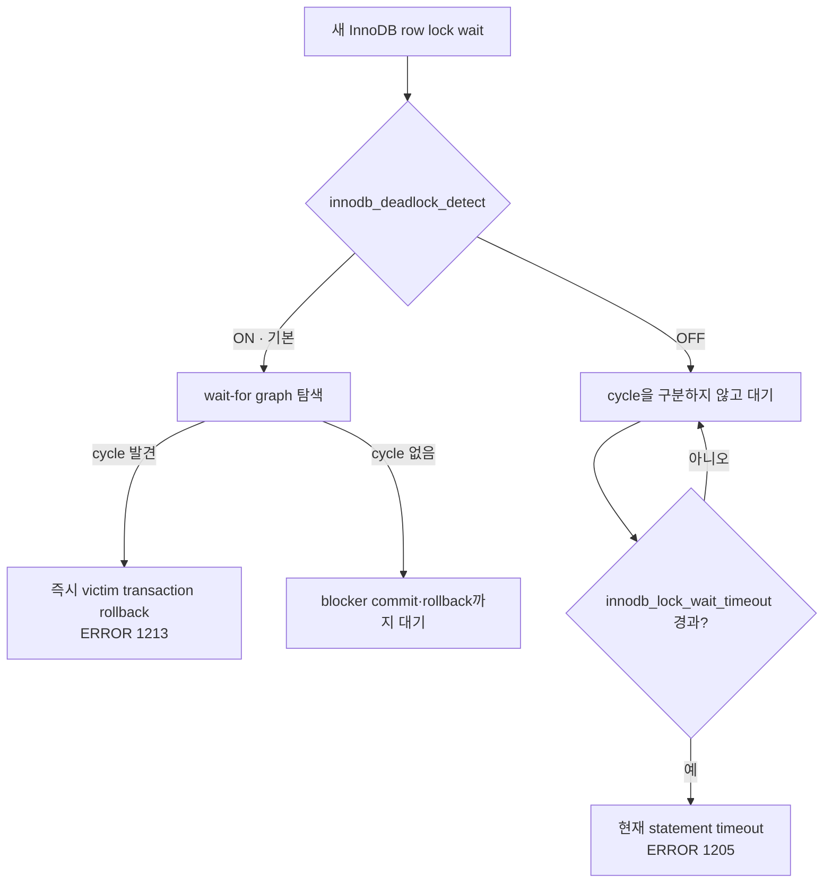

| 선택 | 장점 | 비용 |
|---|---|---|
| detector `ON` | real deadlock을 빠르게 끊어 lock 보유 시간과 장애 전파를 줄임 | 많은 thread가 같은 hot lock을 기다리면 graph 탐색 CPU·lock-system 경합이 커질 수 있음 |
| detector `OFF` | extreme high-contention에서 detector 탐색 비용을 제거할 수 있음 | real deadlock도 timeout까지 기다려 connection·thread·lock을 오래 점유하고 p99 latency가 커짐 |

따라서 일반 서비스에서는 ON을 유지한다. OFF는 “동시 connection이 많다”만으로 선택하지 않고, **같은 lock에 waiter가 대량 집중되고 detector CPU가 실제 병목이라는 측정 증거**가 있을 때 부하 테스트와 함께 검토한다.

#### `innodb_lock_wait_timeout`은 활성화 스위치가 아니라 대기 초 수다

`innodb_deadlock_detect=OFF`여도 기본 timeout이 유한하므로 원문의 “무한정 대기”는 timeout을 극단적으로 크게 두지 않는 한 정확하지 않다. detector가 ON이면 real deadlock은 timeout을 기다리지 않고 즉시 해결하고, detector가 OFF이면 deadlock도 일반 lock wait처럼 timeout 시점까지 남는다.

현재 `realmysql 8.0.44` 실습 server를 읽기 전용으로 확인한 값은 다음과 같다.

```text
innodb_deadlock_detect      = ON
innodb_lock_wait_timeout    = 50 seconds
innodb_table_locks          = ON
innodb_print_all_deadlocks  = OFF
innodb_rollback_on_timeout  = OFF
```

`innodb_lock_wait_timeout`은 GLOBAL·SESSION에서 숫자로 조절한다. 너무 낮추면 정상적인 짧은 lock wait까지 실패시키고, 너무 높이면 blocked connection과 tail latency가 오래 쌓인다.

> [!important] rollback 범위와 application retry
> deadlock victim은 **transaction 전체**가 rollback된다. 반면 lock wait timeout은 기본 `innodb_rollback_on_timeout=OFF`에서 **현재 statement만** rollback되고 transaction은 남을 수 있다. application은 두 오류를 구분하되, 안전하게 transaction boundary 전체를 rollback한 뒤 처음부터 제한 횟수만 재시도해야 한다. backoff·jitter와 idempotency도 함께 설계한다.

#### 운영 확인 순서

```sql
-- 현재 blocker → waiter 관계
SELECT waiting_pid, waiting_query,
       blocking_pid, blocking_query,
       wait_age_secs, locked_table, locked_index
FROM sys.innodb_lock_waits;

-- 가장 최근 deadlock의 SQL·lock·victim
SHOW ENGINE INNODB STATUS;

-- 반복 deadlock 조사 기간에만 error log로 모두 남김
SET GLOBAL innodb_print_all_deadlocks = ON;
```

| 현상 | 먼저 확인 | 우선 전략 |
|---|---|---|
| 가끔 발생하는 1213 deadlock | `LATEST DETECTED DEADLOCK`, transaction SQL·lock order | 전체 transaction retry, 접근 순서 통일, transaction 단축 |
| 1205 lock wait timeout 증가 | `sys.innodb_lock_waits`, blocker의 transaction age | 긴 transaction 제거, index로 scan·lock 범위 축소 |
| hot row에 waiter가 대량 집중 | waiting count, CPU, p95·p99, detector ON/OFF 부하 비교 | 업무 분산·queue·atomic update를 먼저 검토; 증거가 있을 때 detector OFF 실험 |
| `History list length` 지속 증가 | oldest `INNODB_TRX`, DML량, purge 진행 | read view를 오래 잡는 session 종료·transaction boundary 단축 |

### 4.2.6 자동화된 장애 복구

#### 정상 crash recovery와 forced recovery는 목적이 다르다

InnoDB는 정상적인 비정상 종료라면 서버 시작 과정에서 자동 crash recovery를 수행한다. 먼저 checkpoint 이후의 redo를 data page에 다시 적용해 committed change를 복구하고, crash 당시 끝나지 않은 transaction은 undo로 rollback한다.


`innodb_force_recovery`는 이 정상 복구가 손상 때문에 실패할 때 일부 InnoDB 기능을 포기하고 **server를 간신히 띄워 data를 dump하기 위한 emergency mode**다. 손상된 file을 고치거나 정상 운영 상태로 되돌리는 설정이 아니다.

> [!danger] `redo log 손상 → 6`으로 바로 시작하지 않는다
> 공식 절차는 **항상 1부터 필요한 만큼만 단계적으로 올리는 것**이다. 4 이상은 data file을 영구적으로 더 손상시킬 수 있고, 6은 redo roll-forward를 생략해 page를 오래된 상태로 남기므로 최후의 수단이다. 원본 instance에서 바로 실험하지 말고 data directory의 physical copy와 backup을 먼저 확보한다.

#### `innodb_force_recovery=1~6`이 포기하는 것

큰 값은 작은 값의 동작을 모두 포함한다.

| 값 | 내부 이름 | 생략·허용하는 일 | 핵심 위험 |
|---:|---|---|---|
| 0 | normal | 정상 crash recovery | 기본값 |
| 1 | `SRV_FORCE_IGNORE_CORRUPT` | corrupt page·index record를 건너뛰며 기동 시도 | 손상된 page의 row는 dump에서 빠질 수 있음 |
| 2 | `SRV_FORCE_NO_BACKGROUND` | master·purge background thread를 시작하지 않음 | purge가 진행되지 않음 |
| 3 | `SRV_FORCE_NO_TRX_UNDO` | crash 뒤 미완료 transaction rollback을 생략 | uncommitted change가 남은 상태로 보일 수 있음 |
| 4 | `SRV_FORCE_NO_IBUF_MERGE` | change buffer merge와 통계 계산을 생략 | read-only, data file 영구 손상 가능, secondary index 재구축 필요 가능 |
| 5 | `SRV_FORCE_NO_UNDO_LOG_SCAN` | 시작 시 undo log를 읽지 않고 incomplete transaction도 committed처럼 취급 | read-only, 논리적으로 잘못된 row가 남을 수 있음 |
| 6 | `SRV_FORCE_NO_LOG_REDO` | redo roll-forward 자체를 생략 | read-only, checkpoint 이후 변경 유실·B-tree 추가 손상 가능 |

원문의 `data file 손상은 1`, `redo log 손상은 6`은 사진의 기능을 기억하기 위한 축약이다. 실제 선택은 error log·backup·filesystem 상태를 확인한 뒤 **증상에 관계없이 1부터** 올린다. 값이 커질수록 “복구 능력”이 강해지는 것이 아니라 **일관성을 지키는 절차를 더 많이 포기**한다.

#### 운영 복구 runbook

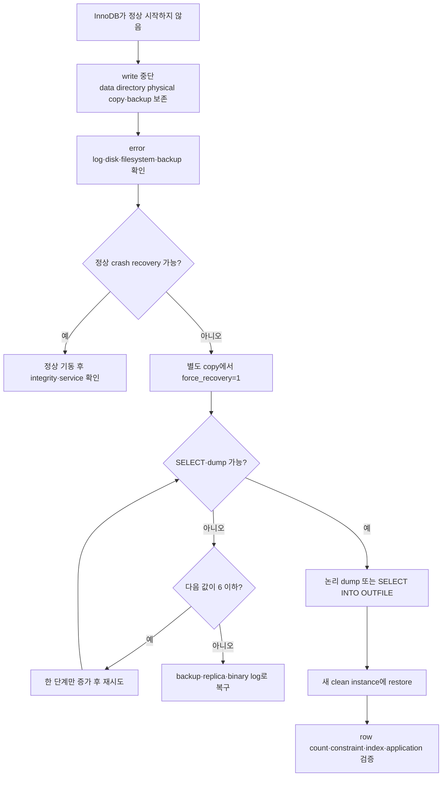

forced recovery instance에는 application traffic을 붙이지 않는다. dump가 되면 가능한 data를 빼고 새 instance를 구축한다. 가장 좋은 복구 경로는 여전히 검증된 full backup + binary log point-in-time recovery이므로, `innodb_force_recovery`는 backup을 대체하지 않는다.

### 4.2.7 InnoDB 버퍼 풀

InnoDB buffer pool은 data·index page를 main memory에 cache하는 공간이면서, DML로 바뀐 dirty page를 당장 data file에 쓰지 않고 모아 두는 write buffer다.

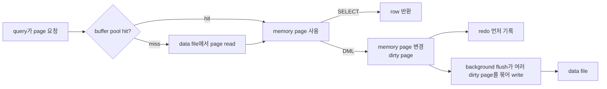

write를 모으면 같은 page의 여러 변경을 한 번에 내릴 수 있고, page마다 흩어진 small random I/O를 정렬·병합해 storage가 처리하기 좋은 sequential·batch I/O로 바꿀 여지가 생긴다. 다만 commit durability는 data page flush가 아니라 redo log flush 정책과 연결된다.

#### 4.2.7.1 버퍼 풀의 크기 설정

##### percentage는 출발점이지 정답이 아니다

공식 문서는 dedicated server에서 physical memory의 50~75%, 경우에 따라 80%까지를 흔한 출발점으로 소개하지만 고정 공식은 아니다. 실제 상한은 다음 예산으로 잡는다.

```text
host·container memory limit
- OS page cache·kernel·monitoring agent
- MySQL global memory(buffer pool 외 redo log buffer·Performance Schema 등)
- connection·statement별 local memory의 peak
- replication·backup·DDL·temporary table의 순간 memory
- 안전 여유와 OOM 방지분
= buffer pool에 줄 수 있는 상한
```

원문의 “record buffer”는 하나의 독립된 대형 pool을 뜻하지 않는다. scan row prefetch용 variable-size buffer와 `read_buffer_size`, `read_rnd_buffer_size`, `sort_buffer_size`, join·network buffer처럼 statement·connection에 따라 필요한 local allocation을 함께 경계하라는 뜻으로 이해한다. 따라서 `max_connections × 모든 per-session max`는 지나치게 보수적일 수 있지만, 실측 peak RSS·동시 query 유형 없이 무시해서도 안 된다.

##### online resize와 단위

`innodb_buffer_pool_size`는 runtime에 늘리거나 줄일 수 있다. 그러나 resize 시작·global lock·hash resize·page withdraw 구간에는 transaction 대기나 free page 부족이 생길 수 있으므로 한가한 시간에 작은 단계로 바꾸고 진행률과 latency를 관찰한다. “절대 줄이지 않는다”보다 **downsize가 page 회수와 eviction을 동반해 더 민감하므로 특히 조심한다**가 정확하다.

최소 조정 단위는 항상 128 MiB가 아니라 다음 곱이다.

```text
innodb_buffer_pool_chunk_size × innodb_buffer_pool_instances
```

chunk 기본값이 128 MiB라서 instance가 1개인 기본 실습 환경에서는 128 MiB 단위처럼 보인다. 설정값이 이 곱의 배수가 아니면 MySQL이 가능한 값으로 조정한다.

```sql
SET GLOBAL innodb_buffer_pool_size = 512 * 1024 * 1024;

SHOW STATUS WHERE Variable_name LIKE 'Innodb_buffer_pool_resize_status%';
```

##### buffer pool instance는 경합을 나누는 shard다

각 instance는 자체 LRU·free·flush list와 hash 구조를 가진다. MySQL 8.0의 일반적인 비-Windows 환경에서는 `innodb_buffer_pool_size >= 1GB`이면 기본 8개, 1GB 미만이면 기본 1개이며 여러 instance는 1GB 이상일 때만 유효하다. 여러 instance를 쓴다면 instance당 최소 1GB가 되도록 권장한다. 따라서 책의 “기본 8개·5GB당 1개”에서 기본 8개는 조건부로 맞지만, instance당 크기와 현재 설치값·workload contention을 먼저 확인한다.

현재 `realmysql 8.0.44` Community container를 읽기 전용으로 확인한 값은 다음과 같다.

```text
innodb_buffer_pool_size       = 134217728 bytes = 128 MiB
innodb_buffer_pool_chunk_size = 134217728 bytes = 128 MiB
innodb_buffer_pool_instances  = 1
innodb_page_size              = 16384 bytes = 16 KiB
buffer_pool_pages_total       = 8192
buffer_pool_pages_free        = 1024
buffer_pool_pages_dirty       = 0
```

이 container는 학습용 128 MiB pool이므로 여러 instance로 나눌 대상이 아니다. 운영에서는 hit ratio 하나로 결론 내리지 않고 free·dirty page, physical read rate, eviction·pending write, query latency, process RSS·swap·OOM을 함께 본다.

```sql
SHOW GLOBAL STATUS WHERE Variable_name IN (
  'Innodb_buffer_pool_pages_total',
  'Innodb_buffer_pool_pages_free',
  'Innodb_buffer_pool_pages_dirty',
  'Innodb_buffer_pool_read_requests',
  'Innodb_buffer_pool_reads'
);
```

누적 hit ratio는 장기간 평균이라 순간 churn을 숨길 수 있다. 측정 구간의 delta로 `1 - ΔInnodb_buffer_pool_reads / ΔInnodb_buffer_pool_read_requests`를 보고 latency·I/O와 함께 해석한다.

#### 4.2.7.2 버퍼 풀의 구조

buffer pool은 `innodb_page_size` 크기의 frame들로 나뉘며 page가 어느 frame에 있는지 찾는 hash 구조와 page 수명을 관리하는 list들을 가진다.

| 구조 | 포함 대상과 역할 |
|---|---|
| free list | 아직 data page가 배치되지 않아 즉시 사용할 수 있는 빈 frame |
| LRU list | cache된 page의 최근 사용성을 관리해 eviction 후보를 고름 |
| flush list | 변경된 dirty page를 **oldest modification LSN** 순서로 관리해 checkpoint flush 대상을 고름 |

한 dirty page는 LRU list에도 있고 flush list에도 동시에 연결될 수 있다. LRU는 “cache에 계속 둘 가치”, flush list는 “disk와 달라서 언제 내려써야 하는가”라는 서로 다른 질문에 답한다. clean page가 flush되면 flush list에서는 빠지지만 cache할 가치가 있으면 LRU에는 남는다.

##### InnoDB의 midpoint LRU

책 사진의 new 5/8·old 3/8은 strict LRU가 아니라 scan-resistant midpoint insertion이다.

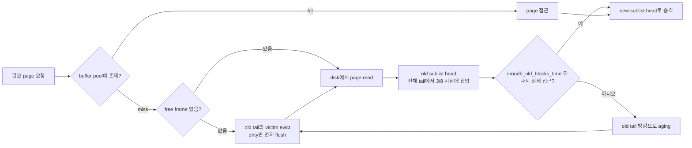

기본 `innodb_old_blocks_pct=37`이라 old 영역이 약 3/8이고, `innodb_old_blocks_time=1000ms` 동안의 빠른 재접근만으로는 즉시 young으로 승격하지 않는다. 이 장치는 full scan·read-ahead로 한 번만 읽는 page가 hot working set을 밀어내는 cache pollution을 줄인다. 현재 실습 container도 `37`, `1000ms`다.

사진의 AHI·B-tree는 row를 찾는 index 경로이고, buffer pool 내부에서는 page identifier를 frame에 매핑하는 page hash로 cache hit를 판단한다. Adaptive Hash Index는 특정 B-tree 탐색을 단축할 수 있는 선택적 보조 구조이지 모든 buffer pool lookup의 필수 관문은 아니다.

#### 4.2.7.3 버퍼 풀과 리두 로그

![[assets/book-photos/real-mysql-8-0-1/04-아키텍쳐/4.2-InnoDB-스토리지-엔진-아키텍쳐/04-12-InnoDB-버퍼-풀과-리두-로그.JPG]]

##### clean·dirty page와 write-ahead logging

- clean page: data file과 같은 내용이라 필요하면 바로 eviction할 수 있다.
- dirty page: DML로 memory 내용이 data file보다 새롭다. eviction하거나 checkpoint 경계를 전진시키려면 disk에 flush해야 한다.
- redo log: 변경된 full page 복사본이 아니라 page change를 재실행할 log record를 먼저 순차 기록한다.

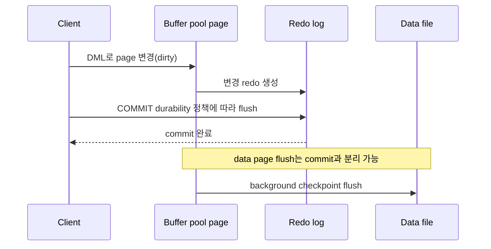

redo를 먼저 durable하게 만드는 write-ahead logging 덕분에 data page를 매 commit마다 random write하지 않아도 crash 뒤 변경을 재실행할 수 있다.

##### LSN과 checkpoint age

LSN은 redo 기록 위치를 나타내는 계속 증가하는 논리 번호다. redo file은 제한된 disk 공간을 순환해 쓰지만 LSN 자체가 다시 0으로 돌아가는 것은 아니다.

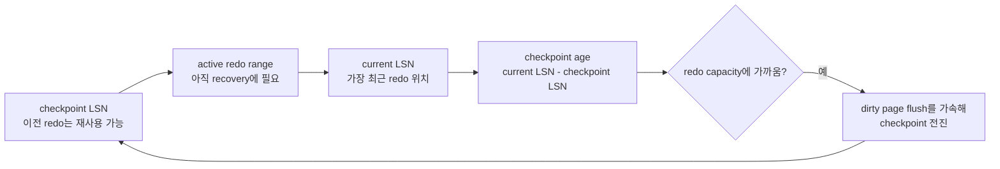

checkpoint가 전진하려면 그 경계 이전 redo에 의존하는 dirty page가 data file에 안전하게 반영되어야 한다. 따라서 redo capacity는 buffer pool 안에 유지할 수 있는 dirty page 양과 write burst를 흡수할 시간에 간접적인 상한을 만든다.

| 설정 불균형 | 결과 |
|---|---|
| 큰 buffer pool + 너무 작은 redo capacity | checkpoint가 자주 dirty flush를 강제해 write buffering 이점 감소·latency spike 가능 |
| 작은 buffer pool + 매우 큰 redo capacity | cache·dirty page 자체가 적어 큰 redo 공간의 이점을 거의 못 쓰고 recovery time·disk 공간만 늘 수 있음 |
| redo를 무조건 크게 설정 | flush 압력은 줄 수 있지만 crash recovery 시간·disk 사용·운영 변경 비용이 커질 수 있음 |

책의 5~10GB는 특정 시점의 시작 heuristic이다. 현재 workload의 redo 생성률과 허용 recovery time으로 결정하고, 점진적으로 조정한다.

##### MySQL 8.0.30 이후 달라진 설정

책의 `ib_logfile0·ib_logfile1`와 `innodb_log_file_size × innodb_log_files_in_group` 설명은 MySQL 8.0.30 이전 모델이다. 8.0.30부터는 `innodb_redo_log_capacity`로 전체 용량을 runtime에 조절하고, `#innodb_redo` 아래 약 32개의 ordinary·spare file로 관리한다.

현재 `realmysql 8.0.44`의 관측값은 다음과 같다.

```text
innodb_redo_log_capacity          = 104857600 bytes = 100 MiB
Innodb_redo_log_capacity_resized  = 104857600
Innodb_redo_log_checkpoint_lsn    = 761023447
Innodb_redo_log_current_lsn       = 761023447
Innodb_redo_log_logical_size      = 512 bytes
Innodb_os_log_written             = 749665280 bytes (누적)
```

측정 순간에는 dirty page가 0이고 current LSN과 checkpoint LSN이 같아 checkpoint age가 사실상 0이었다. 이는 한 시점의 idle snapshot일 뿐 workload capacity가 충분하다는 증거는 아니다.

```sql
SHOW GLOBAL STATUS WHERE Variable_name IN (
  'Innodb_redo_log_capacity_resized',
  'Innodb_redo_log_checkpoint_lsn',
  'Innodb_redo_log_current_lsn',
  'Innodb_redo_log_logical_size',
  'Innodb_os_log_written',
  'Innodb_os_log_pending_writes'
);

SELECT FILE_NAME, START_LSN, END_LSN, SIZE_IN_BYTES, IS_FULL, CONSUMER_LEVEL
FROM performance_schema.innodb_redo_log_files;
```

운영에서는 `current LSN - checkpoint LSN`, redo bytes/sec, dirty page 비율, pending flush·I/O latency, crash recovery 목표를 같은 시간축에서 본다.

#### 4.2.7.4 버퍼 풀 플러시(Buffer Pool Flush)

> [!summary] 나중에 30초만 다시 읽는다면
> - **Flush list flush:** 오래된 dirty page를 써서 checkpoint를 전진시키고 redo 공간을 재사용한다.
> - **LRU list flush:** LRU tail에서 page를 정리해 새 page가 들어갈 free frame을 만든다.
> - 목표는 dirty page를 무조건 적게 유지하는 것이 아니라, foreground query를 방해하는 급격한 flush와 free-page 고갈을 피하면서 storage가 감당할 속도로 꾸준히 쓰는 것이다.

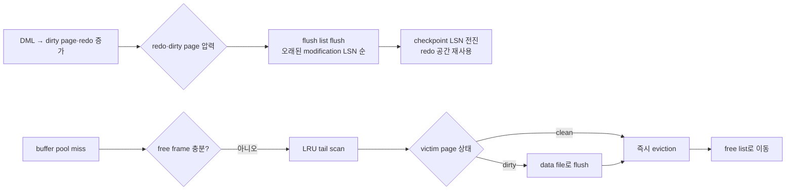

##### 4.2.7.4.1 플러시 리스트 플러시

Adaptive flushing은 redo 생성 속도·checkpoint age·dirty page 상태를 보고 page cleaner가 초당 얼마나 많은 dirty page를 내릴지 조정한다. 평소 조금씩 flush해 checkpoint가 redo tail을 따라가게 만들고, redo 공간이 임계점에 가까워져 foreground thread가 한꺼번에 flush를 떠안는 상황을 줄이는 것이 핵심이다.

##### 플러시 시스템 변수 — 이것만 다시 보면 된다

| 시스템 변수 | 8.0 기본·현재 실습값 | 동적 | 무엇을 제어하는가 | 조정 판단·주의 |
|---|---:|:---:|---|---|
| `innodb_page_cleaners` | 기본 4, 현재 **1** | 아니오 | flush list·LRU flush 작업을 수행하는 cleaner thread 수 | buffer pool instance보다 크면 instance 수로 낮아진다. write-I/O 병목과 hardware 여유가 확인될 때만 재시작 설정으로 검토한다. |
| `innodb_max_dirty_pages_pct_lwm` | 10% | 예 | 이 비율부터 dirty-page preflush 시작 | `max_dirty_pages_pct`보다 낮아야 한다. 0이면 이 조기 flush 조건을 끈다. |
| `innodb_max_dirty_pages_pct` | 90% | 예 | 넘지 않도록 하는 dirty-page 목표 상한 | **flush 속도 자체를 정하지 않는다.** 낮추기 전에 redo 압력·storage latency·I/O budget을 먼저 본다. |
| `innodb_io_capacity` | 200 IOPS | 예 | 평상시 InnoDB background task에 줄 I/O budget | device benchmark 최대 IOPS를 그대로 넣지 않는다. foreground read·log·backup 여유를 남긴 지속 가능 값으로 시작한다. |
| `innodb_io_capacity_max` | 2000 IOPS | 예 | flushing이 뒤처졌을 때 background I/O burst 상한 | 너무 크면 query I/O를 잠식하고 latency spike, 너무 작으면 checkpoint가 뒤처질 수 있다. |
| `innodb_adaptive_flushing` | ON | 예 | redo 생성 속도와 dirty page를 이용한 adaptive flush | 보통 ON 유지. OFF 실험은 write pattern과 checkpoint age를 측정할 때만 한다. |
| `innodb_adaptive_flushing_lwm` | redo capacity 10% | 예 | 이 redo 사용률을 넘으면 adaptive flush 시작 | adaptive flushing을 OFF해도 이 경계를 넘으면 adaptive flushing이 작동할 수 있다. |
| `innodb_flush_neighbors` | 0 | 예 | 같은 extent의 이웃 dirty page도 묶어 쓸지 | SSD는 보통 0, seek가 비싼 HDD는 1·2를 실험한다. storage 종류만 보고 무조건 바꾸지 않는다. |
| `innodb_lru_scan_depth` | instance당 1024 | 예 | cleaner가 매초 각 LRU tail에서 훑는 page 수 | 총 scan work는 대략 `instances × scan_depth`. free page가 0에 가까워지는지 보고 낮게 시작해 올린다. |
| `innodb_idle_flush_pct` | `io_capacity`의 100% | 예 | idle 시 flush 속도를 `io_capacity`의 몇 %로 제한할지 | 낮추면 SSD write를 줄일 수 있지만 shutdown·crash recovery 시간이 길어질 수 있다. |

`innodb_io_capacity=1000`은 “초당 정확히 1000번 write한다”는 보장이 아니다. 내부 알고리즘의 budget이며 실제 I/O는 workload, page 병합, checkpoint pressure와 `innodb_io_capacity_max`에 따라 달라진다.

##### 설정을 바꾸기 전 보는 순서

```sql
SHOW GLOBAL STATUS WHERE Variable_name IN (
  'Innodb_buffer_pool_pages_dirty',
  'Innodb_buffer_pool_pages_total',
  'Innodb_buffer_pool_pages_free',
  'Innodb_buffer_pool_wait_free',
  'Innodb_data_pending_writes',
  'Innodb_data_pending_fsyncs',
  'Innodb_redo_log_checkpoint_lsn',
  'Innodb_redo_log_current_lsn'
);
```

1. dirty ratio와 checkpoint age가 계속 증가하는가?
2. pending write·fsync와 storage latency가 같이 증가하는가?
3. free page가 바닥나 `Innodb_buffer_pool_wait_free`가 증가하는가?
4. 그렇다면 지속 가능한 `io_capacity`와 짧은 burst용 `io_capacity_max`를 먼저 맞춘다.
5. 이후에도 급격한 flush가 남을 때 dirty low-water mark·redo capacity·LRU scan을 함께 검토한다.

현재 `realmysql 8.0.44`는 idle snapshot에서 dirty page·pending write·checkpoint age가 0이었고 다음 설정을 사용했다.

```text
page_cleaners=1       dirty_lwm=10%   dirty_target=90%
io_capacity=200       io_capacity_max=2000
adaptive_flushing=ON  adaptive_lwm=10%
flush_neighbors=0     lru_scan_depth=1024
```

##### 4.2.7.4.2 LRU 리스트 플러시

LRU flush는 cache의 인기보다 **새 page를 넣을 빈 frame 확보**에 초점이 있다. cleaner가 각 instance의 LRU tail을 `innodb_lru_scan_depth`만큼 살피면서 clean page는 free list로 보내고, dirty page는 먼저 flush한 뒤 eviction 가능 상태로 만든다.

`innodb_buffer_pool_wait_free`가 증가하면 query가 free frame을 기다렸다는 강한 신호다. 이때 buffer pool size, scan depth, page cleaner 지연, storage write latency를 같이 보고 원인을 좁힌다. 단순히 scan depth를 크게 하면 CPU·mutex·I/O 작업량도 함께 늘 수 있다.

#### 4.2.7.5 버퍼 풀 상태 백업 및 복구

> [!summary] 핵심
> buffer pool dump는 data page 자체를 저장하는 backup이 아니다. 최근 사용한 page의 **tablespace ID·page ID 목록**만 `ib_buffer_pool`에 기록하고, 재시작 후 그 목록의 page를 data file에서 다시 읽어 warmup 시간을 줄인다.

| 시스템 변수·상태 | 기본·현재 | 동적 | 역할 |
|---|---:|:---:|---|
| `innodb_buffer_pool_dump_at_shutdown` | ON | 예 | 정상 shutdown 때 최근 사용 page 목록 저장 |
| `innodb_buffer_pool_load_at_startup` | ON | **아니오** | startup 때 저장된 목록을 background load |
| `innodb_buffer_pool_dump_pct` | 25% | 예 | 각 pool에서 dump할 MRU 쪽 page 비율 |
| `innodb_buffer_pool_filename` | `ib_buffer_pool` | 예 | data directory 기준 상대 파일명 |
| `innodb_buffer_pool_dump_now` | OFF trigger | 예 | ON을 설정하면 즉시 dump 작업 시작; 값은 OFF로 돌아감 |
| `innodb_buffer_pool_load_now` | OFF trigger | 예 | ON을 설정하면 즉시 load 작업 시작 |
| `innodb_buffer_pool_load_abort` | OFF trigger | 예 | 진행 중 load 중단 |
| `Innodb_buffer_pool_dump_status` | status | 읽기 전용 | dump 진행·완료 상태 |
| `Innodb_buffer_pool_load_status` | status | 읽기 전용 | load 진행·완료 상태 |

```sql
SET GLOBAL innodb_buffer_pool_dump_now = ON;
SHOW STATUS LIKE 'Innodb_buffer_pool_dump_status';

SET GLOBAL innodb_buffer_pool_load_now = ON;
SHOW STATUS LIKE 'Innodb_buffer_pool_load_status';

-- startup warmup이 foreground I/O와 경쟁하면 중단
SET GLOBAL innodb_buffer_pool_load_abort = ON;
```

오래된 page ID나 삭제된 page가 목록에 있어도 load 과정에서 건너뛴다. 파일이 작아도 정상이며, 실제 data backup·crash recovery 수단이 아니라 restart 직후 cache miss를 줄이는 성능 기능이다.

#### 4.2.7.6 버퍼 풀의 적재 내용 확인

`INFORMATION_SCHEMA.INNODB_CACHED_INDEXES`는 index별로 buffer pool에 cache된 page 수를 보여 준다. 특정 table·index가 cache를 얼마나 차지하는지 빠르게 보는 용도다.

```sql
SELECT t.NAME AS table_name,
       i.NAME AS index_name,
       c.N_CACHED_PAGES AS cached_pages
FROM information_schema.INNODB_CACHED_INDEXES c
JOIN information_schema.INNODB_INDEXES i ON i.INDEX_ID = c.INDEX_ID
JOIN information_schema.INNODB_TABLES t ON t.TABLE_ID = i.TABLE_ID
ORDER BY c.N_CACHED_PAGES DESC;
```

이 값은 “현재 cache된 index page 수”이지 index 전체 크기나 hit rate가 아니다. `PROCESS` 권한이 필요하다. `INNODB_BUFFER_PAGE`처럼 page 하나씩 상세 조회하는 table은 큰 buffer pool에서 조회 자체가 무거울 수 있으므로 운영 중 상시 수집용으로 쓰지 않는다.

### 4.2.8 Doublewrite Buffer

![[assets/book-photos/real-mysql-8-0-1/04-아키텍쳐/4.2-InnoDB-스토리지-엔진-아키텍쳐/04-13-Doublewrite-작동-방식.jpg]]

> [!summary] 나중에 다시 볼 핵심
> redo는 page에 적용할 **변경 내용**을 보존하지만, OS·storage 장애로 16KiB page가 절반만 기록되어 page 자체가 찢어지면 redo를 적용할 정상 base page가 없을 수 있다. Doublewrite는 dirty page의 완전한 사본을 먼저 순차 기록해 두었다가 torn page를 발견하면 복구용 사본으로 사용한다.

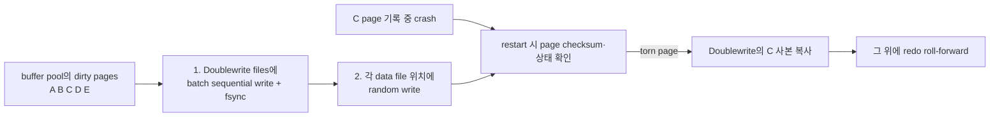

책의 “system tablespace에 Doublewrite 영역” 설명은 MySQL 8.0.20 이전 구조다. **8.0.20부터는 별도 doublewrite files**를 사용하고, 8.0.30부터 `DETECT_ONLY` 모드와 일부 online 전환을 지원한다.

| 시스템 변수 | 현재 실습값 | 동적 | 기억할 점 |
|---|---:|:---:|---|
| `innodb_doublewrite` | ON | 조건부 | 기본은 `ON`=`DETECT_AND_RECOVER`. 8.0.30+에서 enabled mode끼리는 online 전환 가능하지만 `OFF`와 enabled 사이 전환은 restart가 필요하다. |
| `innodb_doublewrite_dir` | data directory | 아니오 | 8.0.20+ doublewrite file 위치. 가능하면 빠르고 신뢰할 수 있는 storage를 사용한다. |
| `innodb_doublewrite_files` | 2 | 아니오 | 기본은 buffer pool instance당 2개, 최소 2개. 고급 튜닝 영역이다. |
| `innodb_doublewrite_pages` | 4 | 아니오 | thread당 batch page 상한. MySQL 8.0 기본은 `innodb_write_io_threads` 값이다. |
| `innodb_flush_log_at_trx_commit` | 1 | 예 | redo commit durability. Doublewrite의 torn-page 방어와 다른 축이다. |
| `sync_binlog` | 1 | 예 | binary log durability·복제 복구 기준. Doublewrite로 대체할 수 없다. |

Doublewrite를 끄면 write I/O는 줄 수 있지만 torn page 복구 능력을 포기한다. benchmark나 storage가 end-to-end atomic page write를 보장하는지 검증한 경우가 아니면 기본 ON을 유지한다. 또한 Doublewrite·redo·binary log·backup은 서로 해결하는 실패가 다르므로 하나를 켰다고 다른 것을 느슨하게 하면 안 된다.

현재 실습 server에서는 Doublewrite가 실제 사용된 누적 흔적도 확인됐다.

```text
Innodb_dblwr_writes        = 9,317
Innodb_dblwr_pages_written = 37,164
```

## 암기 카드

```text
clustered leaf = PK + 전체 row
secondary leaf = secondary key + PK
보조 index의 종착지는 PK, PK index의 종착지는 row
PK 없음 = UNIQUE NOT NULL 첫 index, 그것도 없음 = hidden row ID
FK 검사 = parent·child index 탐색 + 관련 record lock
foreign_key_checks ON 복귀 ≠ OFF 동안 row 재검증
MVCC = read view가 current·undo version 중 보이는 것을 선택
buffer pool = 현재 page cache, undo = 이전 version 재구성 정보
RC = consistent read마다 새 snapshot
RR = 첫 consistent read snapshot 재사용(MySQL 기본)
plain SELECT = consistent read, FOR UPDATE = current locking read
MVCC는 reader-writer block을 줄이지만 writer-writer 경쟁은 남김
lost update = atomic DML·version check·FOR UPDATE 중 의도에 맞게 해결
write skew = invariant에 참여하는 row·range 전체를 보호
긴 transaction = undo purge 지연 + history list 증가
RU = nonlocking이지만 consistent하지 않을 수 있음
RC·RR plain SELECT = read view + undo의 consistent nonlocking read
long read view = purge 기준 고정 → history list 증가
wait-for graph = requester transaction → blocker transaction
deadlock ON = cycle 즉시 감지 + 작은 transaction 전체 rollback
deadlock OFF = 탐색 CPU 절약 가능 + timeout까지 lock·connection 점유
lock wait timeout = 초 단위 대기 한도, 기본은 statement rollback
deadlock 대응 = lock 순서·짧은 transaction·좋은 index·전체 transaction retry
normal crash recovery = redo roll-forward + 미완료 transaction undo rollback
innodb_force_recovery = repair가 아니라 dump를 위한 emergency startup
forced recovery = 원본 copy 보존, 1부터 최소 단계, dump 후 clean rebuild
큰 force recovery 값 = 더 많은 consistency 절차 포기, 4~6은 위험 구간
buffer pool = data·index page cache + dirty page write buffer
buffer pool size = 고정 비율이 아니라 host budget·local memory·peak workload로 결정
resize granularity = chunk size × buffer pool instances
buffer pool instance = 자체 LRU·free·flush list를 가진 shard
free list = 빈 frame, LRU = cache 수명, flush list = dirty page의 oldest LSN 순서
midpoint LRU = 새 page를 old head에 넣어 scan pollution 방지
clean page = 바로 eviction 가능, dirty page = flush 필요
WAL = redo durable 후 data page는 background flush 가능
checkpoint age = current LSN - checkpoint LSN
redo capacity = dirty write burst를 흡수할 시간, buffer pool과 별도 축
MySQL 8.0.30+ = innodb_redo_log_capacity + #innodb_redo
flush list flush = oldest dirty page flush → checkpoint 전진 → redo 재사용
LRU flush = LRU tail 정리 → free frame 확보
dirty LWM = 조기 preflush 시작, dirty max = 목표 상한
io_capacity = 평상시 background I/O budget, io_capacity_max = 밀렸을 때 burst 상한
adaptive flushing = redo 생성률·checkpoint age에 맞춰 flush 속도 조절
flush_neighbors = SSD는 보통 0, HDD는 1·2 검토
LRU 총 scan work ≈ buffer pool instances × lru_scan_depth
buffer pool dump = page data가 아니라 tablespace·page ID 목록
dump/load = backup이 아니라 restart warmup
INNODB_CACHED_INDEXES = index별 현재 cached page 수
Doublewrite = torn page 복구용 완전한 page 사본
redo ≠ Doublewrite = 변경 내용 재실행 vs 정상 base page 보존
MySQL 8.0.20+ Doublewrite = system tablespace가 아닌 별도 #ib_*.dblwr file
durability = Doublewrite + redo flush + binlog sync + backup을 각각 설계
```

## 확인 질문

> [!question]- InnoDB의 clustered index leaf에는 무엇이 저장되는가?
> **답:** PK와 나머지 row column이 함께 저장된다. 그래서 PK lookup은 leaf에 도달하면 row를 얻고, PK range scan은 인접 leaf를 순서대로 읽기 좋다.

> [!question]- secondary index가 physical row address 대신 PK를 저장하면 조회는 어떻게 되는가?
> **답:** secondary B+Tree leaf에서 PK를 얻은 뒤 clustered B+Tree를 다시 찾아 전체 row를 읽는다. 필요한 column이 secondary leaf에 모두 있으면 covering index로 두 번째 lookup을 생략할 수 있다.

> [!question]- PK가 없는 InnoDB table에는 clustered index가 없는가?
> **답:** 아니다. 모든 column이 `NOT NULL`인 첫 UNIQUE index를 사용하고, 그것도 없으면 hidden 6-byte row ID로 `GEN_CLUST_INDEX`를 만든다.

> [!question]- optimizer는 언제나 PK에 고정적으로 더 높은 점수를 주는가?
> **답:** 아니다. clustered lookup이 추가 row lookup을 피하므로 비용이 낮게 나올 가능성이 크지만, optimizer는 선택도·page 수·covering·정렬·통계를 함께 계산한다.

> [!question]- foreign key를 만들 때 child index가 없으면 어떻게 되는가?
> **답:** MySQL이 foreign key column이 선두가 되는 index를 자동 생성한다. parent의 referenced key에도 usable index가 필요하다.

> [!question]- `foreign_key_checks`를 다시 ON으로 바꾸면 OFF 동안 생긴 orphan row도 자동 검사되는가?
> **답:** 아니다. 재활성화해도 기존 row 전수 검증은 수행하지 않는다. 통제된 session에서만 사용하고 별도의 orphan 검증 query를 실행해야 한다.

> [!question]- MVCC가 가장 강점을 보이는 상황은 무엇인가?
> **답:** update 중인 row가 있어도 일반 SELECT가 writer의 X lock을 기다리지 않고 자신에게 보이는 committed version을 읽어야 하는 read·write 혼합 OLTP다. reader-writer block을 줄이지만 writer-writer lock wait는 없애지 않는다.

> [!question]- `READ COMMITTED 이상은 undo, READ UNCOMMITTED는 buffer pool`이라고 나눠도 되는가?
> **답:** 아니다. buffer pool은 current page cache이고 undo는 old version을 만드는 정보다. RC·RR은 read view로 visibility를 판단하고 필요할 때 undo chain을 따라가며, RU는 uncommitted version을 볼 수 있어 consistent snapshot이 아니다.

> [!question]- READ COMMITTED와 REPEATABLE READ의 read view 차이는 무엇인가?
> **답:** RC는 consistent SELECT마다 새 read view를 만들어 직전에 commit된 변경을 다음 SELECT에서 볼 수 있다. RR은 첫 consistent read의 read view를 transaction 동안 재사용해 같은 plain SELECT 결과를 유지한다.

> [!question]- plain SELECT와 `SELECT ... FOR UPDATE`는 무엇이 다른가?
> **답:** plain SELECT는 snapshot의 visible version을 읽고 row lock을 잡지 않는다. `FOR UPDATE`는 최신 row를 읽으며 exclusive lock을 획득하고, 다른 transaction이 이미 수정 중이면 commit·rollback을 기다릴 수 있다.

> [!question]- lost update를 막으려면 항상 `SELECT ... FOR UPDATE`가 필요한가?
> **답:** 아니다. 한 SQL의 relative·conditional UPDATE가 가능하면 먼저 atomic DML을 쓴다. 충돌이 드물면 version column을 이용한 optimistic locking, 여러 후속 작업을 같은 row와 묶어야 하면 `FOR UPDATE`를 선택한다.

> [!question]- write skew는 한 row를 `FOR UPDATE`하면 해결되는가?
> **답:** invariant가 여러 row·range에 걸쳐 있으면 한 row lock만으로 부족하다. invariant에 참여하는 전체 row·range를 같은 순서로 잠그거나, invariant 대표 row·constraint·SERIALIZABLE 같은 설계가 필요하다.

> [!question]- InnoDB REPEATABLE READ에서는 phantom이 항상 발생하는가?
> **답:** SQL 표준 표만 보면 허용될 수 있지만 MySQL InnoDB plain consistent read는 같은 snapshot을 재사용해 반복 SELECT에 새 row가 나타나지 않는다. locking range read·DML은 기본적으로 next-key lock으로 범위 insert를 막는다. consistent read와 locking read를 섞을 때는 서로 다른 시야임을 기억한다.

> [!question]- 오래 열린 read-only transaction도 MVCC에 비용을 만들 수 있는가?
> **답:** 그렇다. old read view가 필요한 update undo version의 purge를 막아 history list와 undo 사용량을 키울 수 있다. `INNODB_TRX`의 transaction age와 `SHOW ENGINE INNODB STATUS`의 `History list length`를 본다.

> [!question]- `READ UNCOMMITTED`의 plain SELECT도 consistent nonlocking read인가?
> **답:** row lock을 걸지 않는 nonlocking read이지만 uncommitted version을 볼 수 있어 consistent snapshot이라고 부르기 어렵다. RC·RR의 plain SELECT가 read view로 committed version을 고르는 consistent nonlocking read다.

> [!question]- plain SELECT인데도 다른 transaction을 기다릴 수 있는 대표 예외는 무엇인가?
> **답:** `FOR SHARE·FOR UPDATE`, autocommit이 꺼진 SERIALIZABLE, RR의 `INSERT ... SELECT`처럼 source row에 shared next-key lock을 쓰는 문맥이다. DML도 current row를 잠그므로 기다릴 수 있다.

> [!question]- long transaction은 왜 undo log를 바로 purge하지 못하게 하는가?
> **답:** old read view가 과거 version을 다시 요구할 수 있기 때문이다. 해당 transaction이 끝날 때까지 InnoDB는 필요한 update undo를 history에 유지해야 한다.

> [!question]- wait-for graph에서 edge `A → B`는 무엇을 뜻하는가?
> **답:** Tx A가 원하는 lock을 Tx B가 가지고 있어 A가 B의 commit·rollback을 기다린다는 뜻이다. 이 edge들이 다시 A로 돌아오는 cycle을 만들면 deadlock이다.

> [!question]- InnoDB는 어떤 transaction을 deadlock victim으로 선택하는가?
> **답:** rollback 비용이 작은 transaction을 고르려 하며, 공식 문서는 insert·update·delete한 row 수로 transaction 크기를 판단한다고 설명한다. 단순히 가장 늦게 시작했거나 lock이 가장 적은 transaction이라는 뜻은 아니다.

> [!question]- `innodb_table_locks=ON`이면 모든 종류의 MySQL deadlock을 감지할 수 있는가?
> **답:** 아니다. autocommit이 꺼진 조건에서 `LOCK TABLES`의 table lock을 InnoDB가 인지하는 데 도움을 주지만 metadata lock과 다른 storage engine lock까지 모두 wait-for graph에 넣는 만능 설정은 아니다.

> [!question]- `innodb_deadlock_detect=OFF`이면 transaction이 무한정 기다리는가?
> **답:** 기본 `innodb_lock_wait_timeout`이 유한하므로 보통 timeout 후 실패한다. 다만 detector ON일 때 즉시 찾을 deadlock도 timeout까지 남아 lock·connection·thread를 오래 점유한다.

> [!question]- deadlock과 lock wait timeout은 rollback 범위가 같은가?
> **답:** 아니다. deadlock victim은 transaction 전체가 rollback된다. timeout은 기본 설정에서 현재 statement만 rollback되므로 application이 명시적으로 transaction 전체를 rollback한 뒤 재시도해야 한다.

> [!question]- 고동시성 서비스라면 deadlock detector를 바로 꺼도 되는가?
> **답:** 아니다. 수많은 waiter가 같은 hot lock에 몰려 detector의 graph 탐색 CPU가 실제 병목이라는 측정이 먼저다. OFF는 즉시 감지를 timeout 대기로 바꾸므로 p99와 resource 점유가 악화될 수 있다.

> [!question]- 정상 crash recovery와 `innodb_force_recovery`는 무엇이 다른가?
> **답:** 정상 crash recovery는 checkpoint 이후 redo를 재실행하고 미완료 transaction을 undo해 일관된 상태로 되돌린다. `innodb_force_recovery`는 정상 복구가 손상 때문에 실패할 때 일부 절차를 생략하고 data를 dump하기 위해 임시로 기동하는 비상 모드다.

> [!question]- redo log 손상이 의심되면 `innodb_force_recovery=6`부터 시작해도 되는가?
> **답:** 아니다. 원본 data directory와 backup을 먼저 보존하고 별도 copy에서 1부터 한 단계씩 필요한 최소값까지만 올린다. 4 이상은 data file을 더 손상시킬 수 있고 6은 redo roll-forward를 포기하는 최후 수단이다.

> [!question]- forced recovery로 server가 켜지면 복구가 끝난 것인가?
> **답:** 아니다. application traffic을 붙이지 말고 가능한 data를 논리 dump한 뒤 clean instance를 새로 구축하고 row·constraint·index·application을 검증해야 한다. forced recovery는 backup과 PITR을 대체하지 않는다.

> [!question]- InnoDB buffer pool의 두 역할은 무엇인가?
> **답:** data·index page를 memory에 cache해 read I/O를 줄이고, DML로 생긴 dirty page를 모아 background에서 일괄 flush해 random write를 줄이는 역할이다.

> [!question]- 전용 DB server라면 buffer pool을 memory의 80%로 고정해도 되는가?
> **답:** 아니다. 비율은 출발점일 뿐이다. OS·agent·MySQL global memory·동시 connection과 statement별 local memory·DDL·backup의 peak 및 OOM 여유를 빼고, 실제 RSS·swap·I/O·latency를 보며 조정한다.

> [!question]- online buffer pool resize의 실제 조정 단위는 무엇인가?
> **답:** `innodb_buffer_pool_chunk_size × innodb_buffer_pool_instances`다. chunk 기본값이 128 MiB여도 instance가 여러 개면 전체 조정 단위가 더 커진다. resize 중 stall과 page 회수를 관찰해야 한다.

> [!question]- free·LRU·flush list는 각각 어떤 질문에 답하는가?
> **답:** free list는 즉시 쓸 빈 frame, LRU list는 어떤 cached page를 오래 둘지, flush list는 어떤 dirty page를 checkpoint를 위해 먼저 disk에 쓸지를 관리한다. dirty page 하나가 LRU와 flush list에 동시에 연결될 수 있다.

> [!question]- 새로 읽은 page를 곧바로 MRU head에 넣지 않는 이유는 무엇인가?
> **답:** full scan·read-ahead처럼 한 번만 읽을 page가 hot working set을 밀어내는 cache pollution을 막기 위해 old sublist head에 먼저 넣는다. 일정 시간이 지난 뒤 다시 사용된 page만 new sublist의 MRU 쪽으로 승격한다.

> [!question]- WAL에서 commit과 data page flush는 왜 분리할 수 있는가?
> **답:** 변경을 재실행할 redo가 먼저 durable해지면 crash 뒤 dirty page의 변경을 복원할 수 있기 때문이다. 그래서 commit마다 data file을 random write하지 않고 background checkpoint flush로 묶을 수 있다.

> [!question]- checkpoint age는 무엇이며 redo capacity에 가까워지면 어떻게 되는가?
> **답:** `current LSN - checkpoint LSN`이다. redo 재사용 불가능 구간이 capacity에 가까워지면 InnoDB는 dirty page flush를 가속해 checkpoint를 전진시켜야 하므로 write latency가 튈 수 있다.

> [!question]- buffer pool만 크게 하고 redo capacity는 매우 작게 두면 어떤 문제가 생기는가?
> **답:** cache hit에는 도움을 줄 수 있어도 dirty page를 오래 buffer할 redo 여유가 부족해 checkpoint flush가 자주 강제된다. 반대로 redo를 무조건 크게 하면 recovery 시간과 disk 비용이 늘 수 있으므로 두 축을 workload와 복구 목표에 맞춰 함께 조정한다.

> [!question]- MySQL 8.0.30 이후 redo 전체 용량은 무엇으로 설정하는가?
> **답:** `innodb_redo_log_capacity`로 설정한다. redo file은 `#innodb_redo` 아래 여러 ordinary·spare file로 관리되며, 이전의 `innodb_log_file_size × innodb_log_files_in_group` 모델과 구분한다.

> [!question]- flush list flush와 LRU list flush의 목적은 무엇이 다른가?
> **답:** flush list flush는 오래된 dirty page를 disk에 써 checkpoint를 전진시키고 redo 공간을 재사용하려는 작업이다. LRU list flush는 LRU tail의 page를 정리해 새 page를 넣을 free frame을 확보하려는 작업이다.

> [!question]- dirty page 비율만 보고 flush 설정을 바꾸면 왜 위험한가?
> **답:** 같은 비율이라도 redo 생성률·checkpoint age·storage latency·free page 상태가 다를 수 있다. dirty ratio가 높아도 안정적으로 처리 중일 수 있고, 낮아도 storage가 포화돼 pending I/O와 query latency가 증가할 수 있으므로 관련 지표를 같은 시간축에서 본다.

> [!question]- `innodb_io_capacity`에는 device의 최대 IOPS를 그대로 넣으면 되는가?
> **답:** 아니다. InnoDB background 작업의 평상시 I/O budget이므로 foreground read·redo·binary log·backup에 쓸 여유를 남긴 지속 가능한 값으로 시작한다. 밀렸을 때의 일시적 상한은 `innodb_io_capacity_max`가 담당한다.

> [!question]- adaptive flushing과 `innodb_adaptive_flushing_lwm`은 어떤 관계인가?
> **답:** adaptive flushing은 redo 생성 속도와 checkpoint 압력을 바탕으로 flush 속도를 조절한다. LWM은 redo capacity 사용률이 그 값에 도달했을 때 이 동작을 시작하게 하는 경계이며, adaptive flushing을 OFF해도 경계를 넘으면 동작할 수 있다.

> [!question]- SSD에서 `innodb_flush_neighbors`를 보통 0으로 두는 이유는 무엇인가?
> **답:** 이웃 page를 함께 쓰는 기능은 seek 비용이 큰 HDD에서 이득이 날 수 있지만 SSD는 random I/O 비용 차이가 작다. 필요하지 않은 이웃까지 flush하면 write amplification만 늘 수 있어 SSD에서는 보통 0을 유지한다.

> [!question]- buffer pool dump file에는 실제 cached page 내용이 들어 있는가?
> **답:** 아니다. 최근 사용 page의 tablespace ID·page ID 목록만 저장한다. load 때 data file에서 page를 다시 읽어 cache를 warmup하므로 data backup이나 crash recovery 수단이 아니다.

> [!question]- `INNODB_CACHED_INDEXES.N_CACHED_PAGES`가 크면 그 index의 hit rate도 높다는 뜻인가?
> **답:** 아니다. 현재 cache된 page 수일 뿐 index 전체 크기나 조회 횟수·hit rate를 직접 보여 주지 않는다. workload 지표와 index 크기를 함께 해석해야 한다.

> [!question]- redo log가 있는데도 Doublewrite가 필요한 이유는 무엇인가?
> **답:** redo는 정상 base page에 변경을 재실행하는 기록이다. 16KiB page가 일부만 기록된 torn page라면 redo를 적용할 온전한 base가 없을 수 있으므로, Doublewrite의 완전한 page 사본으로 먼저 복구한 뒤 redo를 적용한다.

> [!question]- 현재 MySQL 8.0에서 Doublewrite는 system tablespace에 저장되는가?
> **답:** 8.0.20부터는 별도 doublewrite file을 사용한다. 책의 system tablespace 설명은 이전 구조이며, 8.0.30부터는 `DETECT_ONLY`와 enabled mode 사이의 online 전환도 지원한다.

> [!question]- Doublewrite를 켜면 commit durability와 backup도 해결되는가?
> **답:** 아니다. Doublewrite는 torn page를 막고, `innodb_flush_log_at_trx_commit`은 redo durability, `sync_binlog`은 binary log durability를 결정한다. 논리적 삭제·storage 상실·시점 복구는 backup과 복제가 별도로 필요하다.

## 이어지는 내용

- 다음 시작점: **4.2.9 언두 로그(Undo Log)**
- 4.2.9에서 transaction rollback용 undo와 MVCC read용 version chain, purge·long transaction 비용을 확장
- 4.2.10 change buffer에서 secondary index 변경을 buffer하는 조건과 merge 비용을 연결
- 4.2.11 redo log에서 commit durability·checkpoint·crash recovery를 더 깊게 연결
- 4.2.12 adaptive hash index에서 B+Tree 탐색 최적화와 contention trade-off를 구분
- 5장 transaction과 lock에서 record·gap·next-key lock과 isolation level을 실험
- 8장 index에서 clustered·secondary·covering·page split을 실행 계획과 연결
- 연결 개념: [[트랜잭션 락과 격리 수준]], [[동시성 경쟁 조건]], [[인덱스와 실행 계획]]

다음 `4.2.x` 입력도 이 파일의 해당 번호 heading에 원문과 정리본을 append하고, 암기 카드·확인 질문·이어지는 내용·공식 자료를 전체 범위 기준으로 갱신한다.

## 공식 확인 자료

- [InnoDB Clustered and Secondary Indexes](https://dev.mysql.com/doc/refman/8.0/en/innodb-index-types.html)
- [Optimizing InnoDB Queries](https://dev.mysql.com/doc/refman/8.0/en/optimizing-innodb-queries.html)
- [InnoDB FOREIGN KEY Constraints와 `foreign_key_checks`](https://dev.mysql.com/doc/refman/8.0/en/create-table-foreign-keys.html)
- [InnoDB Multi-Versioning](https://dev.mysql.com/doc/refman/8.0/en/innodb-multi-versioning.html)
- [Consistent Nonlocking Reads](https://dev.mysql.com/doc/refman/8.0/en/innodb-consistent-read.html)
- [InnoDB Transaction Isolation Levels](https://dev.mysql.com/doc/refman/8.0/en/innodb-transaction-isolation-levels.html)
- [InnoDB Locking Reads](https://dev.mysql.com/doc/refman/8.0/en/innodb-locking-reads.html)
- [Locks Set by Different SQL Statements](https://dev.mysql.com/doc/refman/8.0/en/innodb-locks-set.html)
- [InnoDB Deadlocks](https://dev.mysql.com/doc/refman/8.0/en/innodb-deadlocks.html)
- [InnoDB Deadlock Detection](https://dev.mysql.com/doc/refman/8.0/en/innodb-deadlock-detection.html)
- [`innodb_deadlock_detect`·`innodb_lock_wait_timeout` 시스템 변수](https://dev.mysql.com/doc/refman/8.0/en/innodb-parameters.html)
- [InnoDB Purge와 long transaction의 History list](https://dev.mysql.com/doc/refman/8.0/en/innodb-purge-configuration.html)
- [InnoDB transaction·lock wait 관측](https://dev.mysql.com/doc/refman/8.0/en/innodb-information-schema-transactions.html)
- [Performance Schema `data_lock_waits`](https://dev.mysql.com/doc/refman/8.0/en/performance-schema-data-lock-waits-table.html)
- [Forcing InnoDB Recovery](https://dev.mysql.com/doc/refman/8.0/en/forcing-innodb-recovery.html)
- [InnoDB Buffer Pool](https://dev.mysql.com/doc/refman/8.0/en/innodb-buffer-pool.html)
- [Resizing the InnoDB Buffer Pool Online](https://dev.mysql.com/doc/refman/8.0/en/innodb-buffer-pool-resize.html)
- [Configuring Multiple Buffer Pool Instances](https://dev.mysql.com/doc/refman/8.0/en/innodb-multiple-buffer-pools.html)
- [Making the Buffer Pool Scan Resistant](https://dev.mysql.com/doc/refman/8.0/en/innodb-performance-midpoint_insertion.html)
- [InnoDB Redo Log](https://dev.mysql.com/doc/refman/8.0/en/innodb-redo-log.html)
- [InnoDB Buffer Pool Flushing](https://dev.mysql.com/doc/refman/8.0/en/innodb-buffer-pool-flushing.html)
- [Saving and Restoring the Buffer Pool State](https://dev.mysql.com/doc/refman/8.0/en/innodb-preload-buffer-pool.html)
- [INFORMATION_SCHEMA `INNODB_CACHED_INDEXES`](https://dev.mysql.com/doc/mysql-infoschema-excerpt/8.0/en/information-schema-innodb-cached-indexes-table.html)
- [InnoDB Doublewrite Buffer](https://dev.mysql.com/doc/refman/8.0/en/innodb-doublewrite-buffer.html)
- [InnoDB System Variables](https://dev.mysql.com/doc/refman/8.0/en/innodb-parameters.html)
- [MySQL Memory Use](https://dev.mysql.com/doc/refman/8.0/en/memory-use.html)

## 학습 강의

- [쉬운코드 BJ.44 · transaction isolation level과 이상 현상·snapshot isolation](https://www.youtube.com/watch?v=bLLarZTrebU)
- [쉬운코드 BJ.45 · LOCK을 활용한 concurrency control과 2PL](https://www.youtube.com/watch?v=0PScmeO3Fig)
- [쉬운코드 BJ.46-1 · MVCC와 isolation level](https://www.youtube.com/watch?v=wiVvVanI3p4)
- [쉬운코드 BJ.46-2 · MVCC와 `SELECT ... FOR UPDATE`](https://www.youtube.com/watch?v=-kJ3fxqFmqA)
