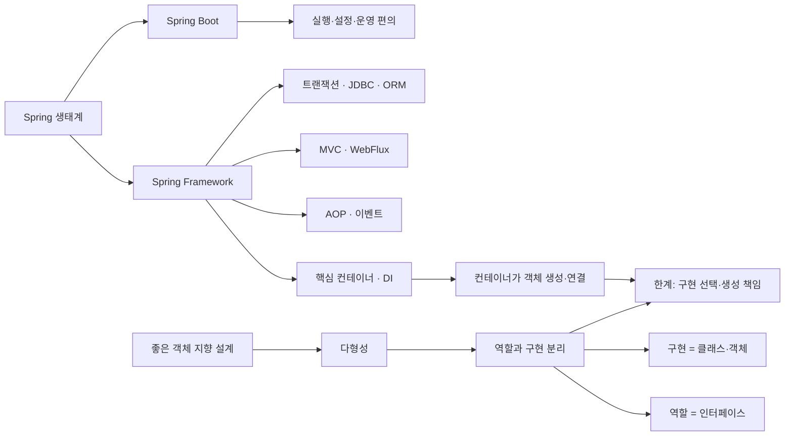
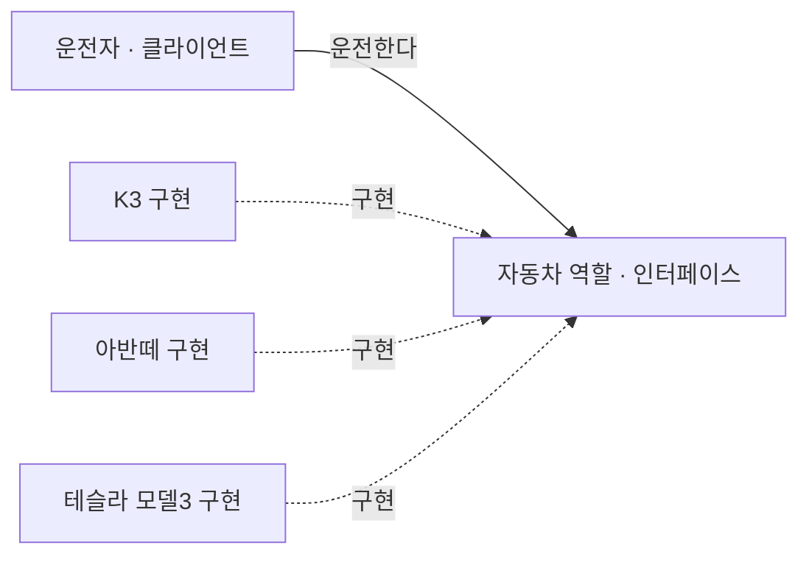
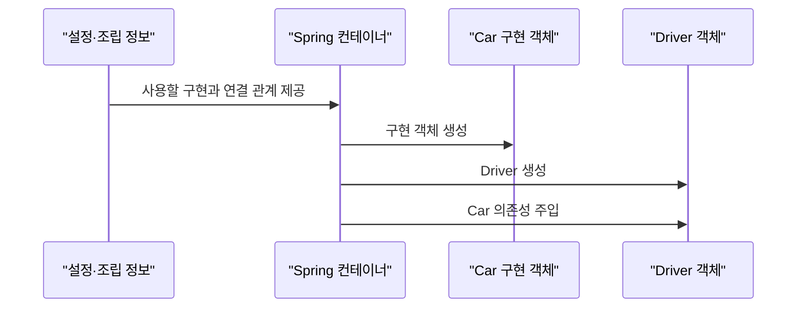

# 1.1 객체 지향 설계와 스프링

> [!summary] 한 문장
> 스프링의 핵심은 Java의 **다형성**을 활용해 역할과 구현을 분리하는 것이며, 스프링 컨테이너는 구현 객체의 생성과 연결을 맡아 클라이언트가 역할에 의존하도록 돕는다.

## 큰 지도



## 사용자 정리 원문

```text
스프링 핵심 원리 - 기본편
스프링이란? (4번째 장까지)

좋은 객체 지향 프로그래밍이란? (5번쨰 사진부터)

유연함 -> 다형성

진짜 다형성에 대해 배워보자
(다형성의 실세계 비유)

운전자 - 자동차
-> 자동차가 바뀌어도 운전에 문제가 없음
-> 자동차 역할 (자동차 인터페이스)만 알고 있음

즉, 운전자, 클라이언트는 자동차 구현을 몰라도 됨. 즉 클라이언트에 영향을 주지 않고 자동차를 만들어낼 수 있음
핵심: 역할과 구현을 분리한다. 역할과 구현을 분리하면 세상이 단순해지고 유연해지며 변경에도 편리해진다
```

## 정리본

### 1.1.1 스프링이란?

`Spring`이라는 말은 문맥에 따라 세 범위를 가리킨다.

1. **Spring Framework**: DI 컨테이너, AOP, 이벤트, 트랜잭션, MVC·WebFlux, 데이터 접근, 테스트 같은 기반 기능을 제공한다.
2. **Spring Boot**: Spring 애플리케이션을 빠르게 만들고 실행·운영하기 위한 편의 계층이다. Starter 의존성, 자동 구성, 내장 웹 서버, 외부 설정, 상태 확인 등을 제공한다.
3. **Spring 생태계**: Framework와 Boot를 포함한 여러 Spring 프로젝트의 전체 집합이다.

![[assets/book-photos/spring-core-basic/01-객체-지향-설계와-스프링/1.1/spring-framework-overview.png]]

![[assets/book-photos/spring-core-basic/01-객체-지향-설계와-스프링/1.1/spring-boot-overview.png]]

Spring Boot는 Spring Framework와 다른 객체 지향 원리를 제공하는 별도 프레임워크가 아니다. **Spring을 쉽게 구성하고 실행하며 운영하도록 돕는 도구**에 가깝다. 예를 들어 클래스패스와 사용자가 정의한 Bean을 살펴 자동 구성을 적용하고, 사용자가 직접 구성한 Bean이 있으면 관련 자동 구성이 물러나는 방식으로 동작한다.

### 1.1.2 좋은 객체 지향 프로그래밍이란?

객체 지향 프로그래밍은 프로그램을 명령의 연속이 아니라 **서로 메시지를 주고받으며 협력하는 객체들의 모임**으로 바라본다. 대표적인 특징은 추상화, 캡슐화, 상속, 다형성이고, 이 강의에서 Spring으로 이어지는 중심축은 **다형성**이다.

여기서 “유연하고 변경하기 쉽다”는 말은 한 구현의 세부사항이 바뀌거나 다른 구현으로 교체되어도 그 역할을 사용하는 쪽의 변경을 최소화한다는 뜻이다. 레고 블록, 키보드와 마우스, 컴퓨터 부품처럼 합의된 연결 지점을 중심으로 부품을 교체하는 그림에 가깝다.

### 1.1.3 진짜 다형성 — 역할과 구현 분리

운전자는 `자동차 역할`이 제공하는 운전 방법을 안다. K3의 엔진 구조나 테슬라의 내부 제어 방식을 알 필요는 없다. 자동차 구현이 바뀌어도 **자동차 역할의 계약이 유지되는 한** 운전자는 같은 방식으로 운전할 수 있다.

![[assets/book-photos/spring-core-basic/01-객체-지향-설계와-스프링/1.1/driver-car-role-implementation.png]]



Java에서는 보통 역할을 인터페이스로, 구현을 인터페이스를 구현한 클래스와 객체로 표현한다.

```java
interface Car {
    void start();
}

final class K3 implements Car {
    @Override
    public void start() {
        System.out.println("K3 출발");
    }
}

final class Driver {
    private final Car car;

    Driver(Car car) {
        this.car = car;
    }

    void drive() {
        car.start();
    }
}
```

이 설계에서 `Driver`는 `K3`가 아니라 `Car`에 의존한다. 따라서 `Driver` 코드를 수정하지 않고 다음처럼 조립할 구현을 바꿀 수 있다.

```java
Driver driver = new Driver(new K3());
```

다만 “역할과 구현을 분리했으니 어떤 변경도 안전하다”는 뜻은 아니다.

- 인터페이스의 계약 자체가 바뀌면 클라이언트도 영향을 받는다.
- 클라이언트가 내부에서 `new K3()`를 직접 호출하면 구체 구현 의존성이 남는다.
- 새 구현이 인터페이스의 의미와 약속을 지키지 않으면 교체 가능성이 깨진다.

즉 다형성의 교체 가능성은 **안정된 역할의 계약**과 **클라이언트의 인터페이스 의존**을 전제로 한다.

### 1.1.4 스프링과 객체 지향의 연결

다형성은 “같은 역할 자리에 여러 구현을 둘 수 있다”는 기반을 제공한다. 그러나 어떤 구현 객체를 생성하고 연결할지는 여전히 누군가 결정해야 한다. 애플리케이션 코드가 직접 구현을 선택하면 구체 클래스 의존성이 조립 코드에 남는다.

Spring의 IoC/DI 컨테이너는 객체가 자신의 의존 객체를 직접 만들게 하지 않고, 다음과 같이 **객체의 생성과 의존관계 연결**을 외부에서 담당한다.



따라서 흐름은 다음과 같다.

> 다형성 → 역할과 구현 분리 → 구현 선택·조립 문제 → IoC/DI 컨테이너

다형성만으로 OCP와 DIP가 자동으로 지켜지는 것은 아니다. 다음 학습에서 좋은 객체 지향 설계의 다섯 원칙, 특히 **OCP와 DIP**를 통해 이 한계를 확인하고 Spring DI가 왜 필요한지 연결한다.

## 암기 카드

- Q. Spring Framework와 Spring Boot의 차이는?
  - A. Framework는 DI·AOP·웹·트랜잭션 같은 기반 기능이고, Boot는 이를 쉽게 구성·실행·운영하게 돕는 편의 계층이다.
- Q. 이 강의가 객체 지향의 네 특징 중 가장 강조하는 것은?
  - A. 다형성이다.
- Q. 역할과 구현을 Java로 표현하면?
  - A. 역할은 인터페이스, 구현은 인터페이스를 구현한 클래스와 객체다.
- Q. 운전자가 자동차 구현을 몰라도 되는 이유는?
  - A. 운전자가 구체 자동차가 아니라 자동차 역할의 안정된 계약에 의존하기 때문이다.
- Q. 다형성 다음에 DI가 필요한 이유는?
  - A. 사용할 구현 객체를 생성하고 클라이언트에 연결하는 책임을 클라이언트 밖으로 옮기기 위해서다.

## 확인 질문

> [!question]- 자동차 구현이 K3에서 테슬라 모델3로 바뀌어도 운전자 코드가 바뀌지 않는 이유는?
> 운전자는 구체 자동차가 아니라 `Car` 역할의 계약에 의존하고, 두 구현이 같은 계약을 지키기 때문이다.

> [!question]- 역할과 구현을 분리하면 클라이언트는 어떤 변경에도 영향을 받지 않는가?
> 아니다. 인터페이스 계약이 바뀌거나 새 구현이 계약을 어기면 영향을 받는다. 또한 클라이언트가 구체 구현을 직접 생성하면 구체 의존성이 남는다.

> [!question]- Spring Framework와 Spring Boot는 어떤 관계인가?
> Framework가 핵심 기능을 제공하고, Boot가 자동 구성·Starter·내장 서버·운영 기능으로 Framework를 더 쉽게 사용하게 한다.

> [!question]- 다형성이 있는데도 Spring DI가 필요한 이유는?
> 다형성은 교체 가능한 구조를 제공하지만 어떤 구현을 만들고 연결할지는 결정하지 않는다. Spring 컨테이너가 이 생성과 조립 책임을 맡는다.

## 이어지는 내용

1. 좋은 객체 지향 설계의 5가지 원칙, SOLID
2. 다형성만으로 해결되지 않는 OCP·DIP 위반
3. IoC, DI, 의존관계 주입
4. 설정·조립 지점과 애플리케이션 실행 영역의 분리
5. Spring 컨테이너, Bean, Bean 조회와 생명주기

## 공식 확인 자료

- [Spring Framework Overview](https://docs.spring.io/spring-framework/reference/overview.html) — Spring Framework의 범위와 모듈
- [Spring Framework Core Technologies](https://docs.spring.io/spring-framework/reference/core.html) — IoC 컨테이너와 AOP
- [Spring IoC Container and Beans](https://docs.spring.io/spring-framework/reference/core/beans/introduction.html) — DI와 객체 의존관계
- [Spring Boot Auto-configuration](https://docs.spring.io/spring-boot/reference/using/auto-configuration.html) — 자동 구성과 사용자 구성 우선
- [Spring Boot Build Systems and Starters](https://docs.spring.io/spring-boot/reference/using/build-systems.html) — Starter 의존성 관리
