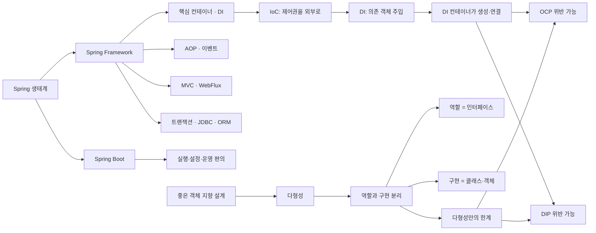
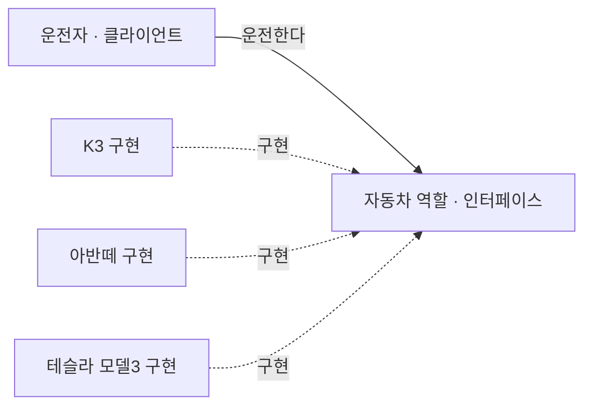
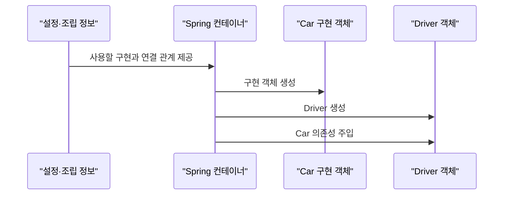
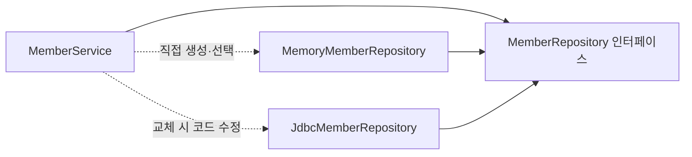
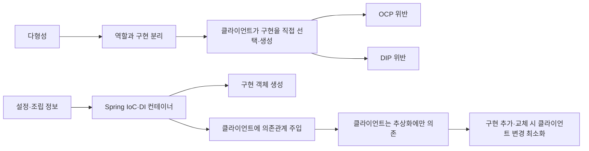

# 1.1 객체 지향 설계와 스프링

> [!summary] 한 문장
> 스프링은 Java의 **다형성** 위에서 객체 생성과 조립 책임을 IoC·DI 컨테이너로 분리해, 클라이언트가 추상화에만 의존하도록 만들고 **OCP와 DIP를 실현하도록 돕는다.**

## 큰 지도



## 사용자 정리 원문

```text
스프링 핵심 원리 - 기본편
스프링이란? (4번째 장까지)

좋은 객체 지향 프로그래밍이란? (5번쨰 사진부터)

유연함 -> 다형성

진짜 다형성에 대해 배워보자
(다형성의 실세계 비유)

운전자 - 자동차
-> 자동차가 바뀌어도 운전에 문제가 없음
-> 자동차 역할 (자동차 인터페이스)만 알고 있음

즉, 운전자, 클라이언트는 자동차 구현을 몰라도 됨. 즉 클라이언트에 영향을 주지 않고 자동차를 만들어낼 수 있음
핵심: 역할과 구현을 분리한다. 역할과 구현을 분리하면 세상이 단순해지고 유연해지며 변경에도 편리해진다
```

<details>
<summary>2026-08-14 · SOLID, OCP·DIP, IoC·DI</summary>

```text
OCP, DIP 가 가장 중요함

IoC 의존성 역전, DI 컨테이너
```

</details>

## 정리본

### 1.1.1 스프링이란?

`Spring`이라는 말은 문맥에 따라 세 범위를 가리킨다.

1. **Spring Framework**: DI 컨테이너, AOP, 이벤트, 트랜잭션, MVC·WebFlux, 데이터 접근, 테스트 같은 기반 기능을 제공한다.
2. **Spring Boot**: Spring 애플리케이션을 빠르게 만들고 실행·운영하기 위한 편의 계층이다. Starter 의존성, 자동 구성, 내장 웹 서버, 외부 설정, 상태 확인 등을 제공한다.
3. **Spring 생태계**: Framework와 Boot를 포함한 여러 Spring 프로젝트의 전체 집합이다.

![[assets/book-photos/spring-core-basic/01-객체-지향-설계와-스프링/1.1/spring-framework-overview.png]]

![[assets/book-photos/spring-core-basic/01-객체-지향-설계와-스프링/1.1/spring-boot-overview.png]]

Spring Boot는 Spring Framework와 다른 객체 지향 원리를 제공하는 별도 프레임워크가 아니다. **Spring을 쉽게 구성하고 실행하며 운영하도록 돕는 도구**에 가깝다. 예를 들어 클래스패스와 사용자가 정의한 Bean을 살펴 자동 구성을 적용하고, 사용자가 직접 구성한 Bean이 있으면 관련 자동 구성이 물러나는 방식으로 동작한다.

### 1.1.2 좋은 객체 지향 프로그래밍이란?

객체 지향 프로그래밍은 프로그램을 명령의 연속이 아니라 **서로 메시지를 주고받으며 협력하는 객체들의 모임**으로 바라본다. 대표적인 특징은 추상화, 캡슐화, 상속, 다형성이고, 이 강의에서 Spring으로 이어지는 중심축은 **다형성**이다.

여기서 “유연하고 변경하기 쉽다”는 말은 한 구현의 세부사항이 바뀌거나 다른 구현으로 교체되어도 그 역할을 사용하는 쪽의 변경을 최소화한다는 뜻이다. 레고 블록, 키보드와 마우스, 컴퓨터 부품처럼 합의된 연결 지점을 중심으로 부품을 교체하는 그림에 가깝다.

### 1.1.3 진짜 다형성 — 역할과 구현 분리

운전자는 `자동차 역할`이 제공하는 운전 방법을 안다. K3의 엔진 구조나 테슬라의 내부 제어 방식을 알 필요는 없다. 자동차 구현이 바뀌어도 **자동차 역할의 계약이 유지되는 한** 운전자는 같은 방식으로 운전할 수 있다.

![[assets/book-photos/spring-core-basic/01-객체-지향-설계와-스프링/1.1/driver-car-role-implementation.png]]



Java에서는 보통 역할을 인터페이스로, 구현을 인터페이스를 구현한 클래스와 객체로 표현한다.

```java
interface Car {
    void start();
}

final class K3 implements Car {
    @Override
    public void start() {
        System.out.println("K3 출발");
    }
}

final class Driver {
    private final Car car;

    Driver(Car car) {
        this.car = car;
    }

    void drive() {
        car.start();
    }
}
```

이 설계에서 `Driver`는 `K3`가 아니라 `Car`에 의존한다. 따라서 `Driver` 코드를 수정하지 않고 다음처럼 조립할 구현을 바꿀 수 있다.

```java
Driver driver = new Driver(new K3());
```

다만 “역할과 구현을 분리했으니 어떤 변경도 안전하다”는 뜻은 아니다.

- 인터페이스의 계약 자체가 바뀌면 클라이언트도 영향을 받는다.
- 클라이언트가 내부에서 `new K3()`를 직접 호출하면 구체 구현 의존성이 남는다.
- 새 구현이 인터페이스의 의미와 약속을 지키지 않으면 교체 가능성이 깨진다.

즉 다형성의 교체 가능성은 **안정된 역할의 계약**과 **클라이언트의 인터페이스 의존**을 전제로 한다.

### 1.1.4 스프링과 객체 지향의 연결

다형성은 “같은 역할 자리에 여러 구현을 둘 수 있다”는 기반을 제공한다. 그러나 어떤 구현 객체를 생성하고 연결할지는 여전히 누군가 결정해야 한다. 애플리케이션 코드가 직접 구현을 선택하면 구체 클래스 의존성이 조립 코드에 남는다.

Spring의 IoC/DI 컨테이너는 객체가 자신의 의존 객체를 직접 만들게 하지 않고, 다음과 같이 **객체의 생성과 의존관계 연결**을 외부에서 담당한다.



따라서 흐름은 다음과 같다.

> 다형성 → 역할과 구현 분리 → 구현 선택·조립 문제 → IoC/DI 컨테이너

다형성만으로 OCP와 DIP가 자동으로 지켜지는 것은 아니다. 다음 학습에서 좋은 객체 지향 설계의 다섯 원칙, 특히 **OCP와 DIP**를 통해 이 한계를 확인하고 Spring DI가 왜 필요한지 연결한다.

### 1.1.5 SOLID — 좋은 객체 지향 설계의 다섯 원칙

SOLID는 객체 지향의 유연성을 실제 설계 원칙으로 구체화한다. 이 강의의 Spring 학습 흐름에서는 특히 **OCP와 DIP**가 중요하다. Spring의 IoC·DI가 필요한 이유를 직접 설명하는 원칙이기 때문이다.

| 원칙 | 핵심 질문 | 요약 |
|---|---|---|
| SRP | 이 코드는 왜 변경되는가? | 한 모듈은 하나의 변경 이유를 갖도록 책임을 나눈다. |
| **OCP** | 새 구현을 추가할 때 기존 사용 코드를 고쳐야 하는가? | 확장에는 열려 있고 기존 코드 변경에는 닫혀 있어야 한다. |
| LSP | 구현을 교체해도 계약과 정확성이 유지되는가? | 하위 타입은 상위 타입의 약속을 깨지 않고 대체될 수 있어야 한다. |
| ISP | 클라이언트가 쓰지 않는 기능에도 의존하는가? | 크고 범용적인 인터페이스보다 클라이언트별로 작고 명확한 인터페이스가 낫다. |
| **DIP** | 정책 코드가 구체 기술을 직접 아는가? | 고수준 정책과 저수준 구현 모두 추상화에 의존해야 한다. |

### 1.1.6 OCP — 다형성만으로는 부족하다

OCP(Open-Closed Principle)는 **새 기능이나 구현을 추가하는 확장에는 열려 있으면서, 이미 동작하는 클라이언트 코드는 수정하지 않아야 한다**는 원칙이다.

`MemberRepository` 인터페이스와 여러 구현을 만들면 다형성은 확보된다. 그러나 `MemberService`가 사용할 구현을 직접 생성한다면 구현을 바꿀 때 클라이언트 코드도 바뀐다.

```java
final class MemberService {
    // 구현을 바꾸려면 이 줄을 수정해야 한다.
    private final MemberRepository repository =
            new MemoryMemberRepository();
}
```

![[assets/book-photos/spring-core-basic/01-객체-지향-설계와-스프링/1.1/ocp-polymorphism-limit.png]]



즉 **인터페이스를 사용했다는 사실만으로 OCP가 완성되지는 않는다.** 클라이언트에서 구현 선택과 생성 책임까지 분리해야 한다.

### 1.1.7 DIP — 추상화에 의존한다

DIP(Dependency Inversion Principle)는 고수준 정책이 저수준 구현에 직접 의존하지 않고, **둘 다 추상화에 의존해야 한다**는 원칙이다.

다음 필드는 선언 타입만 보면 `MemberRepository`라는 추상화에 의존하지만, 오른쪽에서 `MemoryMemberRepository`를 직접 생성하므로 구체화에도 의존한다.

```java
private final MemberRepository repository =
        new MemoryMemberRepository(); // 구체 구현 의존: DIP 위반
```

![[assets/book-photos/spring-core-basic/01-객체-지향-설계와-스프링/1.1/dip-concrete-dependency.png]]

클라이언트는 필요한 역할만 선언하고, 외부 조립자가 구현을 전달하도록 바꾸면 구체 구현 의존을 제거할 수 있다.

```java
final class MemberService {
    private final MemberRepository repository;

    MemberService(MemberRepository repository) {
        this.repository = repository;
    }
}
```

여기서 `new` 자체가 나쁜 것은 아니다. 객체 생성은 반드시 어딘가에서 일어난다. 핵심은 **비즈니스 로직을 수행하는 클라이언트가 구현 선택과 생성까지 책임지지 않도록**, 그 책임을 설정·조립 지점(composition root)으로 옮기는 것이다.

### 1.1.8 IoC, DI, DI 컨테이너

> [!important] 용어를 분리해서 기억하기
> **IoC는 제어의 역전**, **DIP는 의존관계 역전 원칙**, **DI는 의존관계 주입**이다. 서로 연결되지만 같은 용어는 아니다.

- **IoC(Inversion of Control, 제어의 역전)**: 객체 생성, 호출 흐름, 생명주기 같은 제어권을 애플리케이션 객체가 직접 행사하지 않고 프레임워크나 외부 조립자가 담당하는 설계 원리다.
- **DIP(Dependency Inversion Principle, 의존관계 역전 원칙)**: 고수준 정책이 구체 구현이 아니라 추상화에 의존해야 한다는 설계 원칙이다.
- **DI(Dependency Injection, 의존관계 주입)**: 객체가 필요로 하는 의존 객체를 외부에서 전달하여 실제 의존관계를 완성하는 방법이다.
- **DI 컨테이너**: 객체를 생성하고, 설정 정보를 바탕으로 의존관계를 연결하며, 생명주기를 관리한다. Spring에서는 `ApplicationContext`가 대표적인 IoC/DI 컨테이너이고 컨테이너가 관리하는 객체를 Spring Bean이라 한다.

DI는 IoC를 구현하는 대표적인 방식이며, 클라이언트가 추상화에만 의존하도록 만들어 DIP를 지키고 구현 교체 시 클라이언트 변경을 없애 OCP를 실현하도록 돕는다.

### 1.1.9 다형성에서 Spring 컨테이너까지

![[assets/book-photos/spring-core-basic/01-객체-지향-설계와-스프링/1.1/spring-di-container-solution.png]]



한 문장으로 연결하면 다음과 같다.

> 다형성은 구현 교체의 가능성을 만들고, DIP는 의존 방향을 추상화로 제한하며, IoC·DI 컨테이너는 생성과 조립 책임을 외부로 옮겨 OCP를 현실적으로 지킬 수 있게 한다.

## 암기 카드

- Q. Spring Framework와 Spring Boot의 차이는?
  - A. Framework는 DI·AOP·웹·트랜잭션 같은 기반 기능이고, Boot는 이를 쉽게 구성·실행·운영하게 돕는 편의 계층이다.
- Q. 이 강의가 객체 지향의 네 특징 중 가장 강조하는 것은?
  - A. 다형성이다.
- Q. 역할과 구현을 Java로 표현하면?
  - A. 역할은 인터페이스, 구현은 인터페이스를 구현한 클래스와 객체다.
- Q. 운전자가 자동차 구현을 몰라도 되는 이유는?
  - A. 운전자가 구체 자동차가 아니라 자동차 역할의 안정된 계약에 의존하기 때문이다.
- Q. 다형성 다음에 DI가 필요한 이유는?
  - A. 사용할 구현 객체를 생성하고 클라이언트에 연결하는 책임을 클라이언트 밖으로 옮기기 위해서다.
- Q. OCP란?
  - A. 확장에는 열려 있고 기존 코드 변경에는 닫혀 있어야 한다는 원칙이다.
- Q. 인터페이스와 다형성만 사용해도 OCP가 지켜지는가?
  - A. 아니다. 클라이언트가 구체 구현을 직접 선택하고 생성하면 구현 교체 때 클라이언트 코드를 수정해야 한다.
- Q. DIP란?
  - A. 고수준 정책과 저수준 구현이 모두 구체화가 아니라 추상화에 의존해야 한다는 원칙이다.
- Q. IoC와 DIP의 차이는?
  - A. IoC는 제어권을 외부로 넘기는 제어의 역전이고, DIP는 의존 방향을 추상화로 향하게 하는 의존관계 역전 원칙이다.
- Q. DI란?
  - A. 객체가 필요로 하는 의존 객체를 외부에서 전달해 실제 의존관계를 완성하는 방법이다.
- Q. DI 컨테이너의 역할은?
  - A. 객체 생성, 의존관계 연결, 생명주기 관리를 맡는다.
- Q. `new`를 사용하면 무조건 DIP 위반인가?
  - A. 아니다. 비즈니스 클라이언트가 구체 구현을 직접 선택하는 것이 문제이며, 생성 책임을 설정·조립 지점에 모으면 된다.

## 확인 질문

> [!question]- 자동차 구현이 K3에서 테슬라 모델3로 바뀌어도 운전자 코드가 바뀌지 않는 이유는?
> 운전자는 구체 자동차가 아니라 `Car` 역할의 계약에 의존하고, 두 구현이 같은 계약을 지키기 때문이다.

> [!question]- 역할과 구현을 분리하면 클라이언트는 어떤 변경에도 영향을 받지 않는가?
> 아니다. 인터페이스 계약이 바뀌거나 새 구현이 계약을 어기면 영향을 받는다. 또한 클라이언트가 구체 구현을 직접 생성하면 구체 의존성이 남는다.

> [!question]- Spring Framework와 Spring Boot는 어떤 관계인가?
> Framework가 핵심 기능을 제공하고, Boot가 자동 구성·Starter·내장 서버·운영 기능으로 Framework를 더 쉽게 사용하게 한다.

> [!question]- 다형성이 있는데도 Spring DI가 필요한 이유는?
> 다형성은 교체 가능한 구조를 제공하지만 어떤 구현을 만들고 연결할지는 결정하지 않는다. Spring 컨테이너가 이 생성과 조립 책임을 맡는다.

> [!question]- `MemberRepository` 인터페이스를 사용하면서도 `new MemoryMemberRepository()`를 직접 호출하면 왜 OCP와 DIP를 모두 위반하는가?
> 구체 구현을 바꾸려면 클라이언트 코드를 수정해야 하므로 OCP를 위반하고, 클라이언트가 추상화뿐 아니라 `MemoryMemberRepository`라는 구체화에도 의존하므로 DIP를 위반한다.

> [!question]- IoC, DIP, DI를 한 문장씩 구분하면?
> IoC는 제어권을 외부로 옮기는 원리, DIP는 추상화에 의존하라는 설계 원칙, DI는 외부에서 의존 객체를 전달하는 구현 방법이다.

> [!question]- Spring DI 컨테이너가 OCP를 가능하게 만드는 과정은?
> 컨테이너가 구현 객체의 생성과 연결을 맡으면 클라이언트는 추상화만 사용한다. 새 구현을 선택하는 변경이 조립 설정에 국한되므로 클라이언트 코드를 수정하지 않아도 된다.

> [!question]- DI는 곧 IoC인가?
> DI는 IoC를 구현하는 대표적인 방법이다. IoC가 더 넓은 원리이고, DI는 의존 객체를 외부에서 주입하는 구체적인 방식이다.

## 이어지는 내용

1. Spring 컨테이너와 Spring Bean
2. `ApplicationContext`와 Bean 조회
3. `@Configuration`, `@Bean`을 이용한 설정·조립
4. 컴포넌트 스캔과 자동 의존관계 주입
5. 생성자 주입과 의존관계 선택 기준

## 공식 확인 자료

- [Spring Framework Overview](https://docs.spring.io/spring-framework/reference/overview.html) — Spring Framework의 범위와 모듈
- [Spring Framework Core Technologies](https://docs.spring.io/spring-framework/reference/core.html) — IoC 컨테이너와 AOP
- [Spring IoC Container and Beans](https://docs.spring.io/spring-framework/reference/core/beans/introduction.html) — DI와 객체 의존관계
- [Spring Dependencies and Configuration in Detail](https://docs.spring.io/spring-framework/reference/core/beans/dependencies/factory-properties-detailed.html) — 생성자·Setter 기반 의존관계 설정
- [Spring Boot Auto-configuration](https://docs.spring.io/spring-boot/reference/using/auto-configuration.html) — 자동 구성과 사용자 구성 우선
- [Spring Boot Build Systems and Starters](https://docs.spring.io/spring-boot/reference/using/build-systems.html) — Starter 의존성 관리
