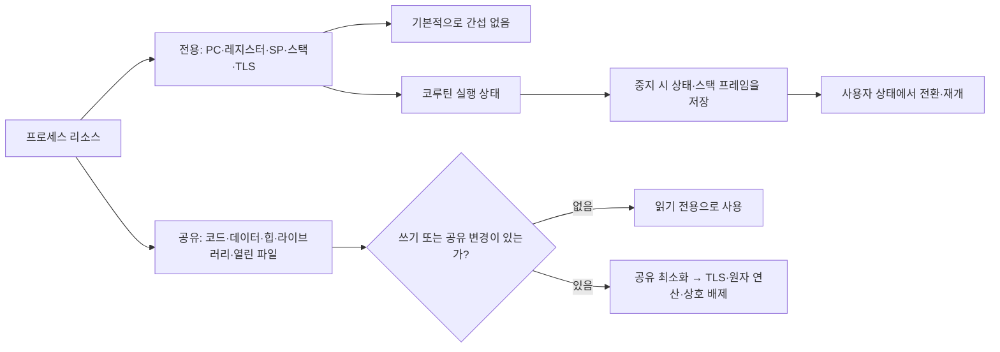

# 2.2–2.4 스레드 리소스, 스레드 안전, 코루틴

> [!summary]
> 같은 프로세스의 스레드는 많은 리소스를 공유하므로 먼저 전용/공유 경계를 판별하고, 공유가 필요하면 읽기 전용·TLS·원자 연산·상호 배제로 안전성을 확보한다. 코루틴은 이 실행 상태와 스택 프레임을 더 가볍게 저장·복원해 한 스레드에서도 여러 실행 흐름을 전환한다.

프로세스는 운영 체제가 리소스를 할당하는 기본 단위고, 스레드는 스케줄링의 기본 단위이며, 프로세스 리소스는 스레드 간에 공유된다.

## 전체 구조



핵심은 **저장 위치가 전용인지**와 **그 데이터에 도달할 수 있는 참조가 전용인지**를 구분하는 것이다. 스택은 스레드별로 나뉘지만, 다른 스레드가 그 주소를 전달받으면 접근할 수 있다.

## 사용자 요청 원문

```text
이전 작업에서 받은 IMG_7883.JPG~IMG_7913.JPG를 사용해 계속 진행해 줘.

- 밑줄·별표·괄호는 중요도 표시로 반영
- 스레드 리소스, 스레드 안전, 코루틴을 하나의 학습 노트로 정리
- 중요한 도표만 회전·크롭하여 노트에 삽입
- 원본 내용을 변형하지 말고 가독성만 개선
- backend-cs-learning 스킬에 이 작업 방식을 추가
```

## 본문

### 2.2.1 스택 영역: 함수 실행의 출발점

함수 호출마다 반환 주소, 매개변수, 지역 변수, 일부 레지스터 값 등이 담긴 스택 프레임이 만들어진다. 호출이 끝나면 해당 프레임이 제거된다. 스레드마다 독립적인 실행 흐름을 유지해야 하므로 스택도 스레드마다 하나씩 필요하다.

![[assets/book-photos/컴퓨터-밑바닥의-비밀/02-2장/2.2/IMG_7884-crop-stack-frame.JPG]]

> [!caption]
> 그림 2-12: 함수 호출이 쌓이는 스택 프레임과 프로세스 주소 공간. 출처: 《컴퓨터 밑바닥의 비밀》 2.2, p.95.

스레드 전환 시 운영 체제는 PC, 스택 포인터, 일반 레지스터 등 현재 실행 상태를 보존하고 복원한다. 책은 이 묶음을 `thread context`로 설명한다.

### 2.2.2 코드 영역: 모든 스레드가 같은 명령을 실행한다

소스 코드는 컴파일되어 실행 가능한 기계 명령이 되고, 프로세스의 코드 영역에 적재된다. 어느 스레드든 같은 함수의 명령을 실행할 수 있으므로 함수 자체를 특정 스레드에 귀속시키는 것은 아니다.

![[assets/book-photos/컴퓨터-밑바닥의-비밀/02-2장/2.2/IMG_7886-crop-program-process.JPG]]

> [!caption]
> 그림 2-15: 소스 파일이 컴파일되어 실행 파일이 되고 프로세스의 코드·데이터 영역으로 적재되는 흐름. 출처: 같은 책 p.97.

코드 영역이 보통 읽기 전용이라는 사실은 **메서드가 자동으로 스레드 안전하다**는 뜻이 아니다. 명령 자체는 바뀌지 않아도 그 명령이 읽고 쓰는 객체 상태는 힙이나 데이터 영역에 공유될 수 있다.

### 2.2.3 데이터 영역: 전역·정적 상태의 공유

전역 변수와 정적 변수는 프로세스에 하나의 인스턴스로 존재하므로 모든 스레드가 같은 값을 볼 수 있다. 여러 스레드가 쓰면 가시성, 원자성, 실행 순서 문제가 생길 수 있다.

Java에서는 `static` 필드뿐 아니라 여러 스레드가 같은 객체를 참조할 때 그 인스턴스 필드도 공유 상태다. Java Memory Model 관점에서는 단순히 “메모리를 공유한다”만으로 최신 값 관찰이 보장되지 않으며, `synchronized`, `volatile`, 락, 원자 클래스 같은 happens-before 수단이 필요하다.

### 2.2.4 힙 영역: 포인터와 참조가 공유를 만든다

`malloc`이나 `new`로 만든 동적 객체는 힙에 놓인다. 힙은 프로세스 주소 공간이므로 주소나 참조만 알면 여러 스레드가 같은 객체에 접근할 수 있다.

![[assets/book-photos/컴퓨터-밑바닥의-비밀/02-2장/2.2/IMG_7888-crop-heap-sharing.JPG]]

> [!caption]
> 힙은 공유되고 스택은 스레드별로 나뉘지만, 포인터 전달 때문에 스택도 완전한 격리 경계는 아니다. 출처: 같은 책 pp.99–100.

Java의 지역 변수 `ref` 자체는 현재 스레드의 스택 프레임에 있을 수 있지만, `ref`가 가리키는 객체는 힙에 있다. 따라서 “지역 변수니까 스레드 안전하다”가 아니라 **참조가 가리키는 객체가 다른 스레드와 공유되는가**를 확인해야 한다.

### 2.2.5 스택 간 접근과 위험

C/C++에서는 한 스레드가 자기 지역 변수의 주소를 다른 스레드에 넘기면 상대 스레드가 그 값을 직접 바꿀 수 있다. 책의 `foo(int* p)` 예시는 새 스레드가 주 스레드의 지역 변수 `a`를 `2`로 바꾸는 흐름이다.

이는 스택이 논리적으로 스레드 전용이어도 하드웨어 수준의 강제 격리 공간은 아니라는 뜻이다. 수명이 끝난 스택 프레임 주소를 계속 쓰면 use-after-return 같은 심각한 오류로 이어질 수 있다. Java는 임의 포인터 산술을 막지만, 공유 객체 참조를 넘겨 같은 논리적 문제가 생길 수 있다.

### 2.2.6 동적 링크 라이브러리와 열린 파일

동적 라이브러리는 프로세스 주소 공간에 매핑되어 같은 프로세스의 모든 스레드가 코드를 이용한다. 파일을 열면 생성되는 파일 디스크립터와 오프셋 등의 열린 파일 상태도 일반적으로 프로세스 자원으로 공유된다.

![[assets/book-photos/컴퓨터-밑바닥의-비밀/02-2장/2.2/IMG_7892-crop-dynamic-library.JPG]]

> [!caption]
> 그림 2-20: 동적 라이브러리 코드가 프로세스 주소 공간에 매핑되어 여러 스레드가 함께 사용한다. 출처: 같은 책 p.103.

공유 파일 오프셋을 여러 스레드가 동시에 바꾸면 예상치 못한 읽기 위치가 될 수 있다. Java의 스트림이나 채널도 객체를 공유한다면 API의 스레드 안전성과 위치 상태를 따로 확인해야 한다.

### 2.2.7 스레드 전용 저장소 TLS

TLS(Thread-Local Storage)는 같은 이름의 변수를 각 스레드가 독립된 복사본으로 가지게 한다. 책의 C/C++ `__thread int a` 예시에서는 각 스레드가 자기 `a`를 증가시키므로 둘 다 `2`를 출력한다.

![[assets/book-photos/컴퓨터-밑바닥의-비밀/02-2장/2.2/IMG_7895-crop-thread-local.JPG]]

> [!caption]
> 그림 2-21: 하나의 TLS 선언으로 스레드마다 별도의 저장 공간이 만들어진다. 출처: 같은 책 pp.105–106.

주의할 점은 TLS 슬롯이 독립적이어도 그 슬롯에 **같은 mutable 객체의 참조**를 넣으면 실제 객체는 다시 공유된다는 것이다.

## 2.3 스레드 안전

### 2.3.1 자유와 제약

스레드 전용 리소스는 다른 스레드가 접근할 수 없으므로 서로 간섭하지 않는다. 공유 리소스는 서로의 실행을 방해하지 않도록 제약이 필요하다.

### 2.3.2 스레드 안전의 정의

여러 스레드가 어떤 순서로 실행되더라도 올바른 결과가 나오도록 공유 리소스를 다루는 것이 책이 설명하는 스레드 안전의 출발점이다.

### 2.3.3 공유 리소스를 찾는다

- 전용으로 보는 영역: 함수 지역 변수, 스택 영역, TLS
- 공유되는 영역: 힙 영역, 데이터 영역, 코드 영역
- 판단 기준: 저장 영역의 이름만 보지 말고 포인터·참조가 실제로 가리키는 대상과 쓰기 가능 여부까지 본다.

코드 영역도 공유되지만 일반적으로 읽기 전용이다. 문제는 코드가 접근하는 데이터가 공유되고 변경될 때 생긴다.

### 2.3.4 지역 변수만 사용하는 함수

함수가 지역 변수만 사용하고 호출 밖의 상태를 읽거나 쓰지 않으면 호출마다 독립된 스택 프레임에서 실행된다. 이런 무상태 함수는 여러 스레드가 동시에 호출해도 서로의 계산을 간섭하지 않는다.

### 2.3.5 값과 포인터를 매개변수로 전달할 때

값을 복사해 전달하면 각 호출의 스택 프레임에 독립된 값이 놓인다. 포인터를 전달하면 함수의 안전성은 포인터가 가리키는 대상의 소유권에 달라진다.

- 전역 변수나 공용 힙 객체를 가리키면 여러 스레드가 같은 값을 바꿀 수 있다.
- 각 스레드가 자기 전용 리소스의 주소를 전달하면 같은 함수라도 서로 간섭하지 않는다.
- 따라서 책이 별표로 강조한 원칙은 **공유 리소스를 가능한 한 피하고, 전달해야 한다면 각 스레드가 자기 리소스를 전달하는 것**이다.

### 2.3.6 읽기 전용과 쓰기 가능한 전역 변수

전역 변수를 초기화한 뒤 읽기만 하면 여러 스레드가 함께 보더라도 값이 바뀌지 않는다. 반대로 쓰기가 가능하면 동시에 변경되는 공유 리소스가 되므로 보호가 필요하다.

![[assets/book-photos/컴퓨터-밑바닥의-비밀/02-2장/2.3-2.4/IMG_7905-crop-readonly-writeable.JPG]]

> [!caption]
> 그림 2-28, 원본 `IMG_7905.JPG`(p.115). 이 그림에서 볼 것: 같은 데이터 영역의 전역 변수라도 읽기 전용은 안전한 공유가 가능하지만, 읽고 쓰는 값은 동기화 대상이 된다.

한 번의 읽기·쓰기를 원자 연산으로 만들 수 있어도 여러 값에 걸친 불변식이나 읽기-수정-쓰기 전체가 자동으로 안전해지는 것은 아니다. 보호 범위가 여러 단계라면 락 같은 더 큰 임계 구역이 필요하다.

### 2.3.7 스레드 전용 저장소

TLS를 사용하면 전역에서 접근 가능한 이름을 유지하면서도 스레드마다 독립된 복사본을 갖는다. 한 스레드가 자기 복사본을 바꿔도 다른 스레드의 복사본에는 영향을 주지 않는다.

![[assets/book-photos/컴퓨터-밑바닥의-비밀/02-2장/2.3-2.4/IMG_7906-crop-thread-local-copies.JPG]]

> [!caption]
> 그림 2-29, 원본 `IMG_7906.JPG`(p.116). 이 그림에서 볼 것: 하나의 TLS 선언이 스레드 A·B·C에 각각 다른 복사본을 만든다.

### 2.3.8 반환값

지역 변수의 값을 복사해 반환하면 호출 밖으로 독립된 값이 전달된다. 반면 정적 지역 변수의 주소를 반환하면 그 주소를 얻은 모든 스레드가 같은 데이터 영역의 값을 공유할 수 있으므로 스레드 안전하지 않다. 이 방식으로 만들어지는 싱글턴은 생성과 접근의 동시성까지 별도로 확인해야 한다.

### 2.3.9 스레드 안전이 아닌 코드를 호출할 때

스레드 안전하지 않은 함수를 호출하더라도 호출 전후를 하나의 잠금으로 감싸 공유 상태에 동시에 접근하지 못하게 하면 그 호출 경로는 안전하게 만들 수 있다. 반대로 함수 선언만 보고 안전성을 확정할 수 없는 경우도 있다. 포인터 매개변수가 공용 상태를 가리키는지 호출 스레드의 지역 변수를 가리키는지는 호출 지점에서 결정되기 때문이다.

### 2.3.10 구현 순서

별표와 묶음선으로 표시된 결론을 순서대로 정리하면 다음과 같다.

1. 어떤 리소스가 스레드 전용이고 어떤 리소스가 공유인지 먼저 파악한다.
2. 공유하지 않아도 되는 리소스는 최대한 공유하지 않는다.
3. 전역 접근이 필요하면 TLS 또는 읽기 전용으로 만들 수 있는지 확인한다.
4. 한 값의 독립 연산이면 원자 연산을 검토한다.
5. 공유 접근 순서를 직접 유지해야 하면 뮤텍스·스핀 잠금·세마포어 등으로 상호 배제한다.

## 2.4 코루틴

### 2.4.3 코루틴은 어떻게 구현할까?

책의 구현 설명에서 코루틴은 스레드처럼 일시 중지했다가 다시 시작할 수 있는 실행 흐름이다. 다시 시작하려면 중지 시점의 상태를 기록해야 한다.

- CPU 레지스터 정보
- 함수 실행 상태인 스택 프레임

일반 스레드의 함수 스택 프레임은 스레드 스택에 쌓인다. 책의 그림 2-34에서는 한 스레드 안의 여러 코루틴이 각자 중지·재개될 수 있도록 코루틴별 실행 시간 스택 프레임을 힙 영역에 둔다.

![[assets/book-photos/컴퓨터-밑바닥의-비밀/02-2장/2.3-2.4/IMG_7913-crop-coroutine-layout.JPG]]

> [!caption]
> 그림 2-34, 원본 `IMG_7913.JPG`(p.130). 이 그림에서 볼 것: 한 일반 스레드 위에 코루틴 A·B가 있고, 각 코루틴의 함수 프레임이 힙의 독립된 코루틴 스택 영역에 놓인다.

그림에는 실행 흐름이 세 개다. 일반 스레드 하나와 코루틴 두 개다. 그러나 운영 체제가 생성·스케줄링하는 스레드는 하나뿐이다. 코루틴 전환은 사용자 상태에서 선택적으로 일어나며, 저장·복원할 정보가 스레드 전환보다 가볍다는 것이 책의 핵심 설명이다.

> [!note] 범위
> 제공된 사진에서 2.4는 2.4.3(p.129–130)만 포함한다. 2.4.1·2.4.2의 원문은 이번 노트에서 추측해 채우지 않았다.

## Java/JVM으로 옮겨 보기

| 책의 표현 | Java/JVM에서 대응해 생각할 것 | 공유 여부 |
|---|---|---|
| PC·레지스터·스택 | 스레드별 실행 상태, Java 스택과 프레임 | 스레드 전용 |
| 코드 영역 | 클래스 메타데이터와 JIT 컴파일 코드 | 프로세스/JVM 공유 |
| 데이터·힙 | `static` 필드, 공유 객체와 배열 | 참조가 퍼지면 공유 |
| TLS | `ThreadLocal<T>` | 슬롯은 스레드별 |
| 열린 파일 | 공유한 `InputStream`, `FileChannel`, 소켓 상태 | 객체와 OS 핸들에 따라 공유 |
| 코루틴 실행 상태 | Kotlin coroutine continuation·상태 머신 | 코루틴별 상태지만 참조한 객체는 공유 가능 |

`volatile`은 한 변수의 가시성과 특정 순서 제약을 제공하지만 `count++` 같은 복합 연산을 원자적으로 만들지는 않는다. 공유 상태의 불변식이 여러 연산에 걸치면 락이나 원자적 설계가 필요하다.

코루틴도 공유 mutable 상태를 자동으로 안전하게 만들지는 않는다. 실행 흐름을 가볍게 중지·재개하는 구조와, 여러 실행 흐름이 같은 객체를 동시에 읽고 쓰는 동시성 문제는 따로 판단해야 한다.

## Spring 백엔드 연결

Spring의 기본 빈 스코프는 singleton이다. 따라서 `@Service` 인스턴스의 필드는 여러 요청 스레드가 공유할 수 있다. 메서드의 지역 변수 자체는 호출별 스택 프레임에 있지만, 빈 필드나 지역 변수가 가리키는 mutable 객체는 공유될 수 있다.

```java
@Service
class OrderService {
    private int lastOrderNo; // 여러 요청 스레드가 공유하는 상태

    int nextOrderNo() {
        return ++lastOrderNo; // 경쟁 조건 가능
    }
}
```

그래서 서비스 빈은 가능한 한 무상태로 설계하고, 공유 상태가 필요하면 데이터베이스 제약·트랜잭션·락·원자 자료구조 등 상태의 실제 소유 위치에 맞는 동시성 제어를 선택한다.

`ThreadLocal`은 트랜잭션 동기화, 보안 컨텍스트, 요청 추적 ID 같은 문맥 전달에 쓰일 수 있다. 다만 서버 스레드 풀에서는 작업이 끝나도 스레드가 재사용되므로 반드시 `remove()` 또는 프레임워크의 정리 수명주기를 보장해야 한다. `@Async`나 별도 실행기의 스레드로 넘어가면 기존 스레드 로컬 문맥이 자동 전달된다고 가정해서도 안 된다.

Kotlin 코루틴을 사용하는 서버에서는 코루틴이 중지 후 다른 스레드에서 재개될 수 있으므로 특정 스레드에 묶인 `ThreadLocal`을 그대로 코루틴 문맥으로 간주하면 안 된다. 어떤 문맥을 전달하고 정리할지는 코루틴 컨텍스트와 프레임워크 수명주기에 맞춰야 한다.

## 운영에서 확인할 지표

- 스레드 수, 스택 크기, native memory 사용량
- 경쟁이 의심되는 락 대기 시간과 스레드 덤프
- 스레드 풀 큐 길이, active thread 수, 거절 횟수
- `ThreadLocal` 정리 누락에 따른 장기 실행 서버의 메모리 증가
- 공유 파일·소켓 객체의 동시 접근과 타임아웃
- 코루틴 수, 실행기 큐 길이, 중지 지점 이후의 지연과 취소 누락

## 암기 카드

- 공유: 코드·데이터·힙·동적 라이브러리·열린 파일
- 스레드 전용: PC·레지스터·스택·TLS
- 전용 저장 영역도 포인터나 참조가 전달되면 완전한 격리 경계가 아니다.
- Java에서는 지역 변수 자체와 그 변수가 가리키는 힙 객체를 구분한다.
- Spring singleton 빈의 mutable 필드는 요청 스레드가 공유할 수 있다.
- 스레드 안전 구현 순서: 공유 최소화 → TLS/읽기 전용 → 원자 연산 → 상호 배제.
- 코루틴은 실행 상태를 가볍게 저장·복원하지만 공유 mutable 상태의 안전 문제는 그대로 남는다.

## 확인 질문

> [!question]- Java에서도 메서드는 특정 스레드에 속하지 않는가?
> 그렇다. 메서드 코드는 공유되고, 호출할 때 생성되는 프레임과 실행 상태가 스레드에 속한다. 메서드가 접근하는 객체 상태가 공유되는지가 동시성의 핵심이다.

> [!question]- 스택이 스레드 전용인데 다른 스레드가 접근할 수 있는가?
> 논리적 소유는 스레드별이지만 주소 공간 자체는 같은 프로세스 안에 있다. C/C++ 포인터처럼 주소가 전달되면 접근할 수 있다. Java에서도 다른 스레드가 공유 객체를 통해 같은 데이터를 바꾸는 문제는 그대로 남는다.

> [!question]- `ThreadLocal`이면 객체도 완전히 격리되는가?
> 슬롯은 분리되지만 각 슬롯에 같은 mutable 객체 참조를 넣으면 객체는 공유된다. 또한 스레드 풀에서는 값 제거가 중요하다.

> [!question]- 스레드 안전 코드를 구현할 때 무엇부터 확인해야 하는가?
> 어떤 것이 스레드 전용 리소스이고 어떤 것이 공유 리소스인지부터 확인한다. 그다음 공유를 줄이고, 읽기 전용·TLS·원자 연산·상호 배제 중 실제 접근 범위에 맞는 방법을 선택한다.

> [!question]- 코루틴을 쓰면 스레드 안전 문제가 사라지는가?
> 아니다. 코루틴은 실행 상태의 중지·재개와 전환 비용을 다루는 실행 모델이다. 여러 코루틴이나 스레드가 같은 mutable 객체에 접근하면 별도의 동시성 제어가 필요하다.

## 사용자 정리 원문

### [사진 표시 전사] 2.2 · IMG_7883.JPG–IMG_7895.JPG

- “프로세스는 운영 체제가 리소스를 할당하는 기본 단위”, “스레드는 스케줄링의 기본 단위”, “프로세스 리소스는 스레드 간에 공유된다”에 밑줄.
- 여백 질문: “스레드 간 어떤 프로세스 리소스를 공유?”, “공유 리소스란?”, “어떤 방식으로 작동?”, “스레드 전용 리소스는?”
- “스레드는 사실 함수 실행”, “실행 시간 정보는 스택 프레임에 저장”에 밑줄. 그림 2-12 별표.
- PC 레지스터, 스택 포인터, 함수 실행 레지스터가 스레드 전용이라는 문단 옆에 “암기”. `thread context` 물결 밑줄.
- “나머지는 모두 스레드 간 공유”에 밑줄.
- 코드 영역 문단에 “Spring: Java에서 Thread Method?” 메모.
- “코드 영역은 스레드 간 공유”, “어떤 함수든지 모든 스레드에 적재하여 실행”, “어떤 스레드도 코드 영역 내용을 변경할 수 없다”에 밑줄. 그림 2-15 별표.
- “데이터 영역은 전역 변수가 저장되는 곳”에 밑줄. Java 적용 여부 질문 표시.
- `malloc`, `new`, 힙의 스레드 간 공유에 밑줄. 그림 2-17 별표.
- “스택 영역은 엄밀하게 격리된 스레드 전용 공간은 아니다”, “다른 스레드의 스택 변수를 임의로 수정할 수 있음”에 밑줄. 그림 2-18 별표.
- 동적 링크 라이브러리와 열린 파일 정보도 공유된다는 문장에 밑줄. 그림 2-20 별표.
- TLS의 두 속성인 “변수는 전체 영역에서 접근 가능”과 “스레드마다 전용 복사본”에 밑줄.
- `[판독 불확실]` C++ TLS 예시 여백에 “Java? C++”로 보이는 메모.
- 그림 2-21 별표, “스레드마다 TLS 변수 복사본 하나”에 밑줄.

### [사진 표시 전사] 2.3 · IMG_7896.JPG–IMG_7911.JPG

- “스레드 안전(thread safe)”에 밑줄.
- 스레드 전용 리소스는 스레드 안전하고, 공유 리소스는 상호 간섭하지 않는 제약이 필요하다는 두 문장을 괄호로 묶음. “대기 제약”에 밑줄.
- 스레드가 어떤 순서로 실행되든 올바른 결과를 내는 것이 스레드 안전이라는 설명과 “공유 리소스”에 밑줄.
- 함수 지역 변수, 스택 영역, 스레드 전용 저장소는 스레드 전용 리소스라는 문장에 밑줄.
- 힙 영역·데이터 영역·코드 영역의 설명을 괄호로 묶음.
- 공유 리소스를 보호할 때 “잠금이나 세마포어 같은 장치”에 밑줄.
- 지역 변수만 사용하는 함수와 “무상태 함수(stateless function)”에 밑줄.
- `[판독 불확실]` 값 전달과 포인터 전달 예시 여백에 “스택 영역의 메서드가 쓰이는 메모리에서 얻는 조건 → 전역변수(공유리소스) 매개변수로”로 보이는 메모.
- 힙의 동일한 변수를 여러 스레드가 공유한다는 문장에 밑줄.
- 별표와 괄호: “스레드마다 각자 전용 리소스의 주소를 함수에 전달”, “공유 리소스를 최대한 사용하지 않는 것이 원칙”.
- 전역 변수는 한 번 초기화된 뒤 읽기만 하면 스레드 안전하다는 문장을 괄호로 묶음.
- 읽기 전용 전역 변수와 읽고 쓰기가 가능한 전역 변수의 차이 문장에 물결 밑줄. `atomic`에 밑줄.
- `__thread` 예시에서 “func 함수는 다시 스레드 안전”에 밑줄. 여백 메모: “Java 버전으로”.
- 값을 반환하는 함수는 “스레드 안전”에 밑줄.
- 정적 지역 변수(`static local variable`)와 반환된 주소가 “스레드 공유 리소스”가 된다는 표현에 밑줄.
- 별표: 정적 지역 변수로 싱글턴 패턴을 구현할 수 있다는 문장.
- 2.3.10 “스레드 안전 코드는 어떻게 구현할까?” 제목에 별표.
- “어떤 리소스라도 최대한 공유하지 않는 것이 원칙”에 밑줄.
- 별표와 괄호로 `스레드 전용 저장소(thread local storage)`, `읽기 전용(read-only)`, `원자성 연산(atomic operation)` 세 항목을 묶음.
- `동기화 시 상호 배제(mutual exclusion in synchronization)` 항목 전체를 괄호로 묶음. 뮤텍스·스핀 잠금·세마포어가 함께 표시됨.
- 별표와 밑줄: “스레드 안전 구현은 스레드 전용 리소스와 스레드 공유 리소스를 중심으로 진행됩니다. 먼저 어떤 것이 스레드 전용 리소스고 어떤 것이 스레드 공유 리소스인지 파악하고, 이어 각 증상에 맞는 약을 처방하면 됩니다.”
- 별표와 밑줄: “커널 스레드(kernel thread)”, “스레드의 생성, 스케줄링, 종료를 모두 운영 체제가 수행”, “프로그래머는 스레드가 어떻게 생성되고 스케줄링되는지 전혀 관여할 수 없다”.
- “스레드보다 더 가벼운 실행 흐름이 코루틴”에서 `코루틴`에 밑줄.

### [사진 표시 전사] 2.4.3 · IMG_7912.JPG–IMG_7913.JPG

- 괄호: “힙 영역에 코루틴의 실행 시간 스택 프레임 정보를 저장하는 메모리를 요청할 수 있습니다.”
- 그림 2-34 “동시 프로그램의 구현”에 별표.
- 괄호: 일반 스레드 한 개와 코루틴 두 개가 있지만 스레드는 하나만 생성되며, 메모리가 충분하면 코루틴 개수에 제한이 없고, 코루틴 간 전환·스케줄링은 사용자 상태에서 일어나며, 저장·복구 정보가 더 가벼워 효율성이 높다는 문단.
- 괄호: 코루틴의 중요한 역할 중 하나는 프로그래머가 동기 방식으로 비동기 프로그래밍을 가능하게 하는 것이라는 문단.

## 이어지는 내용

> [!question]
> 2.4의 다음 제공 사진에서 코루틴이 동기 방식으로 비동기 프로그래밍을 가능하게 하는 과정을 이어서 확인한다.

## 공식 확인 자료

- 이번 캡처는 소유한 책 사진만 사용했으며 별도의 외부 자료는 추가하지 않았다.
- [[01 컴퓨터 구조와 운영체제]]
- [[02 Java와 JVM]]
- [[2.1 운영 체제, 프로세스, 스레드의 근본 이해하기]]
