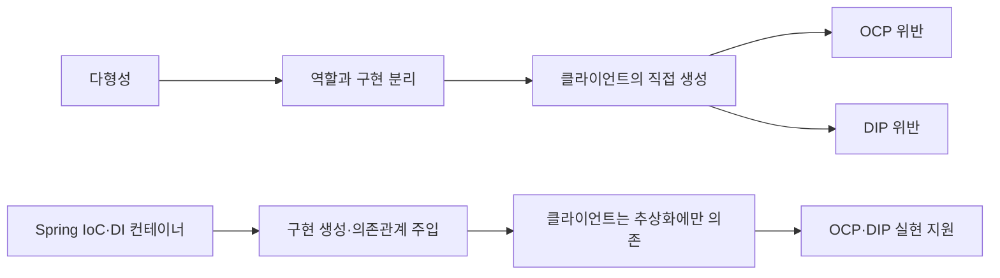

# 2026-08-14 Spring 핵심 원리 — 객체 지향 설계와 스프링

## 오늘의 목표

- Spring Framework·Spring Boot·Spring 생태계를 구분한다.
- 좋은 객체 지향 프로그래밍의 유연성을 다형성과 연결한다.
- 운전자–자동차 예시로 역할과 구현 분리를 설명한다.
- SOLID를 훑고 OCP와 DIP를 핵심 원칙으로 연결한다.
- IoC·DIP·DI를 구분하고 DI 컨테이너의 역할을 설명한다.

## 확보한 이해

- 운전자는 자동차의 구체 구현이 아니라 자동차 역할의 계약을 사용한다.
- 역할과 구현을 분리하면 클라이언트에 영향을 최소화하면서 구현을 교체할 수 있다.
- 다형성만으로 구현 객체를 선택하고 연결하는 책임까지 사라지는 것은 아니다.
- Spring의 IoC/DI 컨테이너는 객체 생성과 의존관계 연결을 외부에서 담당한다.
- 클라이언트가 인터페이스를 사용하더라도 구체 구현을 직접 생성하면 OCP와 DIP를 위반할 수 있다.
- IoC는 제어의 역전, DIP는 의존관계 역전 원칙, DI는 의존관계 주입이다.
- `new` 자체가 문제가 아니라 비즈니스 클라이언트가 구현 선택과 생성 책임까지 갖는 것이 문제다.
- DI 컨테이너는 객체를 생성하고 의존관계를 연결하며 생명주기를 관리한다.

## 갱신한 지도와 노트

- [[1.1 객체 지향 설계와 스프링]]
- [[04 Spring 내부 원리와 애플리케이션 설계]]
- [[Spring 핵심 원리 기본편]]
- [[현재 학습 위치]]

## 다음

Spring 컨테이너와 Spring Bean을 학습하고, `ApplicationContext`, `@Configuration`, `@Bean`으로 객체 생성과 조립이 실제로 어떻게 이뤄지는지 확인한다.

## 확인 질문

> [!question]- 다형성만으로 OCP와 DIP가 자동으로 지켜지지 않는 이유는?
> 클라이언트가 구체 구현을 직접 선택하고 생성하면 구현 교체 때 클라이언트 코드가 바뀌며, 구체 클래스에도 의존하기 때문이다.

> [!question]- IoC, DIP, DI의 차이는?
> IoC는 제어권을 외부로 옮기는 원리, DIP는 추상화에 의존하라는 설계 원칙, DI는 필요한 의존 객체를 외부에서 전달하는 방법이다.
